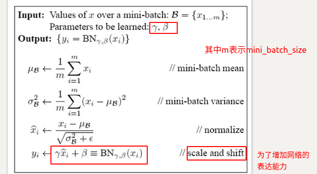

# BN

参考文献：

[wiki](https://en.wikipedia.org/wiki/Batch_normalization)

https://www.cnblogs.com/guoyaohua/p/8724433.html

问题背景：

[梯度消失](https://zh.wikipedia.org/wiki/%E6%A2%AF%E5%BA%A6%E6%B6%88%E5%A4%B1%E9%97%AE%E9%A2%98)与[梯度爆炸](https://zhuanlan.zhihu.com/p/32154263)的问题

[一般解决方法汇总](https://blog.csdn.net/qq_25737169/article/details/78847691)

drop_out:这里可以参考吴恩达老师的deep learning课件

### 要解决的问题

内部协变量移位现象(Internal Covariate shift)

机器学习中有一个比较重要的假设：独立同分布，就是假设训练数据和测试数据是同时满足相同分布；

​	在网络的训练阶段，由于前几层的参数发生变化，因此当前层的输入分布也会相应变化，因此当前层需要不断调整以适应新的分布。对于较深的网络，此问题尤为严重，因为较浅的隐藏层的细微变化将在它们在网络中传播时被放大，从而导致较深的隐藏层发生显着变化。因此，提出了批量标准化的方法，以减少这些不必要的偏移，以加快训练速度并生成更可靠的模型。

​	NP的基本思想就是让每个隐层节点的激活输入分布固定下来（一般是放置在激活层之前）;类似于白化操作：对深层神经网络的每个隐层神经元的激活值做简化版本的白化操作.

​	同时，我们可以发现BN还有其他的用途

​		1.会使网络使用更高的学习速率而不会出现梯度消失或者梯度爆炸

​		2.似乎存在正则化效果从而改善了归一化属性，可以不使用drop out　

### 本质思想

### 算法步骤

①不仅仅极大提升了训练速度，收敛过程大大加快；

②还能增加分类效果，一种解释是这是类似于 Dropout 的一种防止过拟合的正则化表达方式，所以不用 Dropout 也能达到相当的效果；

③另外调参过程也简单多了，对于初始化要求没那么高，而且可以使用大的学习率等。

