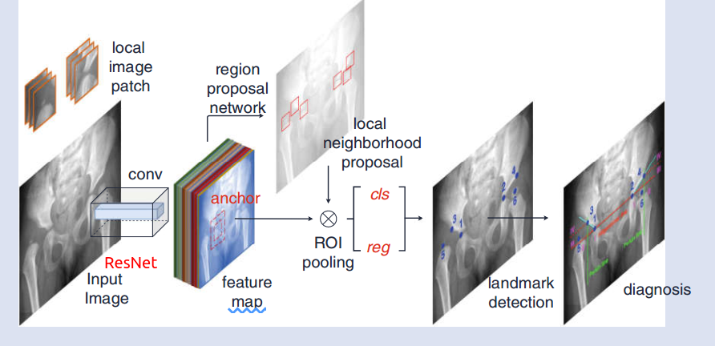
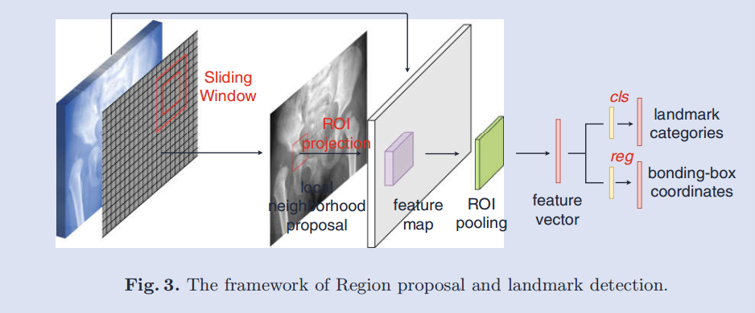
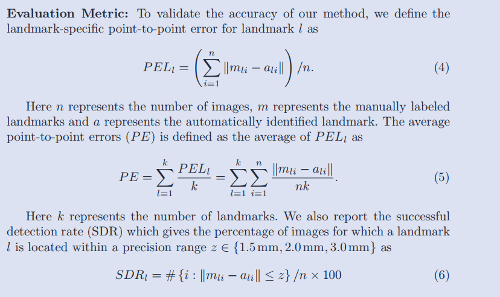

## 综述

本文的主要想法：首先我们提取以landmark为中心的(2N+1)×(2N+1)大小的image patch作为local neighborhood;我们把关键但的检测转换成local neighborhood的检测，目标检测的中心就是我们要检索的landmark。

所以网络框架是目标检测的框架.　本文论文关于网络具体框架什么的描述的细节比较少，而且没有代码，所以就..写的很简单，感觉可以学的就只是一个思路

## 网络框架

网络框架比较简单

## loss函数

该损失函数和[Faster R-CNN](https://gritcs.github.io/2020/08/27/Faster%20R-CNN/)的损失函数相同，这里不再赘述

## 实验过程

1.采用均值为０，方差为0.01的 Gaussian distribution随机初始化

2. learning rate of 0.001 for 80k mini-batches,  0.0001 for the next 30k mini-batches on the dataset. 
3. The momentum is set to be 0.9 and the weight decay is set to be 0.0005. 

[论文中描述的比较简单]

## 评价标准

感觉这篇论文写的不是特别明确，[等之后再多看点论文，再总结关键点检测的评价标准吧]

