#  Faster R-CNN

主要[参考博文](https://zhuanlan.zhihu.com/p/31426458)

[原文地址](http://papers.nips.cc/paper/5638-faster-r-cnn-towards-real-time-object-detection-with-region-proposal-networks.pdf)


在原论文的摘要中提出：

在之前SPP-Net 和Fast R-CNN提出依靠region proposal algorithms去预测物体的位置会减少很多计算量，但是这也暴露了区域提议计算的瓶颈

本文关键提出了RPN(region proposal network)，使用卷积层，减少参数的数量，有较快的速度和较高的准确率

RPN ==shares full-image convolutional features== with the detection network, thus enabling nearly ==cost-free== region proposals. 

​	An RPN is a fully-convolutional network that simultaneously ==predicts object bounds and objectness scores== at each position. RPNs are trained end-to-end to generate highquality region proposals, which are used by Fast R-CNN for detection. 	

softmax交叉熵损失函数：https://blog.csdn.net/chaipp0607/article/details/73392175

## 网络框架


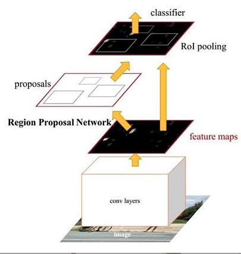


主要分为四部分：

1. Conv layers:　作为一种CNN网络目标检测方法，使用conv+pooling+relu来提取feature maps，被之后的RPN 和全连接层共享

2. RPN(region proposal network )

   ​	==用于生成region proposals==，该层主要工作：

   ​		a. 通过softmax判断anchors属于positive , negative，

   ​		b. 再利用bounding box regression 修正anchors获得较为准确的			proposals

3. roi pooling

   ​	该层收集输入的feature maps和proposals，综合这些信息提区proposal feature maps，

4. classification 

   ​	利用 proposal feature maps 计算 proposal 的类别，同时再次 bounding box regression 获得检测框最终的精确位置


下图为python的VGG16模型中的faster_rcnn_test.pt网络结构

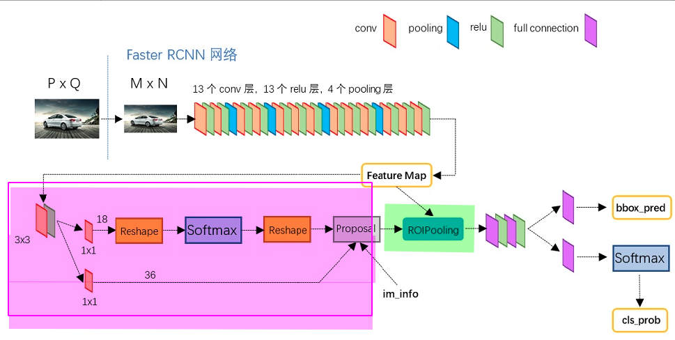

### Conv layers

在Conv layers中

1. 所有的conv层都是　kernel_size = 3, pad =1 ,stride =1
2. 所有的pooling层都是　kernel_size =2, pad =0, stride =2

导致　Conv layers中conv层不改变输入输出矩阵的大小，只有在pooling层中M×N的矩阵变成(M/2)×(N/2)的大小。所以从Conv layers输出的矩阵的尺寸为M×N

目的是为了在ROI Pooling的输入层中proposal（M×N)与 feature maps尺寸一致

### Region Proposal Network

这一层的主要任务： 获取有效的proposals，完成目标定位

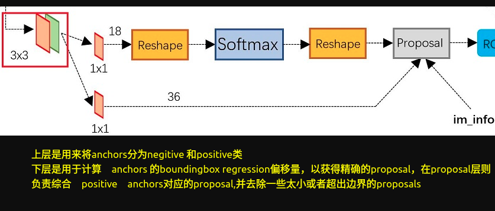

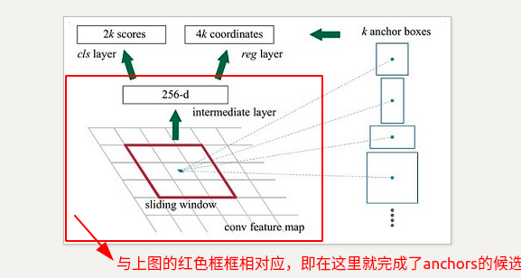


**主要流程：生成 anchors -> softmax 分类器提取 positvie anchors -> bbox reg 回归 positive anchors -> Proposal Layer 生成 proposals**

**这是主要的原理就是：利用3×３的卷积核的中心作为anchor的中心，在每个点设置9个anchor作为候选区，之后再有cnn来判断anchor是negitive or positive anchor**，目前这里只是二分类,而且后面还有 2 次 bounding box regression 可以修正检测框位置


#### 1.生成anchors

略(思路是比较简单的,可以参考[博客)](https://zhuanlan.zhihu.com/p/31426458)

#### 2.softmax分类器提取positive anchors

输入：anchors，输出:rpn_cls_score

#### 3.bbox 回归

###### bounding box regression原理

大致思想：我们目标是像通过　bounding box regression，对anchors进行调整，让他接近GT(但是我们anchor的选取按照固定的方法，没有结合GT的位置信息)；所以我们学习的是anchors和GT之间变换(每张图片的GT是固定的，而且anchors的选取也是固定的)

​	所以本文学习的是预测的窗口(anchor)=>GT窗口之间的一种变换（先平移后进行缩放）(如果相差比较小，即positive可以看作是线性回归模型)

​	并设计相应的loss函数对其进行约束

**原理**

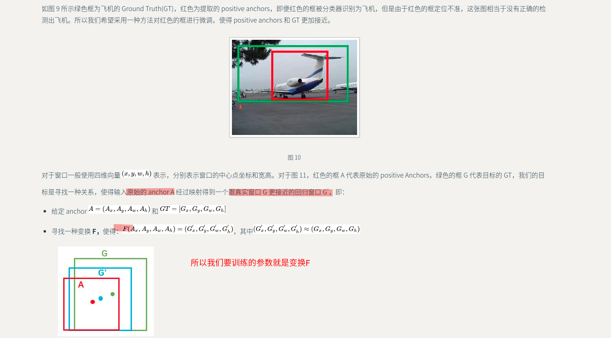

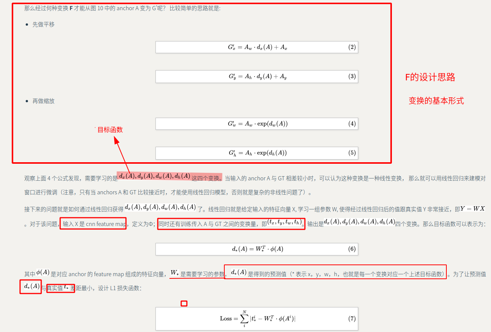

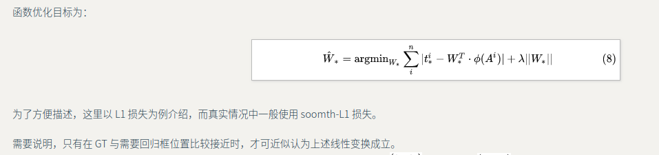

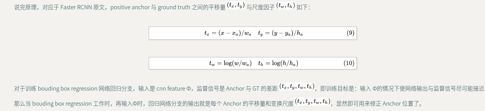

而在原论文中是这样子记录的

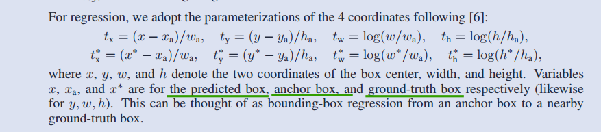


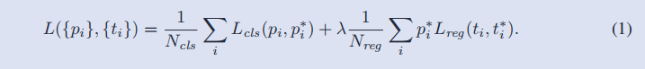

==**在bbox-regression 中要训练的参数就是，我们需要预测的box(x,y,w,h)**==


#### 的4. proposal layer 生成 proposals

```
根据bbox回归得到的[dx(A), dy(A), dw(A) ,dh(A)]对所有的anchors进行修正和微调
按照输入的positive softmax scores　由大到小排序anchors，提取前pre_nms_topN，即选择较好的修正后的　positive anchors
限定超出图像边界的 positive anchors 为图像边界，防止后续 roi pooling 时 proposal 超出图像边界
剔除尺寸非常小的 positive anchors
对剩余的 positive anchors 进行 NMS（nonmaximum suppression）
```

注意由于第三步生成的proposal要和原图像进行对比，所以它的尺寸是M*N

###### [NMS：非极大值抑制](https://zhuanlan.zhihu.com/p/37489043)


消除冗余的边界框

```
根据置信度得分进行排序
选择置信度最高的比边界框添加到最终输出列表中，将其从边界框列表中删除
计算所有边界框的面积
计算置信度最高的边界框与其它候选框的IoU。
删除IoU大于阈值的边界框
重复上述过程，直至边界框列表为空
```

​	

### RoI Pooling

是一个简单的SPP-Net, 属于卷积层和连接层之间的过渡层，将大小不一的proposals变成固定大小(之后classifier　模块是利用全连接层进行分类，所以需要固定大小)

存在其他方法：crop，warp,但是他们会破坏图像原有信息

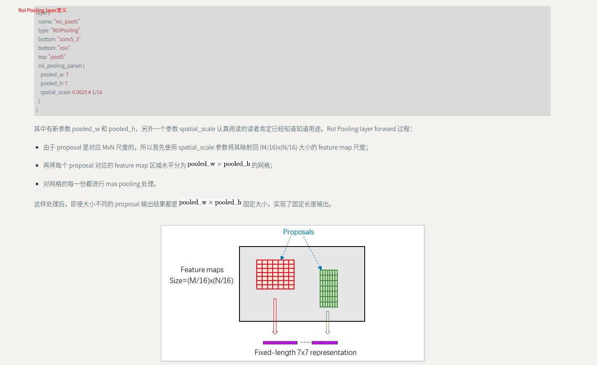

### Classification

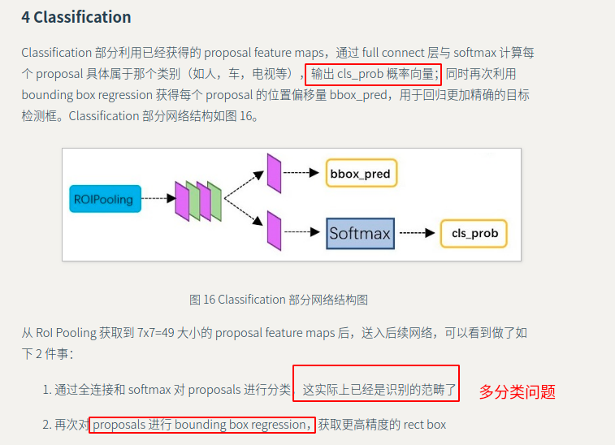


## loss函数


在训练过程和bbox回归中都有涉及


## 训练过程

### 交替训练过程

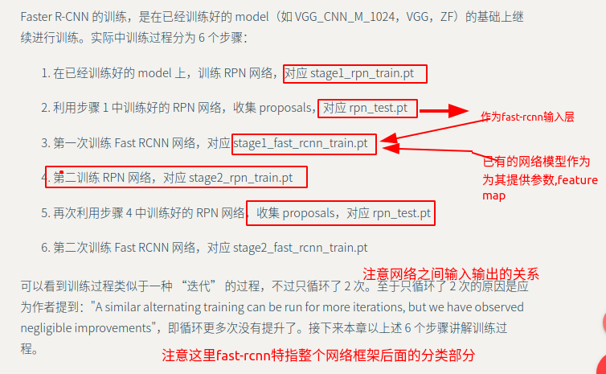

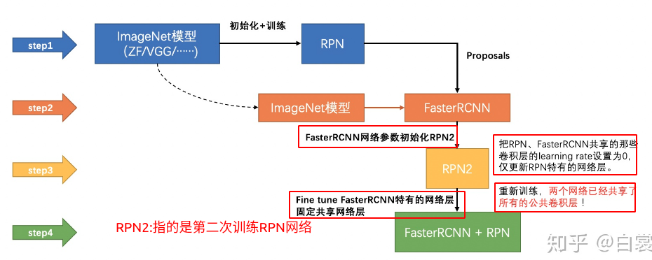

**公共卷积层的不是已经训练好了么？？**

```
参数说明：
rpn_cls_prob_reshape:　positive vs negative anchors 分类器结果 

 rpn_bbox_pred:　对应的 bbox reg 的  变换量[dx(A,dy(A),dw(A),dh(A))]
 
im_info:  对于一副任意大小 PxQ 图像，传入 Faster RCNN 前首先 reshape 到固定 MxN，im_info=[M, N, scale_factor] 则保存了此次缩放的所有信息。这样做的是为了方便之后训练网络[历史遗留问题]
```

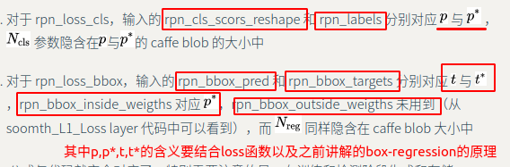

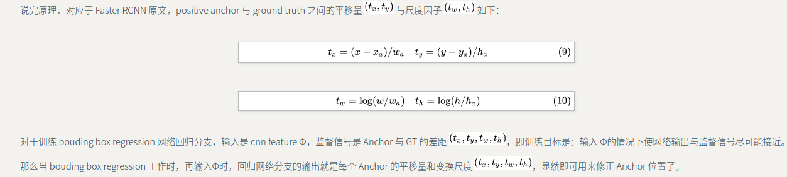

#### rpn-train1

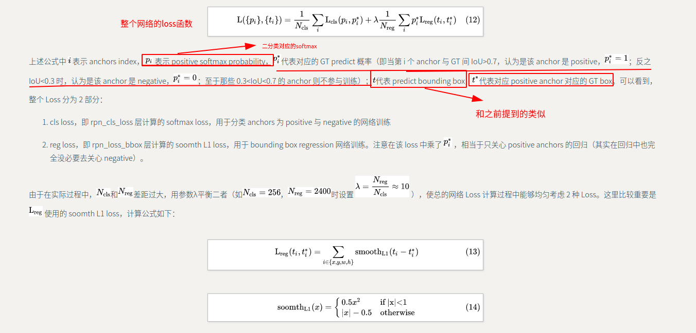

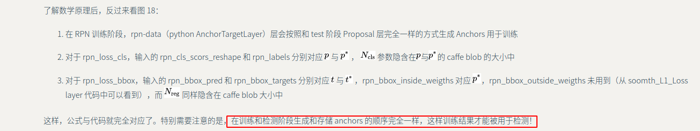

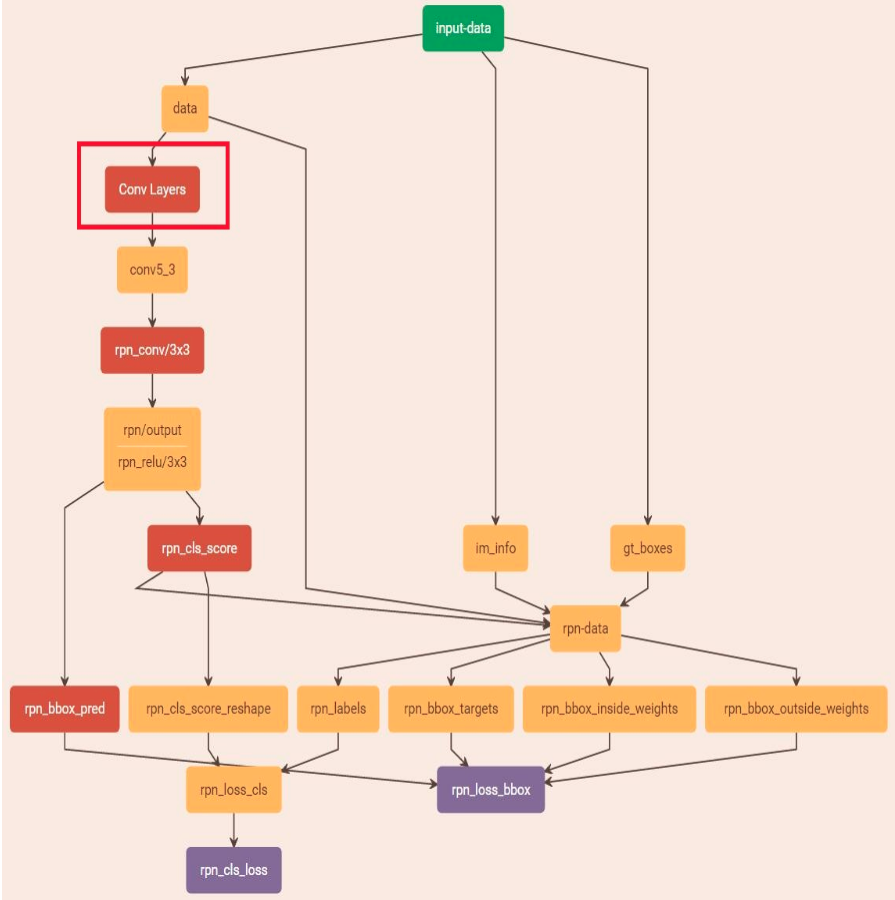

#### RPN-test

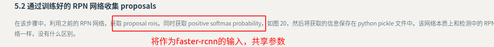

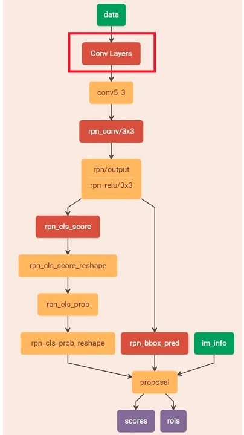

#### faster rcnn

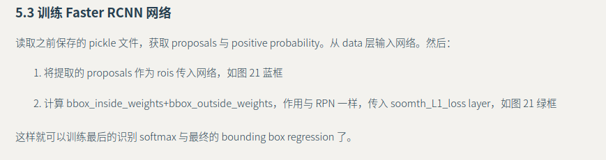

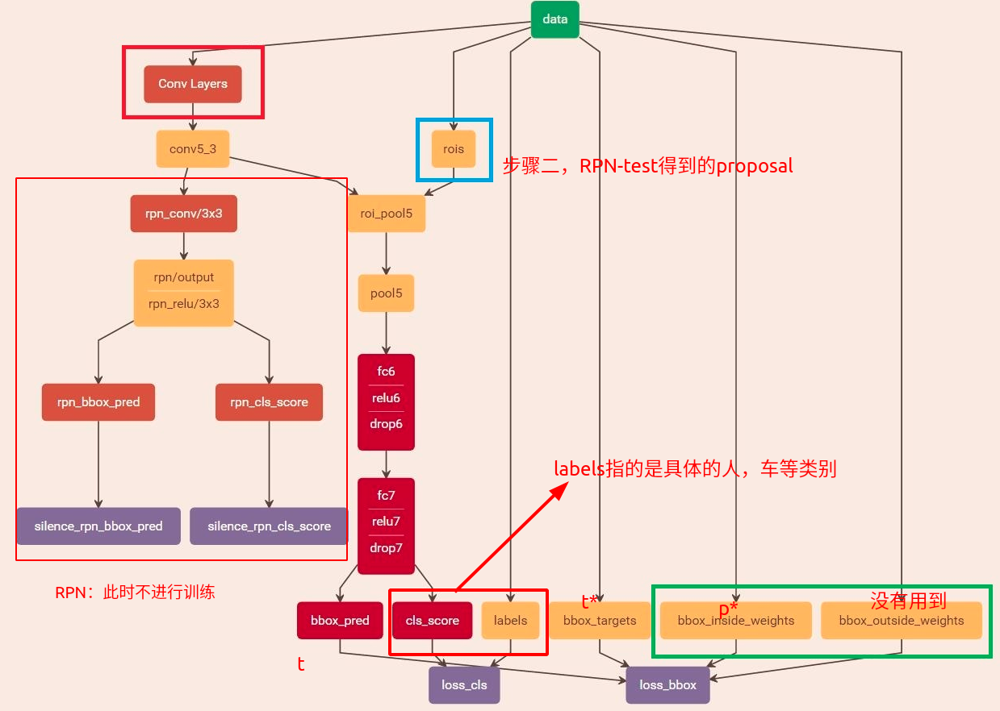


第二轮训练方式与第一轮大同小异。

### 端到端方式


## 仍然存在的问题

１。读不懂代码，意味不知道网络需要什么样子的输入以及标注,而且看论文只能看个大概，不是特别清楚得了解每层网络之间的尺寸，维度等等的变换

２.不是特别明白训练的过程

３.不是特别明白　这里关于faster-rcnn　和　rpn　之间的参数共享的问题

4. 要训练的参数都有哪些？？　反向传播，参数更新的过程