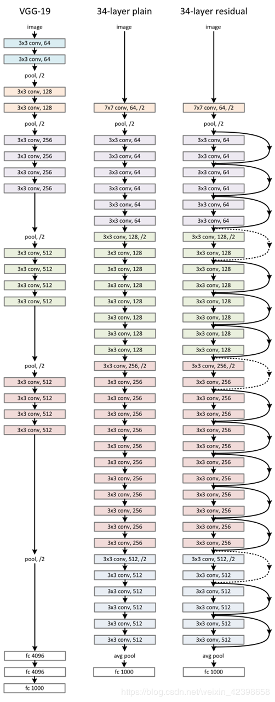
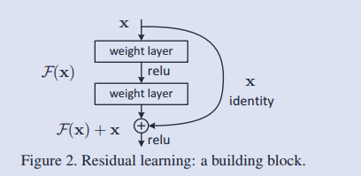
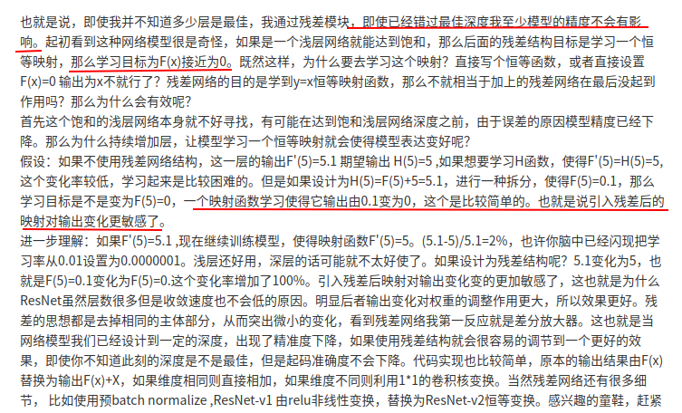
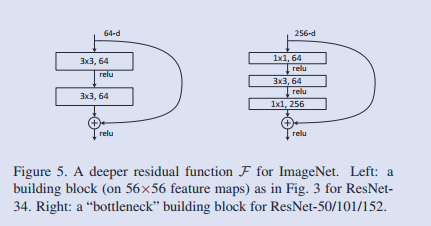
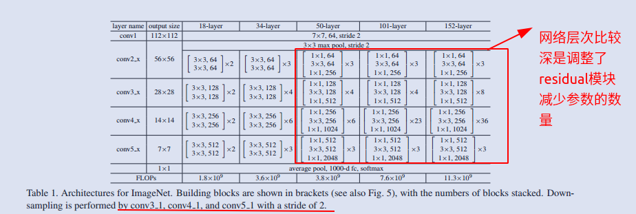
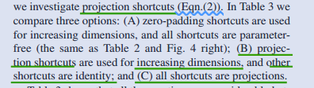
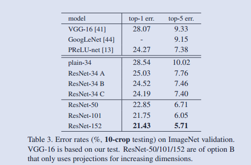

# 1.ResNet

## 综述


## 网络结构

在原论文中，作者不断加深网络结构来研究随着网络层次的加深，残差模块的表现

所以存在 ResNet-34, ResNet-50, ResNet-101, ResNet-152

这里只以ResNet-34为主



可以看到整个网络分为两部分Plain Network 和Residual Network

### Plain Network 

参考最左侧VGG网络的框架，都是采用３×３的卷积核

 (i) for the same output feature map size, the layers have the same number of filters; 而且stride=1, padding =1,

(ii) if the feature map size is halved, the number of filters is doubled 

so as to preserve the time complexity per layer.[池化层使用步长为２,然后３×３的卷积核]

可以看出来网络比较工整

### Residual Network

#### 基本结构

最右侧的网络即是残差网络，在plainNet的基础上增加了Residual模块



实弧线，表示这里shortcuts是正常的恒等映射
$$
Y = F(X,\{w_i\}) + X
$$
虚弧线，表示这里恒等映射(identity mapping / shortcuts)要进行增加维度；原文中提到了两种方式

1.　with extra zero entries padded for increasing dimensions;我理解的是仅仅是用０来填充多余的维度
2.　采用 projection shortcut (采用１*1 的卷积核)，公式为,$W_s$用来调整维度和尺寸。

$$
Y = F(X,\{w_i\}) + W_sX
$$

对于以上两种方式，stride=2

#### 残差结构的原理

＝＝自己的数学比较鸡肋，感觉应该是重点理解残差结构（而不仅仅是保证梯度不会很小）

本片论文的introduction中提到了，增加学习网络的深度确实有利于提高神经网络的能，但是会因为一些意料之外的原因导致出现在较深网络层次中准确率降低的情况；

其中比较重要的影响因素是　较深的网络会出现梯度消失和梯度爆炸的问题

1.梯度消失：导致深层的梯度不能传递到浅层,不能更新参数

2.梯度爆炸的：导致网络不稳定

有一些其他的解决方法　比如　normalized initialization, intermediate normalization layers[NP]

本文采用使用　残差结构：在深层网路，训练 F(x)的梯度趋向０，保证不出现梯度下降和梯度爆炸的现象

利用公式，我们可以简单验证一下梯度更新的情况


$$
Y = F(X,\{ W_i \}) +X\\
F = W_2\sigma(W_1 X) \\
$$
这里忽略了　偏移量$b_i$, $\sigma$ 表示relu函数

实际上我们训练的就是$F(x)$,而且在网络结构的深层我们趋向于将它的梯度训练为０

我们设损失函数为$\Epsilon$


$$
\\
X_{l+1} = X_{l} + F(X_l,\{ W_i \})\\即上一个残差模块的输出作为下一个残差模块的输入\\
X_{l+2 } = X_{l+1}+F(X_{l+1},\{W_I\}) = X_l +  F(X_l,\{ W_i \})+F(X_{l+1},\{W_I\})\\
...\\
X_L = X_l + \sum_{i =l}^{L-1} F(X_i,W_i)\\
 \\　X_l表示第l个残差模块的输入，X_L表示第L个残差模块的输入;满足l<L\\
$$

$$
\frac{\partial \Epsilon}{\partial X_l }  = \frac{\partial \Epsilon }{\partial X_L}\times \frac {\part X_L} {X_l}= \frac{\partial \Epsilon }{\partial X_L}(1+\frac{\part}{\part X_l}(\sum_{i=l}^{L-1} F(X_i,W_i)))
$$
注：这里恒等映射没有经过１×１的卷积运算

可以看出来，较为深层的网络，我们也可以保证梯度不为消失，可以较为无损地传播梯度

其他优秀博主的意见：[可以换个角度思考一下]



### 残差网络的其他设计

1.由浅层的网络到深层的网络，将两层（3*3)转换成３层（１×１，３×３，１×１），减少参数，便于训练(１×１卷积，用来调整维度的；第１个降低维度到原来的1/2，第二个再恢复原来的维度)





２.关于涉及维度变换的残差模块的恒等映射，作者比较了三种实现



比较结果



但是考虑到训练的成本，建议选择方案A，即Zero-padding　shortcut,毕竟重点是残差结构


## 实验部分


```
（1）使用color augmentation做数据扩增
（2）在每个卷积层之后，激活函数之前使用batch normalization (BN)
（3）SGD作优化，weight decay =0.0001，momentum=0.9
（4）learning rate=0.1,当错误率停滞时除以10
（5）不使用dropout  
```

参考一些博客，博主们都提到了训练过程中　BN位置的设置等问题

参考博客：

实验：https://juejin.im/entry/6844903564590972936

原理：https://www.itread01.com/content/1544868722.html

​		https://blog.csdn.net/u014296502/article/details/80438616

综述：https://zhuanlan.zhihu.com/p/31852747


原文地址：