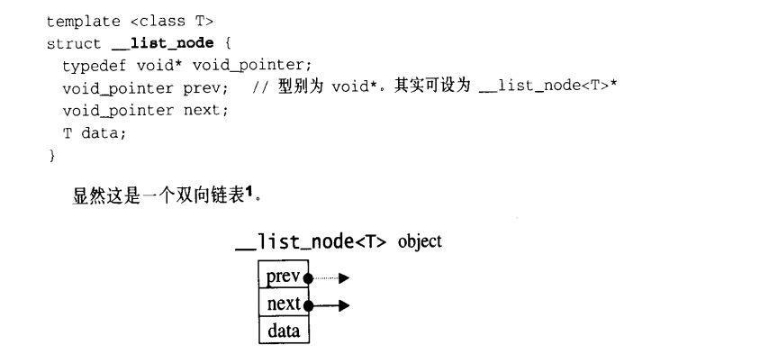
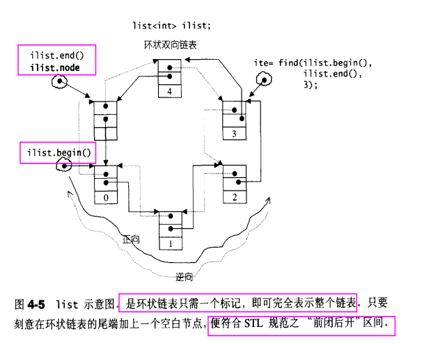

## list的底层结构

**环形双向链表**







**List的重要性质：**

1. **插入操作(insert) 和 接合操作(splice)都不会造成原有的list失效，只有删除时，指向被删除元素的那个迭代器会失效，其他不受影响** ; 而vector的迭代器，如果插入导致原来的数组容量扩充，会造成所有的迭代器失效
2. 不支持随机存取，下标操作和at()函数

## list的相关操作

https://leetcode-cn.com/problems/lru-cache/

### list的定义和构造函数

```c++
list<A> listname;
list<A> listname(size);
list<A> listname(size, value);
list<A> listname(elselist);
list<A> listname (first,last);// 

int iv[5] ={5,6,7,8,9};
list<int> ilist2(iv,iv+sizeof(iv)//sizeof(int))
```

### list的插入和删除

#### list插入

```c++
void push_front(const A& x); //作为头节点
void push_back(const A& x);


iterator insert(iterator position, const A& x); //在迭代器position所指的位置之前 插入结点，内容为x,position不失效

```

#### list删除操作

```c++
void pop_front();
void pop_back();

iterator erase(iterator position);//只是被删除的结点迭代器失效，
void remove(const T& value); //将数值为value的所有元素都移除
```

### list的移动和拼接操作

```c++
//下面拼接操作中，x中的元素也有变化

splice(iterator position,list& x); //将x拼接到position所指的位置之前，x不同于position所指的list
splice(iterator position, list& x, iterator i);// i指向 list x中的一个元素，将i接合与position之前。 i和position可以指向同一个list，swap操作

splice(iterator position, list& x ,iterator first ,iterator last);
//将 list x中的[first，last）中的元素拼接到position中

   
    // splicing lists

#include <iostream>

#include <list>

#include <string>

#include <algorithm>

using namespace std;

int main ()

{

  list<int> mylist1, mylist2;

  list<int>::iterator it;

  // set some initial values:

  for (int i=1; i<=4; i++)

     mylist1.push_back(i);      // mylist1: 1 2 3 4

  for (int i=1; i<=3; i++)

     mylist2.push_back(i*10);   // mylist2: 10 20 30

  it = mylist1.begin();

  ++it;                         // points to 2

  mylist1.splice (it, mylist2); // mylist1: 1 10 20 30 2 3 4

                                // mylist2 (empty)

                                // "it" still points to 2 (the 5th element)                                     

  mylist2.splice (mylist2.begin(),mylist1, it);
                               // mylist1: 1 10 20 30 3 4
                                // mylist2: 2
                                // "it" is now invalid.
  it = mylist1.begin();
  advance(it,3);                // "it" points now to 30
 mylist1.splice ( mylist1.begin(), mylist1, it, mylist1.end());
                                // mylist1: 30 3 4 1 10 20
}
```

### list中的高级算法

algorithm 中常见的库函数 https://blog.csdn.net/cl939974883/article/details/104225232

#### `merge()`

tips:

> 0.algorithm 里的反转函数接口:reverse(first,last) 参数为容器的迭代器起始位置和终止位置1.string和vector和deque只能使用模板库算法里的反转函数
> 2.list可以使用算法里的和list类的reverse
> 3.stack和queue没有迭代器，自然不能使用算法里的reverse,其类也没有提供反转的成员函数
> 4.set和map的元素是按照键值排序的，不能修改键值，不可反转.
> ————————————————
> 版权声明：本文为CSDN博主「嘻嘻作者哈哈」的原创文章，遵循CC 4.0 BY-SA版权协议，转载请附上原文出处链接及本声明。
> 原文链接：https://blog.csdn.net/weixin_43971252/article/details/88566605

```c++
#include<iostream>
#include<algorithm>
#include<string>
#include<vector>
#include<list>
#include<queue>
#include<stack>
#include<deque>
#include<set>
#include<map>
using namespace std;

int main()
{
	string str("abcde");
	reverse(str.begin(), str.end());         //string使用<algorithm>里的reverse ,string类自身没有reverse成员函数
	cout << "string elem : ";
	for (int i = 0; i < str.size(); i++)
		cout << str.at(i) << "   ";
	cout << "\n\n";

	vector<int> v{ 1,2,3,4,5,6 };
	reverse(v.begin(), v.end());            //vector使用<algorithm>里的reverse,vector类自身也没有reverse成员函数
	cout << "vector elem : ";
	for (vector<int>::iterator it = v.begin(); it != v.end(); it++)
		cout << *it << "   ";
	cout << "\n\n";
	
	list<int> l{ -1,-2,-3,-4,-5,-6 };
	reverse(l.begin(), l.end());           //list使用算法里的
	cout << "list elem : ";
	for(list<int>::iterator it=l.begin();it!=l.end();it++)
		cout << *it << "   ";
	cout << "\n";
	l.reverse();                         //list使用自身类的reverse成员函数
	cout << "list elem : ";
	for (list<int>::iterator it = l.begin(); it != l.end(); it++)
		cout << *it << "   ";
	cout << "\n\n";

	//queue和stack容器不支持遍历操作，没有迭代器，所以不能使用算法里的反转函数，其类也没有提供反转的成员函数
	queue<int> myq;
	myq.emplace(1);
	myq.push(2);
	
	stack<int> mys;
	mys.emplace(6);
	mys.push(7);

	deque<int> myd{ 2,4,6,8 };
	reverse(myd.begin(), myd.end());       //deque容器使用算法里的反转函数，deque类没有reverse成员函数
	cout << "deque elem : ";
	for (deque<int>::iterator it = myd.begin(); it != myd.end(); it++)
		cout << *it << "  ";
	cout << "\n\n";

	//因为set和map是关联式容器，在插入元素时就已经根据键值排好序了，如果反转会使元素变成无序状态，从而破会容器组织
	set<int> s;
	s.insert(10);
	s.insert(9);
	s.insert(8);
	//reverse(s.begin(), s.end());
	cout << "set elem : ";
	for (set<int>::iterator it = s.begin(); it != s.end(); it++)
		cout << *it << "  ";
	cout << "\n\n";

	map<int, string> m;
	m.insert(make_pair(0, "小王"));
	m.insert(make_pair(1, "小玲"));
	//reverse(m.begin(), m.end());
	cout << "map elem : " << "\n";
	for (map<int, string>::iterator it = m.begin(); it != m.end(); it++)
		cout << "key : " << it->first << "  value : " << it->second << endl;
	cout << "\n\n";

	system("pause");
	return 0;
}
```

#### `sort`

#### list中数据类型为基本类型，例如为整数类型排序：

```c++
    #include <iostream> 
    #include <list>
    using namespace std;
     
    int main()
    {
        list<int> num;
        num.push_back( 1 );
        num.push_back( 3 );
        num.push_back( 2 );
        num.push_back( 9 );
        num.push_back( 5 );
        num.sort();
        list<int>::iterator vi;
        for( vi=num.begin();vi!=num.end();vi++) 
        {
            cout  << *vi << endl;
        } 
        
        return 0;
    }
```

#### list中的类型为自定义类型

```c++
    #include <iostream> 
    #include <list>
    using namespace std;
     
     
    class student
     {
        public:
          int age;
          student()
          {}
          student(int a)
          {
              this->age=a;
          }
      public:
          bool operator < (student b)
         {
               return this->age < b.age;
         }
     
         bool operator > (student b)
         {
               return this->age > b.age;
         } 
     
     }; 
     
    int main()
    {
        list<student> num;
        num.push_back( student(1) );
        num.push_back( student(5));
        num.push_back( student(2));
        num.push_back( student(6));
        num.sort();
       // sort(num.begin(),num.end());
        list<student>::iterator vi;
     
        for( vi=num.begin();vi!=num.end();vi++) 
        {
            cout  << vi->age << endl;
        }
        num.clear();
        
    }
```

#### 3、自定义规则进行排序

##### 3.1 使用函数对象 (参考[2]）

```c++
    #include<iostream>
    #include<list>
    using namespace std;
     
    class A{
    public:
     int a,b;
     A(int t1,int t2){a=t1,b=t2;}
    };
     
     
    struct node{
     bool operator()(const A& t1,const A& t2){
      return t1.a<t2.a;    //会产生升序排序,若改为>,则变为降序
     }
    };
     
    int main() {
     list<A> list_a;
     A a1(1,2), a2(4,6), a3(2,8);
     list_a.push_back(a1);
     list_a.push_back(a2);
     list_a.push_back(a3);
     
     list_a.sort(node()); //排序操作； 
     
     list<A>::iterator ite;
     ite=list_a.begin();
     for(int i=0;i<3;i++)  {cout<<ite->a<<endl; ite++;}
     
     return 0;
     
    }
```

##### 3.2 使用回调函数自定义排序规则：（参考[3]）

```c++
    #include<iostream>
    #include<list>
    using namespace std;
     
    class A{
    public:
     int a,b;
     A(int t1,int t2){a=t1,b=t2;}
    };
     
    bool compare(A a1, A a2){
    	return a1.a < a2.a;  //会产生升序排列，若改为>,则会产生降序； 
    }
     
    int main() {
     list<A> list_a;
     A a1(1,2), a2(4,6), a3(2,8);
     list_a.push_back(a1);
     list_a.push_back(a2);
     list_a.push_back(a3);
     
     list_a.sort(compare); //排序操作； 
     
     list<A>::iterator ite;
     ite=list_a.begin();
     for(int i=0;i<3;i++)  {cout<<ite->a<<endl; ite++;}
     
     return 0;
     
    }
```

