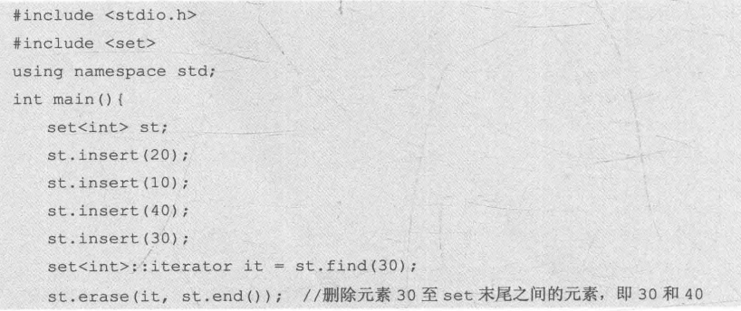
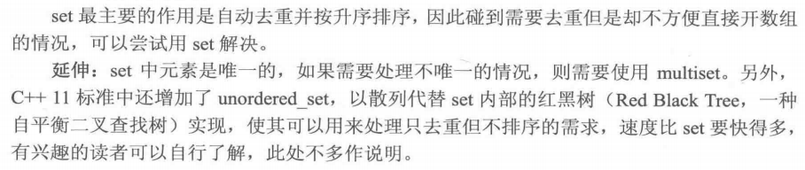

## set

内部自动有序并且不包含重复元素的容器

#include<set\>

###  set的定义和初始化

```c++
set<int> name;
set<string> strs;
set<char> a[100]; ///set数组
```

### set容器内元素的访问

> set只能通过迭代器访问
>
> set<int\>::iterator it;

**除了vector和string之外的STL容器都不支持`*(it+1)`的访问方式 ** 而且迭代器不能比较

```c++
int main(){
		set<int> st;
		st.insert(3);
		st.insert(4);
		st.insert(1);
		for(set<int>::iterator it = st.begin() ; it != st.end() ; it++){
			cout<<*it<<" ";
		}
}
///output:  1 3 4
```

### set常用函数

#### insert()

底层是红黑树,自动递增排序和去重,时间复杂是$O(logN)$ , $N$ 为set内元素个数

#### find()

find(value)返回set中对应为value的迭代器,找不到返回set.end() , 时间复杂是$O(logN)$ , $N$ 为set内元素个数

#### erase()

##### 删除单个元素

###### 方法1: 

```c++
set.erase(it);  //it为所需要删除的元素的迭代器,时间复杂度为O(1).
```

###### 方法2:

```c++
set.erase(value); //value为所要删除的值,时间复杂度是Olog(N) , N为set内元素个数
```

##### 删除一个区间内的所有元素

```c++
set.erase(first,last) //可以删除一个区间内所有的元素,[first,last)
```



#### clear()

#### size()

### set的常见用途

