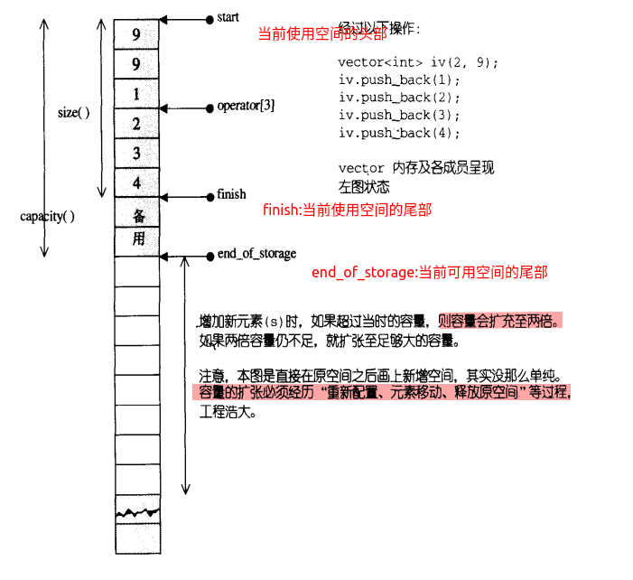

## **STL(Standard Template Library)**概念

​	6大组件： 容器，算法，迭代器，仿函数，适配器，空间配置器

在C++标准中，STL被组织成13个头文件

algorithm ,

deque ,

functional

iterator

vector

memory

numeric

queue

stack

set

utility

map

list

STL的优点：1.不需要额外安装其他软件包

​					2.实现了数据结构和算法的分离

​					3.程序员可以不用思考STL具体的实现过程，封装易用

​					4.高可重用性(模板类，模板函数)

​					5.高性能

​					6.高移植性

​					7.跨平台性


容器：

​	序列式容器：容器的元素的位置是由 进入容器的时机和地点来决定

​    关联式容器：容器已有规则，通常提供键值key作为索引

​	

## vector

### 动态增长原理

vector：动态数组,可变数组,单口容器

动态增长原理：当插入新元素的时候，如果空间不足，vector会重新申请更大的一块内存空间，将源空间数据拷贝到新空间，释放旧空间数据，再把新元素插入新申请空间.**注意：一旦引起空间重新配置，指向原vector的所有迭代器都失效了**

**3个迭代器属性：start,finish,end_of_storage**

**finish: 指向数组中最后一个元素的下一个位置**



### vector常用API

#### vector构造函数

```c++
vector<T> V; //利用模板实现类实现 ，默认构造函数

vector(v.begin(), v.end() );  //v为vector<T>
//将v[begin(), end()] 区间中的元素拷贝给本身

vector(n,elem ); //构造函数将n个elem拷贝给本身

//第一个赋值函数
int arr[] ={0,1,2,3,4};
vector<int> vl(arr,arr + sizeof(arr)/sizeof(int) );
```

#### 其他基本操作

##### 属性获取

```c++
public:
	// 获取数据的开始以及结束位置的指针. 记住这里返回的是迭代器, 也就是vector迭代器就是该类型的指针.
    iterator begin() { return start; }
    iterator end() { return finish; }
	// 获取值
	reference front() { return *begin(); }
    reference back() { return *(end() - 1); } 

// 获取右值
	const_iterator begin() const { return start; }
    const_iterator end() const { return finish; }

	const_reference front() const { return *begin(); } //首元素
	const_reference back() const { return *(end() - 1); }//最后一个元素


    // 获取基本数组信息
	size_type size() const { return size_type(end() - begin()); }	 // 数组元素的个数
    size_type max_size() const { return size_type(-1) / sizeof(T); }	// 最大能存储的元素个数
    size_type capacity() const { return size_type(end_of_storage - begin()); }	// 数组的实际大小
```

##### 元素访问方法

```c++
vector<typename T> c;

c.at(index);
c[index]; //这两种访问方式返回值都是引用，可读可写

c.front();//返回第一个元素
c.back();//返回最后一个元素

```


##### 增删改查

- **push和pop操作都只是对尾部finish进行操作的**

- `erase`清除是一个**左闭右开的区间**.

```c++
void push_back(const T& x);
vector<T ,Alloc> ::insert(iterator position, size_type n, const T& x); //从position开始，插入n个元素，元素的初值是x
```


```c++
void pop_back(); //将尾端元素拿掉，并调整大小

iterator erase(iterator first,iterator last); //清除[first,last) 中的所有元素,return first
  
iterator erase(iterator position); //清除某个位置上的元素 return position

void clear() { erase(begin(), end()); }
```

##### 容器的调整

```c++
void reserve(size_type n)//修改容器的实际大小
void resize (size_type new_size)
```

##### **vector遍历**

###### 1.使用迭代器

```c++
template<class T>
void Iter_for(vector<T>& vt){
	T temp;
	vector<T> :: iterator iter;
	for(iter=vt.begin(); iter!=vt.end(); iter++){
		temp =*iter;
		std::cout<<temp<<std::endl;
	}
}

```

###### 2.for_at

```c++
template<class T>
void at_for(vector<T>& vt){
	T temp;
    int i=0;
    int m=vt.size();
    for(i=0;i<m;i++){
        temp=vt.at(i);
        std::cout<<temp<<std::endl;
    }
}
```

###### 3. STL for_each

**for_each原型**

```c++
 template < typename InputIterator, typename Function >
Function for_each(InputIterator beg, InputIterator end, Function f)  {
  while(beg != end) 
    f(*beg++);
}
```


```c++
#include<algorithm>
#include<iostream>
#include<vector>
void print(const int& temp){
    std::cout<<temp<<endl;
}
void main(){
    int nums[4]={1,2,3,4};
   	vector<int> myvt=std::vector<int>(nums,nums+sizeof(nums)/sizeof(int));
    std::for_each(ptr.begin(),ptr.end(),print)
}
```


#### vector高级编程

##### 元素查找和搜索

使用STL通用算法find()

```c++
template<class InputIterator,class T> inline
 InputIterator find(InputIterator first,InputIterator last, const T& value);

InputIterator find_if(InputIterator first,InputIterator last,Predicate predicate);
```

##### 元素排序

使用STL通用算法**sort()**

**sort()底层实现是插入排序优化的快排，时间复杂度是 n*log2(n)**

###### 1.跟据元素自身定义的大小关系，进行升序排序

```c++
template <class RandomAccessIterator>
   inline void sort(RandomAccessIterator first, RandomAccessIterator);
```

使用方法

```c++
#include<iostream>

#include<vector>
#include<algorithm>

void print(const int& temp){
    std::cout<< temp<<" ";
}
int main(){
    int nums[] = {34,1,89,0,3,5,11};
    std::vector<int> ptr = std::vector<int>(nums,nums+sizeof(nums)/sizeof(int));
    //遍历方法
    std::for_each(ptr.begin(),ptr.end(),print);

    //sort两个参数
    std::sort(ptr.begin(),ptr.end());
    std::cout<<std::endl;
    std::for_each(ptr.begin(),ptr.end(),print);
}
/**
34,1,89,0,3,5,11
0,1,3,5,11,34,89
**/
```

###### 2.利用cmp函数定义大小关系，bool cmp{};

```c++
#include<iostream>

#include<vector>
#include<algorithm>

void print(const int& temp){
    std::cout<< temp<<" ";
}
bool cmp(int a,int b){
    return (a>b);//升序排列
}
int main(){
    int nums[] = {34,1,89,0,3,5,11};
    std::vector<int> ptr = std::vector<int>(nums,nums+sizeof(nums)/sizeof(int));
    //遍历方法
    std::for_each(ptr.begin(),ptr.end(),print);

    //sort三个参数
    std::sort(ptr.begin(),ptr.end(),cmp);
    std::cout<<std::endl;
    std::for_each(ptr.begin(),ptr.end(),print);
}
/**
34 1 89 0 3 5 11 
89 34 11 5 3 1 0 
**/
```

