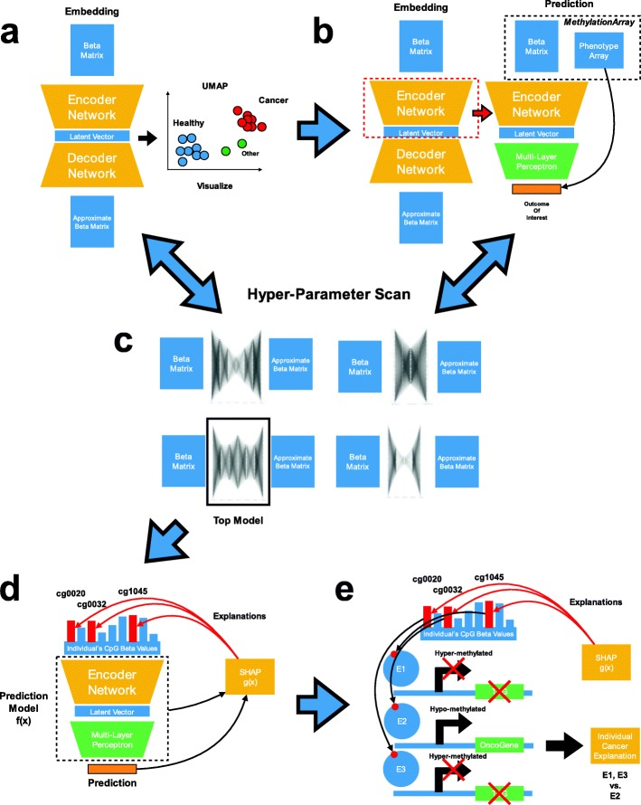

## 实验背景

 				DNA甲基化（DNAm）是在核苷酸（通常是胞嘧啶）上添加一个甲基，该核苷酸不会改变DNA序列，并且最常见于胞嘧啶-鸟嘌呤二核苷酸（CpG）。DNA的甲基化区域（高甲基化）与浓缩的染色质相关，当存在于基因启动子附近时，会抑制转录。DNA的未甲基化区域（低甲基化）与开放的染色质状态相关，并允许基因转录。DNAM模式与细胞类型特异性基因表达程序相关联，和改变DNAM已经与衰老和环境暴露有关[ [8](https://www.ncbi.nlm.nih.gov/pmc/articles/PMC7076991/#CR8)，[9](https://www.ncbi.nlm.nih.gov/pmc/articles/PMC7076991/#CR9)]。此外，众所周知，DNAm的改变有助于癌症的发展和发展。抑癌基因的甲基化过高和癌基因的甲基化过低会导致发病机制和不良预后。抑癌基因的甲基化过高和癌基因的甲基化过低会导致发病机制和不良预后。 基于负担得起的基于阵列的基因组规模测量DNAm的方法已经增强了表观基因组广泛关联研究（EWAS），用于测试DNAm与表型，暴露水平以及人类健康和疾病状态的关联。 因为DNAm模式是特定于细胞类型的，所以EWAS通常使用基于参考或无参考的方法推断生物样品细胞组成变化所引起的潜在混淆，以推断细胞类型的比例

## KeyWords: 

## 相关统计概念:

Shapley value : 基于Shapley值进行利益分配体现了各盟员对联盟总目标的贡献程度,避免了分配的平均主义,比任何一种仅按资源投入价值、资源配置效率及将二者相结合的分配方式都更具合理性和公平性，也体现了各盟员相互博弈的过程。但Shapley值法的利益分配方案尚未考虑联盟成员的风险分担因素，实质上隐含着各盟员风险分担均等的假设，因此，对于联盟成员风险分担不等或风险分担存在较大差异的状况，需要根据风险分担大小对Shapley值法的利益分配方案做出适当的修正

[https://wiki.mbalib.com/wiki/%E5%A4%8F%E6%99%AE%E5%88%A9%E5%80%BC](https://wiki.mbalib.com/wiki/夏普利值)

https://en.wikipedia.org/wiki/Shapley_value

## 相关生物背景知识:

CpGs :        https://en.wikipedia.org/wiki/CpG_site

在哺乳动物中，70％至80％的CpG胞嘧啶被甲基化。[[1\]](https://en.wikipedia.org/wiki/CpG_site#cite_note-Jabbari2004-1)对基因内的胞嘧啶进行甲基化可以改变其表达

## 算法流程                                

### 算法框架

####  主要分为3部分

​	我们的方法使用一些简单的命令，所有这些命令都可以用于任何预测任务。首先，使用变分自动编码器对深度学习预测模型进行预训练，然后使用编码器的层提取生物学上有意义的特征。这些神经网络层用于嵌入数据并提取特征，以便在无监督的情况下进行聚类，生成对原始源具有高保真度的新数据以及进行预测模型预训练。其次，在编码器的下游包括预测层，它们可以端对端地微调模型的预测层和特征提取层，以实现多输出回归和分类的任务。训练预测层可优化神经网络以执行预测任务。第三，进行自主超参数扫描以优化第一和第二任务的模型参数，同时生成丰富的数据可视化。最后，通过Shapley特征归因方法确定CpG对每个预测的不同粒度程度的贡献。

预训练 Training the feature extractor to embed data

 emded data嵌入数据的程序是通过使用VAE(Variational Autoencoder )来找到无监督潜在的数据的表征(representation)去预训练最后的预测模型

​	其中VAE主要有两部分:编码器和解码器:

​			1. 编码器主要用于 压缩数据,然后将此压缩得到的representations,这些压缩数据作为解码器的输入,

   				2. 解码器尝试进行重建原始数据集,同时尝试生成合成样本(synthetic training examples),并且在这两者之间进行权衡.
                          				1. synthetic training examples: 对于在训练用于预测任务的网络时增加噪声很重要,该组件作为正则化形式的一部分,提高算法的在测试数据上的准确性和泛化能力
                          				2. 原始数据也很重要,它是真实正确的样本,决定数据的潜在表示如何捕获正确描述基础信息的特征,保证了算法的正确性

  

### 相关数据集

数据集1: 用于研究年龄和细胞类型分类,该数据集是是年龄范围广的健康受试者最大的现成的最大DNAm数据集之一（GSE87571为15至95岁的人的血液[DNAm](https://www.ncbi.nlm.nih.gov/geo/query/acc.cgi?acc=GSE87571) [ [28](https://www.ncbi.nlm.nih.gov/pmc/articles/PMC7076991/#CR28) ]；补充图[1](https://www.ncbi.nlm.nih.gov/pmc/articles/PMC7076991/#MOESM1)和补充表 [1](https://www.ncbi.nlm.nih.gov/pmc/articles/PMC7076991/#MOESM1)）

第二数据集（癌症基因组图谱，TCGA）用于研究癌症亚型和包括表示32个不同的癌症亚型（补充表格8376个样品 [1](https://www.ncbi.nlm.nih.gov/pmc/articles/PMC7076991/#MOESM1)，[2](https://www.ncbi.nlm.nih.gov/pmc/articles/PMC7076991/#MOESM1)）。

第三个数据集（Liu数据集）用于比较类风湿性关节炎研究（[GSE42861](https://www.ncbi.nlm.nih.gov/geo/query/acc.cgi?acc=GSE42861)，子集*n* = 188 [ [29](https://www.ncbi.nlm.nih.gov/pmc/articles/PMC7076991/#CR29) ]）中当前吸烟者和从未吸烟者的血液DNAm 。[整个表观基因组关联数据表明.DNA甲基化是类风湿关节炎遗传风险的中介]

这三个数据集使用*PyMethylProcess*进行了预处理，分别产生300 k，200 k和300 k CpG特征，然后分为70％训练，20％测试和10％验证。

三个额外的数据集（[GSE40279](https://www.ncbi.nlm.nih.gov/geo/query/acc.cgi?acc=GSE40279)，[GSE84207](https://www.ncbi.nlm.nih.gov/geo/query/acc.cgi?acc=GSE84207)和[GSE75067](https://www.ncbi.nlm.nih.gov/geo/query/acc.cgi?acc=GSE75067)）用于外部验证和乳腺肿瘤亚型的初步评估。

### DNAm encoding的动机

建立了甲基化网络作为DNAm编码的一种方法，证明能够再现原始DNAm信号，同时提供优越的聚类性能超过最先进的聚类方法，如递归分区混合建模(RPMM)[30](参见补充材料，"无监督编码器性能的评估";补充图2、3和4)考虑到甲基网络在非监督域的表现以及它对DNAm f进行有意义编码的能力,我们选择进行DNAm encoding

实验1:

  

### VAE :variational Auto-Encoder 

在MethyNet中的功能是 extract biologically meaningful features and  downstream prediction tasks

由两部分构成encoder 和 decoder

迁移学习的介绍:https://www.jiqizhixin.com/articles/2018-01-04-7