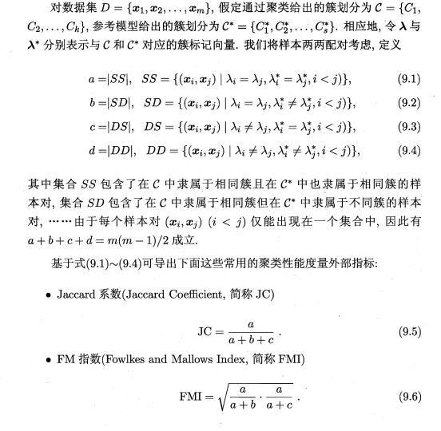
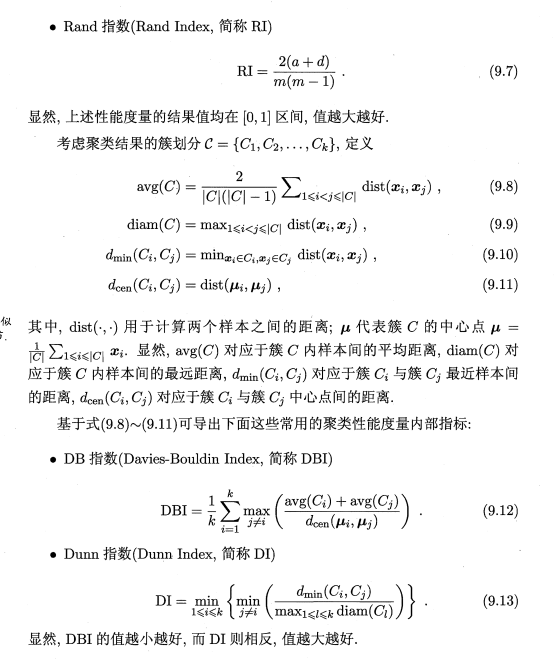
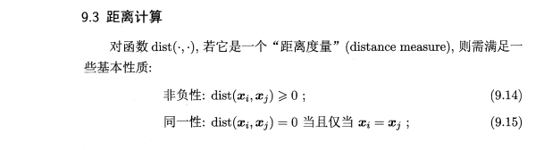
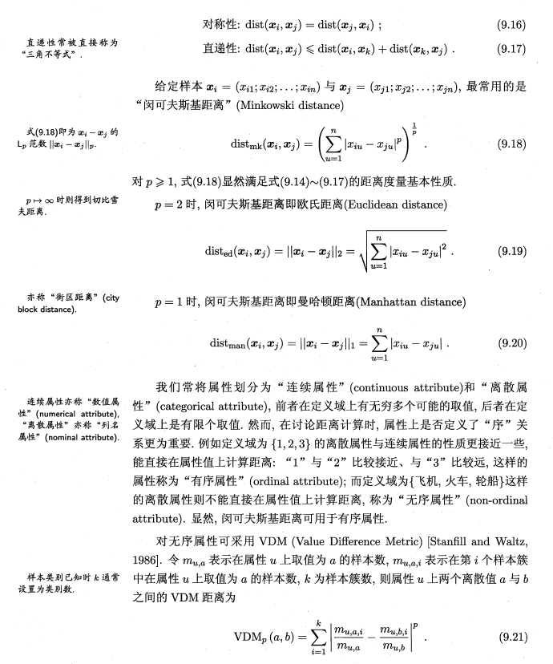
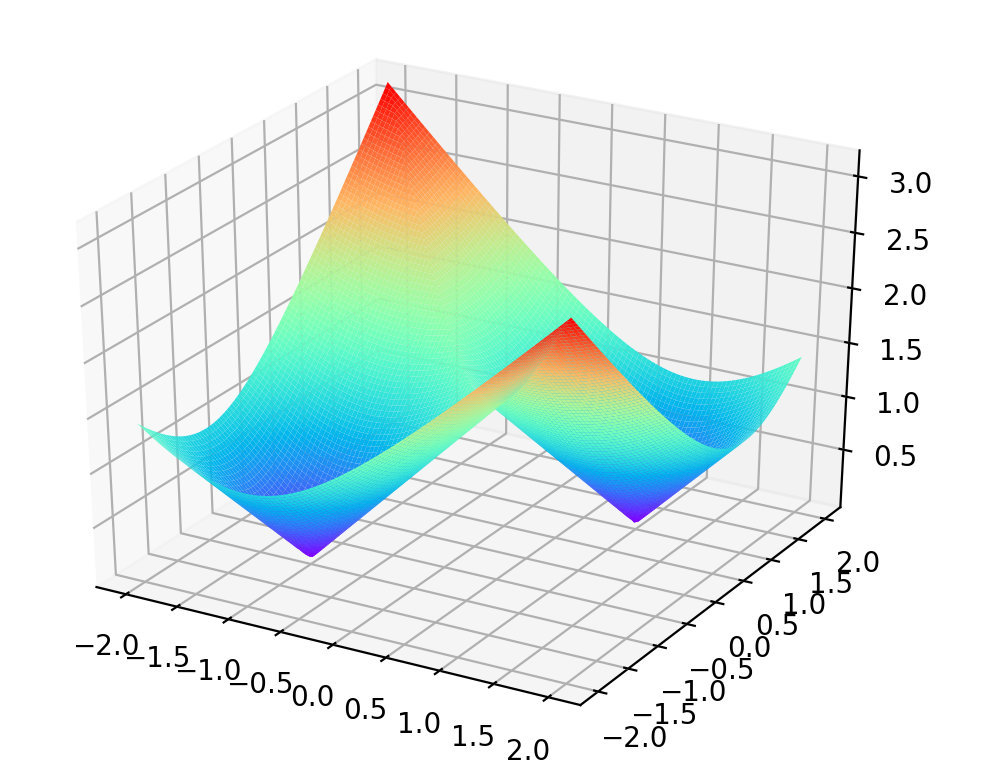
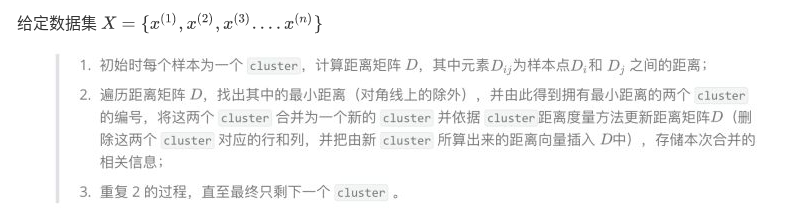
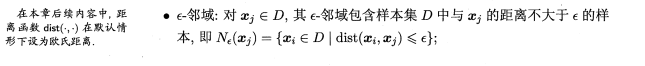
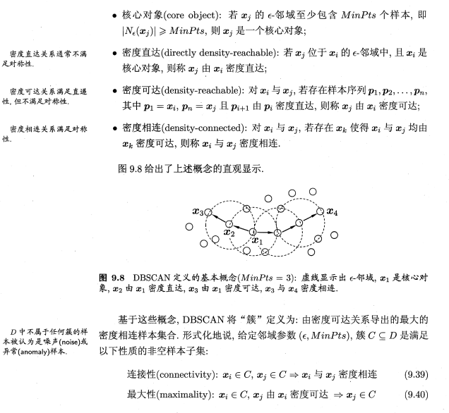
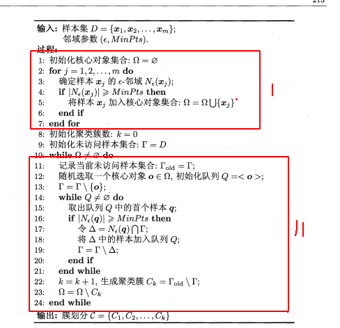
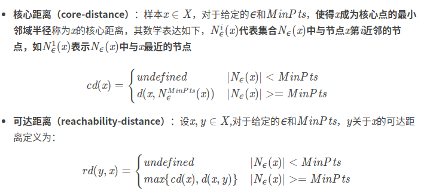

## 机器学习---聚类篇

### 1.聚类算法的概述:

聚类试图 将数据集中的样本划分为若干个通常是不相交的子集,每个子集对聚类算法而言,样本簇亦称"类"称为一个"簇" (cluster). 通过这样的划分,每个簇可能对应于一些潜在的概念(类别) , 

聚类既能作为一个单独过程,用于找寻数据内在的分布结构,也可作为分类等其他学习任务的前驱过程.例如,在一些商业应用中需对新用户的类型进行判别, {且定义"用户类型"对商家来说却可能不太容易,此时往往可先对用户数据进行聚类,根据聚类结果将每个簇定义为一个类,然后再基于这些类训练分类模型,用于判别新用户的类型.

训练的目标:

1.簇间的距离较大,簇内的距离较小

### 2.指标和距离公式的选择

 性能指标:簇内的相似度 和  簇间的相似度











### 3.常见聚类算法

#### 3.1聚类算法类别

| 类别                            | 典型算法                              | 算法的基本策略                                               |
| ------------------------------- | ------------------------------------- | ------------------------------------------------------------ |
| Partitioning approach           | K-means,k-medoids,CLARANS,PAM         | Construct various partitions and then evaluate them by come criterion |
| Hierarchical (层次) approach    | Diana,Agnes,BIRCH,ROCK,CAMELEON       | create a hierarchical decomposition of the set of data(or object) using some criterion |
| Density-based approach          | DBSACN,OPTICS, DenClue                | based on connectivity and density functions                  |
| Grid-based approach             | STING,WaveCluster,CLQUE               | based multiple-level granularity (多层次粒度)structure       |
| Model-based                     | EM,SOM,COBWEB                         | A model is hypothesized for each of the clusters and tries to find the best fit of that model to each other |
| Frequent pattern-based          | pCluster                              | based on the analysis of frequent patterns                   |
| used-guided or constraint-based | COD(obstacles),constrained clustering | cluster by considering user-specified or application-specifier constraints |
|                                 |                                       |                                                              |


### 4. Partition Algorithm

#### 4.1 k-means

##### 4.1.1算法的基本步骤:

```
1.创建k个点作为初始质点(经常是随机选取)
2.当任意一个点的簇分配结果发生变化时
			*对于每个数据集中的数据点
					#对于每个质点
							计算出质心与数据点之间的距离
					#将数据点分类到距离最近的簇 
3.对于每个簇,计算簇中的所有点的均值作为新的质心
4.重复上述操作,直至目标函数不再出现更优的结果
```

目标函数 : 假设![[公式]](https://www.zhihu.com/equation?tex=x_i%28i%3D1%2C2%2C%E2%80%A6%2Cn%29)是数据点，![[公式]](https://www.zhihu.com/equation?tex=%5Cmu_j%28j%3D1%2C2%2C%E2%80%A6%2Ck%29)是初始化的数据中心

​                                                        $min\sum_{i=1}^n min ||x_i -\mu_j||^2$

这个函数是非凸优化函数,会收敛于局部最优解

函数的曲线如下:[以k=2为例]



##### 4.1.2算法的基本评价

时间复杂度: $O(tkn)$ :t :迭代的次数,k表示类别的个数,n表示样本的数量

相比较     RAM :$O(k(n-k)^2)$                                       CLARA: $O(ks^2 +k(n-k)$

算法的复杂度比较低,不过很可能得到的是局部最优解(可以通过,模拟退火和 遗传算法 得到最优解)

缺点: 1. 只能适用于 中心值有意义的数据,不适用于categorical data

​			2.需要提前确定k值

​			3.因为会出现进入局部最优解的现象,所以会对噪音点,以及最初中心点的设置会很敏感

​			4. Not suitable to discover clusters with non-convex shapes

##### 4.1.3对于K-means 算法的改进

```
可以用 modes来代替均值,用其他方法取确定质点
更换其它衡量clusters相似性的标准,处理categorical object---目标函数
using  frequency-based method to update modes of cluster
a mixture of categorical 

```

#### 4.2 K-Medoids

Find representative object,called medoids ,in clusters

##### 4.2.1 PAM

PAM(Partitioning Around Medoids,1987)是作为K-medoids的基础算法,基本流程:

1. 首先随机选择k个对象作为中心

2. 把每个对象分配给离它最近的中心,然后随机地选择一个非中心交替替换中心对象

3. 计算分配后的距离改进量,进而得到改进的cost ,如果cost<0,即结果有改进,则进行交换

4. 直到目标函数不再有改进为止

   算法复杂度比较高,只适用于小数据集

##### 4.2.2 CLARA

它从数据集中抽取多个样本集, 对每个样本集使用PAM, 并以最好的聚类作为输出

###### **CLARA 算法的步骤:**

　　(1) for 　i = 1 to v (选样的次数) ,重复执行下列步骤( (2) ～ (4) ) :
　　(2) 随机地从整个数据库中抽取一个N(例如：(40 + 2 k))个对象的样本,调用PAM方法从样本中找出样本的k个最优的中心点。
　　(3)对于每个点,把它归类到距离它最近的点的簇
　　(4) 计算上一步中得到的聚类的总代价. 若该值小于当前的最小值,用该值替换当前的最小值,保留在这次选样中得到的k个代表对象作为到目前为止得到的最好的代表对象的集合.
　　(5) 返回到步骤(1) ,开始下一个循环.
　　算法结束后，输出最好的聚类结果

###### 优点: 

可以处理的数据集比 PAM大

###### 缺点:

1有效性依赖于样本集的大小

2 基于样本的好的聚类并不一定是整个数据集的好的聚类, 样本可能发生倾斜
　　例如, Oi是整个数据集上最佳的k个中心点之一, 但它不包含在样本中, CLARA将找不到最佳聚类

##### 4.2.3 CLARANS


##### focusing+spatial data structure

### 5.层次化聚类方法

一般来说分为两类:

- Agglomerative 层次聚类：又称自底向上（bottom-up）的层次聚类，每一个对象最开始都是一个 `cluster`，每次按一定的准则将最相近的两个 `cluster` 合并生成一个新的 `cluster`，如此往复，直至最终所有的对象都属于一个 `cluster`。这里主要关注此类算法。
- **Divisive 层次聚类**： 又称自顶向下（top-down）的层次聚类，最开始所有的对象均属于一个 `cluster`，每次按一定的准则将某个 `cluster` 划分为多个 `cluster`，如此往复，直至每个对象均是一个 `cluster`。

优点:1 .不需要提前确定k,但是需要一个停止条件

​			2.可以用树状结构来反映训练的过程,并且得到不同k情况下

的划分方案

缺点: 1

主要思想:

1. 每次找到距离最近的两个点作为一个簇

 					2. 把同一个簇的所有点看作一个点
    										3. 重复上述操作.....直到达到停止条件

#### 5.1 AGNES（Agglomerative Nesting)

sklearn  源码:

```
class sklearn.cluster.AgglomerativeClustering(n_clusters=2, affinity=’euclidean’, memory=None, connectivity=None, compute_full_tree=’auto’, linkage=’ward’, pooling_func=<function mean>)
```

算法的主要过程:

single linkage: 适用两个簇之间 距离最小的一对点的距离作为簇之间的



可以看到，该 算法的时间复杂度为 ![[公式]](https://www.zhihu.com/equation?tex=O%28n%5E3%29) （由于每次合并两个 `cluster` 时都要遍历大小为 ![[公式]](https://www.zhihu.com/equation?tex=O%28n%5E2%29+)的距离矩阵来搜索最小距离，而这样的操作需要进行 ![[公式]](https://www.zhihu.com/equation?tex=n%E2%88%921) 次），空间复杂度为![[公式]](https://www.zhihu.com/equation?tex=O%28n%5E2%29+) （由于要存储距离矩阵）


#### 5.2 DIANA

是AGNES算法的反过程,最后结果是每个样本都是属于一类


#### 5.3 BIRCH

链接:https://www.cnblogs.com/pinard/p/6179132.html

链接:https://zhuanlan.zhihu.com/p/22458092

##### 5.3.1 CF Tree动态建立的过程:

基本概念:

**CF（Clustering Feature）：**类簇总体信息三元组![[公式]](https://www.zhihu.com/equation?tex=%28N%2C+LS%2C+SS%29)，其中![[公式]](https://www.zhihu.com/equation?tex=N)是一个类簇中数据点个数，![[公式]](https://www.zhihu.com/equation?tex=LS)是类簇中所有数据点的加和值，即![[公式]](https://www.zhihu.com/equation?tex=%5Csum_%7Bi%3D1%7D%5E%7BN%7D%7B%5Cbar%7BX_%7Bi%7D%7D%7D+)，![[公式]](https://www.zhihu.com/equation?tex=SS)是类簇中所有数据点的平方和![[公式]](https://www.zhihu.com/equation?tex=%5Csum_%7Bi%3D1%7D%5E%7BN%7D%7B%5Cbar%7BX_%7Bi%7D%7D%5E2%7D+)，CF相当于对一个类簇的信息做了总结。

性质: 

**CF可加性定理**：

​				针对两个不相交的类簇，其CF向量分别为![[公式]](https://www.zhihu.com/equation?tex=CF_%7B1%7D%3D%28N_%7B1%7D%2C+LS_%7B1%7D%2C+SS_%7B1%7D%29)，![[公式]](https://www.zhihu.com/equation?tex=CF_%7B2%7D%3D%28N_%7B2%7D%2C+LS_%7B2%7D%2C+SS_%7B2%7D%29)，那么这两个不相交类簇合并后的CF向量为：![[公式]](https://www.zhihu.com/equation?tex=CF_%7B1%7D%2BCF_%7B2%7D%3D%28N_%7B1%7D%2BN_%7B2%7D%2C+LS_%7B1%7D%2BLS_%7B2%7D%2C+SS_%7B1%7D%2BSS_%7B2%7D%29)。这里的证明比较简单，就略去了。
在BRICH中，针对一个类簇，通常只保留其CF向量信息，这样做比较节省空间且高效，后续的聚类需要的计算只需要根据类簇的CF向量即可完成。
**CF Tree：**类似于B树的一颗高度平衡树，有三个参数：内部节点平衡因子B，叶节点平衡因子L，簇半径T。每个非叶子节点至多包含B个项，形式为![[公式]](https://www.zhihu.com/equation?tex=%5BCF_%7Bi%7D%2C+child_%7Bi%7D%5D)，其中![[公式]](https://www.zhihu.com/equation?tex=child_%7Bi%7D)是指向第i个子节点的指针。每个叶子节点至多包含L个项，且包含指向前后叶子节点的指针prev和next，其中的每一项代表一个类簇，且满足类簇直径小于T。树的结构如下图：


CF Tree会随着新的数据点的加入而动态的建立起来，其插入过程包含以下几步：
（1）从根节点开始，递归向下选择最近的孩子节点，这里最近的度量是根据前面提到的![[公式]](https://www.zhihu.com/equation?tex=D0%2C+D1%2C+D2%2C+D3%2C+D4)中任意一个确定；
（2）如果在（1）中找到了最近的叶子节点中的一个![[公式]](https://www.zhihu.com/equation?tex=L_%7Bt%7D)，检查其中最近的CF元组能否不超过阈值T吸收此数据点，若能，更新CF值；若不能，是否有空间（**这里每个节点能分配的空间有限，可参见下面的参数表**）添加新的元组，若能则添加新的元组，若不能，分裂距离最远的一对元组到两个叶子节点，作为初始的种子，将其他元组按距离最近原则重新分配到两个新的叶子节点上。
（3）从叶子节点向上回溯修改每个非叶子节点的CF值，若叶子节点发生分裂，则在父节点中增加相应的CF元组，同样，父节点也可能需要分裂，则持续分裂直至根节点，最终如果根节点发生分类，则树的高度需要加1。

算法的流程:


##### 5.3.3算法评价

优点:

1.节省内存 2.速度快 4可以识别噪音点

缺点:

1.结果依赖于数据点的插入顺序  

2.对于非球状的簇聚类效果非常不好 

3.对于高维数据簇类效果不好

4.局部性可能会导致聚类效果不佳

#### 5.4 ROCK

相似度的计算:**jaccard系数,余弦相似度**

> Jaccard 系数    定义为A与B交集的大小与A与B并集的大小的比值，值越大，相似度越高。


> 余弦相似度，是通过计算两个向量的夹角余弦值来评估他们的相似度。
> 值越接近1，就说明夹角角度越接近0°，也就是两个向量越相似，就叫做余弦相似


适用于类别型数据,核心思想是利用链接作为相似性的度量,而不仅仅是依赖于距离


clustering categorical data by neighbor and link analysis

#### 5.5 CHAMELEON

https://zhuanlan.zhihu.com/p/55896918

### 6. 基于密度的聚类算法


"密度聚类" 基于密度的聚类(density-based clustering),此类算法假设聚类结构能通过样本分布的紧密程度确定.通常情况下,从样本密度的角度来考察样本之间的可连接性,并基于**可连接样本**不断扩展聚类簇以获得最后的聚类结果


主要特点: 1. 可以处理任何形状的cluster

​					2.可以处理噪音

​					3.一次扫描

​					4.需要设置密度参数,作为终止条件

#### 6.1 DBSCAN

参考链接:https://www.cnblogs.com/pinard/p/6208966.html

​					机器学习--周志华

==一般建议:当数据比较稠密时,而且数据集不是凸的,那么用DBSCAN 会比 K-means聚类效果很好,如果聚类效果不是很好时,不建议用DBSCAN==

##### 6.1.1算法介绍

是基于一组"邻域"(neighborhood) 参数($\epsilon $  ,$MinPts$)来刻画样本分类的紧密程度,

$\epsilon$ 表示了 域的半径长度

$MinPts$ :成为核心点的最低密度标准

定义: 给定的数据集$D = \{ x_1,x_2...x_m \}$





所以想要找到满足连接性和最大性的簇的方法就是:如果 $x$ 为核心对象,由 $x$密度可达的所有样本组成的集合$X = \{  x^{'}  \in D | x_{'}由x密度可达 \}$ 即为满足要求的簇

##### 6.1.2算法的主要流程

I:寻找样本集中所有的核心对象

II:形成 满足连接性和最大性的所有核心对象



##### 6.1.3算法小结

　DBSCAN的主要优点有：

　　　1） 可以对任意形状的稠密数据集进行聚类，相对的，K-Means之类的聚类算法一般只适用于凸数据集。

　　　2） 可以在聚类的同时发现异常点，对数据集中的异常点不敏感。

　　　3） 聚类结果没有偏倚，相对的，K-Means之类的聚类算法初始值对聚类结果有很大影响。

  DBSCAN的主要缺点有：

　　　　1）如果样本集的密度不均匀、聚类间距差相差很大时，聚类质量较差，这时用DBSCAN聚类一般不适合。

　　　2） 如果样本集较大时，聚类收敛时间较长，此时可以对搜索最近邻时建立的$KD$树或者球树进行规模限制来改进。

　　　3） 调参相对于传统的K-Means之类的聚类算法稍复杂，主要需要对距离阈值ϵϵ，邻域样本数阈值$MinPts$联合调参，不同的参数组合对最后的聚类效果有较大影响。

#### 6.2 OPTICS

该算法是DBSCAN算法的改进(相关概念延续上面)

##### 6.2.1 定义



说明:如果当x为核心点时,

$$rd(y,x) =\begin{cases} d(x,y) \qquad 当y不是x邻域中的点\\ cd(x) \qquad 当y是邻域中的点时,为x的核心距离   \end{cases}$$


https://blog.csdn.net/LoveCarpenter/article/details/85049135

[https://bacterous.github.io/2018/01/06/OPTICS%E7%AE%97%E6%B3%95%E5%9F%BA%E7%A1%80/#%E5%AE%9A%E4%B9%89](https://bacterous.github.io/2018/01/06/OPTICS算法基础/#定义)


#### 6.3 DENCLUE

#### 6.4 CLIQUE

### 7.网格聚类法

1. STING (a STatistical INformation Grid approach) by Wang, Yang
   and Muntz (1997)

2. WaveCluster by Sheikholeslami, Chatterjee, and Zhang (VLDB’98)

   ​	A multi-resolution clustering approach using wavelet method

3. CLIQUE: Agrawal, et al. (SIGMOD’98)On high-dimensional data (thus put in the section of clustering high-dimensional data


### 参考链接🔗

https://zhuanlan.zhihu.com/p/104355127