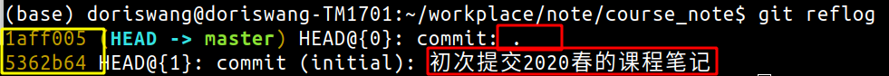
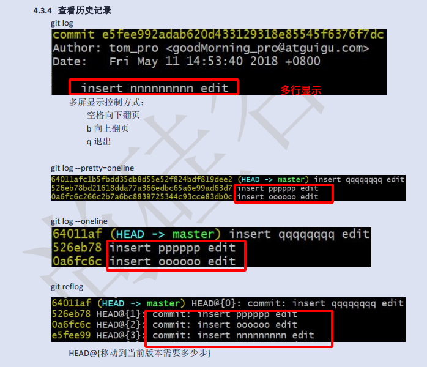
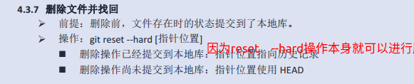

## git学习和博客搭建的相关资源

### 1. hexo搭建博客的相关参考博客

​	a.如何在本地库增加新的博客

[https://winney07.github.io/2018/08/02/%E5%9C%A8Hexo%E5%8D%9A%E5%AE%A2%E4%B8%AD%E5%8F%91%E5%B8%83%E6%96%87%E7%AB%A0/](https://winney07.github.io/2018/08/02/在Hexo博客中发布文章/)

 b.如何搭建博客

​	[http://www.wzqj.top/2019/02/26/linux%E4%B8%8B%E4%BD%BF%E7%94%A8-Github-Pages-Hexo-%E6%90%AD%E5%BB%BA%E4%B8%AA%E4%BA%BA%E5%8D%9A%E5%AE%A2/](http://www.wzqj.top/2019/02/26/linux下使用-Github-Pages-Hexo-搭建个人博客/)

https://segmentfault.com/a/1190000017986794


c.hexo的常见命令

[https://vel.life/Hexo-%E5%8D%9A%E6%96%87%E7%BC%96%E8%BE%91%E6%89%8B%E5%86%8C/](https://vel.life/Hexo-博文编辑手册/)

**托管中心**`维护远程库`

 - **内网：可以自己搭建一个GitLab服务器**
- **外网：可以使用码云、Github**

**版本控制工具**

- **集中式**：CSV ,**SVN**,VSS
- **分布式**：**Git**，Darcs,...

## Git命令行操作

### 1.1本地库初始化

`进入文件夹`

```
git init
注意：生成的 .git 目录中存放的是本地库相关文件，不要删除
```

### 1.2设置签名

- 项目(仓库)级别`仅在当前本地库有效`

  ```
  git config user.name tom  #设置用户名tom
  git config user.email liu@qq.com #设置用户邮箱
  ```

- 系统用户级别`仅在当前登录的操作系统用户有效`

  ```
  git config --global user.name tom
  git config --global user.email liu@qq.com
  ```

> 仅仅加了一个 `--global`
>
> 优先级别：`项目级别`  >  `系统级别`
>
> 信息保存位置：` ~/.gitconfig 文件 `   

### 1.3基本操作

#### 1.3.1 状态查看

```
git status   #查看工作区、暂存区状态
```

#### 1.3.2 添加

```
git add fileName  #指定文件
git add . #所有
说明：将工作区的文件添加到暂存区
```


```
git rm --cached filename
git rm /*
＃将filename对应的文件从缓存区撤回，但是文件仍保留在工作区，相当于是add的一个撤回操作　sudo权限
```


#### 1.3.3 提交

```
git commit -m 'commit message' fileName
说明：将暂存区内容提交到本地库,不需要再通过vim编辑提交的说明信息，没有提交信息，本次提交将无效
git commit *
说明：将暂存区中的所有内容都提交到本地库中
```

文件修改之后

1. 要先git add加到暂存区中，之后再添加到git commit
2. 或者直接使用 git -a commit filename 这时本次提交不能撤回(git rm /*)

#### 1.3.4 查看历史记录

```
git log #查看提交的日志，包括时间，提交的说明信息
git reflog  #常用
git log --greph #图形显示,更直观
git log --pretty=oneline #每行日志
git log --oneline #简洁显示
说明：HEAD@{移动到当前版本需要多少步}
```



哈希值＋指针移动量＋提交的说明信息

多屏控制的方式：

１．空格向下翻页　，ｂ向下翻页　，ｑ退出



#### 1.3.5 前进后退

- 基于索引值`推荐`

  ```
  git reset --hard 指针位置
  例子：git reset --hard a6ace91 #回到这个状态，a6ace91指的是日志的短的索引值
  ```

- 使用 **^** 符号`只能后退`

  ```
  git reset --hard HEAD^
  例子：git reset --hard HEAD^^
  注意：几个 ^ 表示后退几步
  ```

- 使用 **~** 符号`只能后退`

  ```
  git reset --hard HEAD~n
  例子：git reset --hard HEAD~3
  ```

#### 1.3.6 reset的三个参数比较

```
soft: 
  - 仅本地库移动HEAD 指针
mixed:
  - 在本地库移动HEAD指针
  - 重置暂存区
hard:
  - 在本地库移动HEAD指针
  - 重置暂存区－－及暂存区的文件也回到之前的版本
  - 重置工作区
```

#### 1.3.7　删除文件并找回

- **相当于建立一个快照，虽然删除了，但只要添加到暂存区，就能找回**

~~~
git reset --hard 指针位置
~~~



#### 1.3.8 文件差异比较

```
git diff 文件名 #将工作区中的文件与暂存区中的文件进行比较
git diff 哈希值 文件名  #将工作区中的文件和历史中的一个版本比较
git diff  #不带文件名，则比较多个文件
```

### 2.2 分支管理

`hot_fix` `master` `feature_x` `feature_y`

#### 2.2.1 什么是分支管理

- 在版本控制中，使用推进多个任务

#### 2.2.2 分支的好处

- 同时并行推进多个功能开发，提高开发效率
- 某一分支开发失败，不会对其它分支有任何影响

#### 2.2.3 分支操作

- 创建分支

~~~
git branch 分支名
~~~

- 查看分支

~~~
git branch
git branch -v 
~~~

- 切换分支

~~~
git checkout 分支名
git checkout -b 分支名   #创建分支并直接切换到该分支
~~~

- 合并分支`相当于把修改了的文件拉过来`

~~~
git merge xxx
注意：合并分支的时候要明确谁谁合并
	我在a分支里面修改了。要合并到master，就先切换到master，然后合并b
~~~

- 删除分支

~~~
git branch -d 分支名
~~~


#### 2.2.4 解决冲突

- 冲突的表现
- 冲突的解决
  - 第一步：编辑，删除特殊标记`<<<` `===`
  - 第二步：修改到满意位置，保存退出
  - 第三步：添加到缓存区  `git  add 文件名`
  - 第四步：提交到本地库`git commit -m '日志信息' `  `注意：后面一定不能带文件名`

## Git 结合Github

`别分手`  `别名 分支名`

#### 1.1 创建远程库地址别名

~~~
git remote -v  #查看远程地址别名
git remote add 别名 远程地址 
例子：git remote add origin https://xx
~~~

#### 1.2 推送

`开发修改完把本地库的文件推送到远程仓库` `前提是提交到了本地库才可以推送`

~~~
git push 远程库别名 分支名
git push -u 远程库别名 分支名    #-u指定默认主机
例子：git push origin master
~~~

#### 1.3 克隆

`完整的把远程库克隆到本地`  `克隆下来后不要在主分支里面做开发` `clone进行一次，从无到有的过程，更新用pull`

~~~
git clone  远程地址
例子：git clone https://xx
~~~

#### 1.4 拉取

  `本地存在clone下来的文件  就用pull更新`  

```
pull = fetch + merge
	git fetch 别名 分支名
	git merge 别名 分支名
git pull 别名 分支名
```

#### 1.5 解决冲突

`注意：解决冲突后的提交是不能带文件名的`

`如果不是基于远程库最新版做的修改不能推送，必须先pull下来安装冲突办法解决`

#### 1.6 rebase

`提交记录简洁不分叉`  `没学懂，感觉有点鸡肋` `混眼熟`

```
git rebase -i 索引号
git rebase -i HEAD~3  #合并最近三条记录
说明：在vim编辑里面改成s
```

#### 1.7 beyond compare 

`用软件解决冲突` 

 ```
1.安装 ：
	beyond compare 
2.配置：
    git config --local merge.tool bc3  #合并名称
    git config --local mergetool.path '/usr/local/bin/bcomp' #软件路径
    git config --local mergetool.keepBackup false  #False不用保存备份
3.应用：
	git mergetool
说明：--local指只在当前操作系统有效
 ```

#### 1.8 跨团队合作

`代码review之后合并`

- **适用于个人**

  **邀请成员**:`Settings` --> `Collaborators` -->`填写用户名` -->`打开链接接受邀请`

- **企业**   `创建一个组织` `方便管理`

- **review**

  `组织做review`  `通过Pull request`

- **给开源社区共享代码**

  `点击别人仓库的fork 到自己的仓库`   -- > `然后clone下来 修改后推送到远程库`  --> `点击Pull Request请求` --> `Create pull request发消息`

#### 1.9 Tag标签

`为了清晰的版本管理，公司一般不会直接使用commit提交`

```
git tag -a v1.0 -m '版本介绍'   #创建本地tag信息
git tag -d v1.0    		#删除tag
git push origin --tags   #将本地tag信息推送到远程库
git pull origin --tags    #拉取到本地

git checkout v.10    #切换tag
git clone -b v0.1 地址   #指定tag下载代码
```


#### 1.10 SSH 免密登录

- 输入:`ssh-keygen -t rsa -C GitHub邮箱地址`  
- 进入`.ssh`目录，复制`id_rsa.pub`文件内容
- 登录GitHub。`Settings`  --> `SSH and GPG keys ` --> `New SSH Key    `
- 回到git通过ssh地址创建。`git remote add 别名 SSH地址  `

## Git工作流

#### 1.1 概念

```
在项目开发过程中使用Git的方式
```

#### 1.2 分类

##### 1.2.1 集中式工作流

```
像SVN一样，集中式工作流有一个中央仓库，所有的修改都提交到了Master分支上
```

##### 1.2.2 GitFlow工作流 `*`

主干分支`master`  开发分支`develop`  修复分支`hotfix`   预发布分支`release`  功能分支`feature`

```
GitFlow 有独立的分支，让发布迭代过程更流畅。
```

##### 1.2.3 Forking 工作流    

```
在 GitFlow 基础上， 充分利用了 Git 的 Fork 和 pull request 的功能以达到代码审核的目的。 
安全可靠地管理大团队的开发者
```

