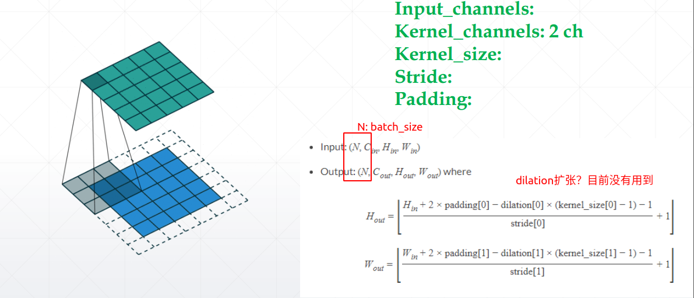
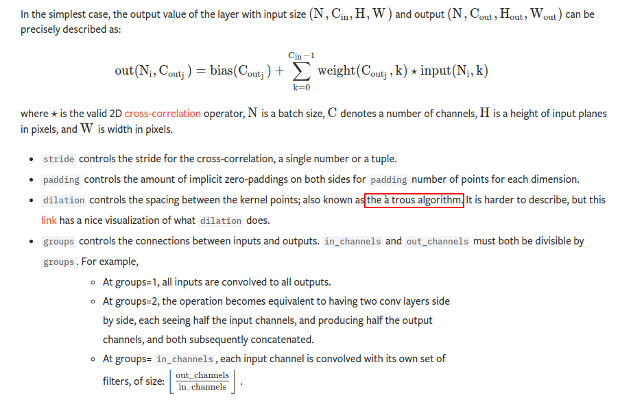
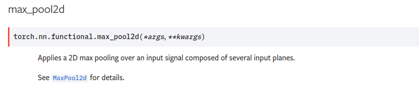
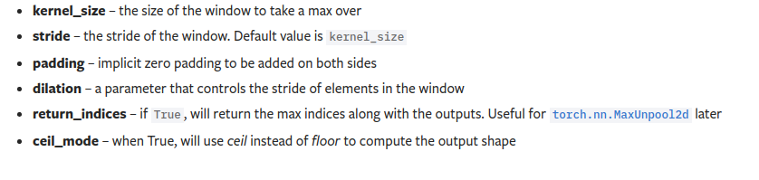
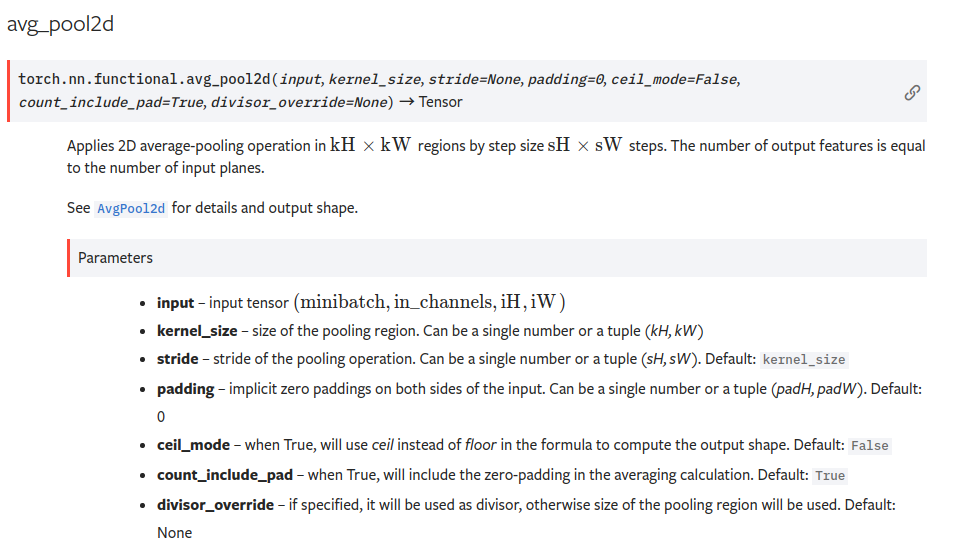
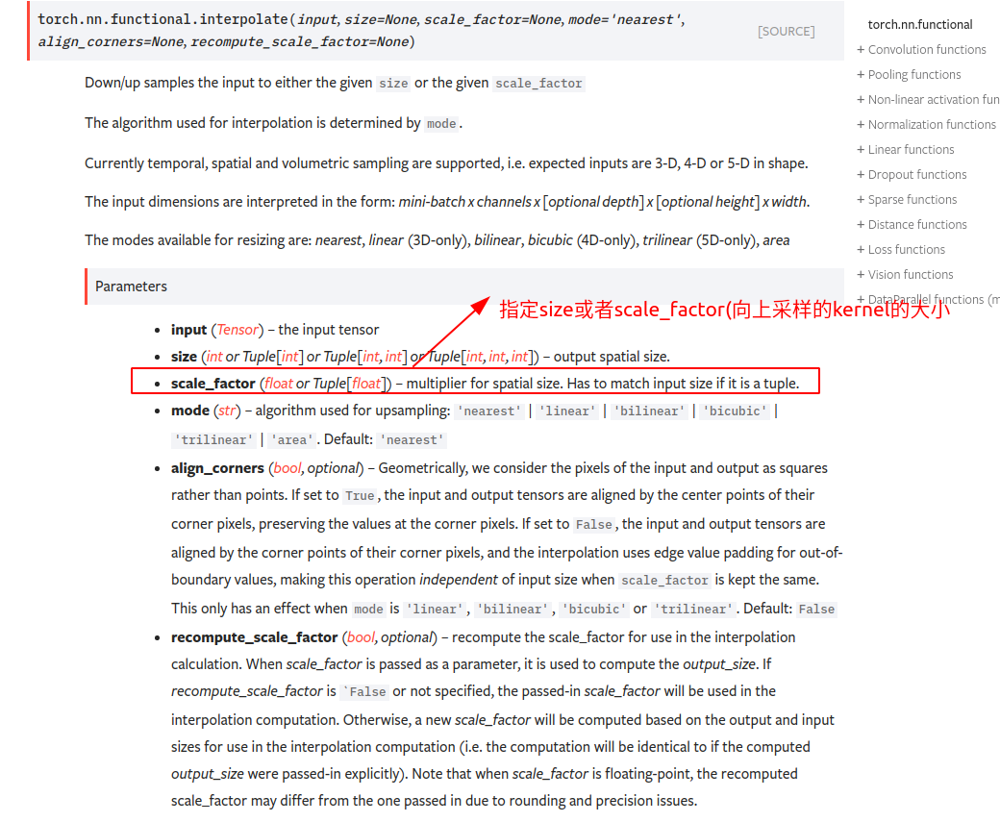
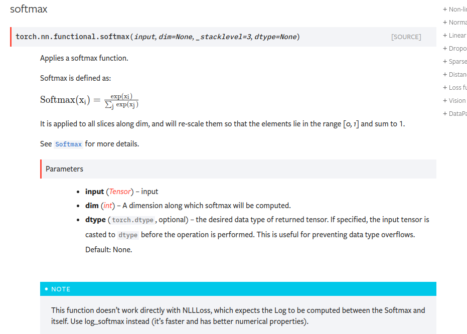
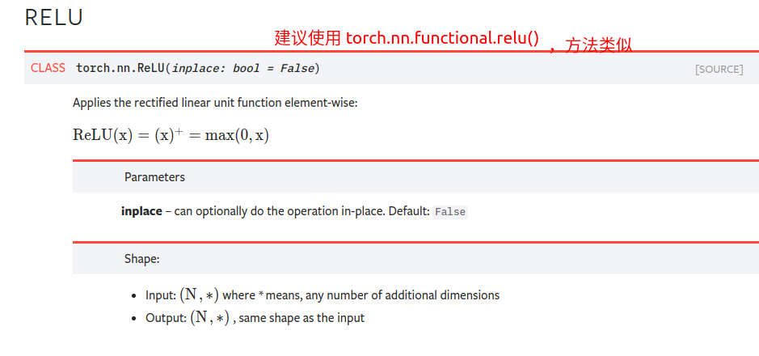
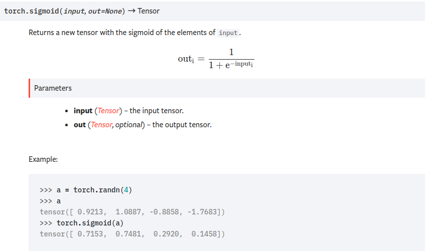

# 卷积神经网络

**本文罗列一些简单的api**

[api官方文档连接](https://pytorch.org/docs/stable/nn.functional.html?highlight=interpolate#)

首先先补一个知识点：关于torch.nn.Xxxx 和 torch.nn.functional.xxx的 api的区别和使用建议

推荐博客： https://www.zhihu.com/question/66782101/answer/579393790

结论：

```
PyTorch官方推荐：具有学习参数的（例如，conv2d, linear, batch_norm)采用nn.Xxx方式，没有学习参数的（例如，maxpool, loss func, activation func）等根据个人选择使用nn.functional.xxx或者nn.Xxx方式。但关于dropout，个人强烈推荐使用nn.Xxx方式，因为一般情况下只有训练阶段才进行dropout，在eval阶段都不会进行dropout。使用nn.Xxx方式定义dropout，在调用model.eval()之后，model中所有的dropout layer都关闭，但以nn.function.dropout方式定义dropout，在调用model.eval()之后并不能关闭dropout。

作者：有糖吃可好
链接：https://www.zhihu.com/question/66782101/answer/579393790
来源：知乎
著作权归作者所有。商业转载请联系作者获得授权，非商业转载请注明出处。
```


## 卷积



### api介绍（2维卷积）

```python
torch.nn.Conv2d(
     in_channels: int,
    out_channels: int,
    kernel_size: Union[T, Tuple[T, T]], 
    stride: Union[T, Tuple[T, T]] = 1, 
    padding: Union[T, Tuple[T, T]] = 0,
    dilation: Union[T, Tuple[T, T]] = 1,# atrous算法
    groups: int = 1,
    bias: bool = True, 
    padding_mode: str = 'zeros')
```



### 实例代码

```python
import torch
import torch.functional as F
import torch.nn as nn
#conv

conv = nn.Conv2d(3,5,kernel_size=3,stride =1,padding=0)#5个 3×（3×3）size=3,channel=3卷积核
x = torch.rand(1,3,28,28)#表示一张尺寸为28×28的rgb图像

#forward()
out = conv.forward(x)
print(out.shape)
#torch.Size([1, 5, 26, 26]);一张 channels = 5，size=26*26的image
# weigth && bias
print(conv.weight.shape)#这个就是kernel,卷积核
print(conv.bias.shape)

```

## pooling

使用 `F.avg_pool2d`，`F.max_pool2d`








## upsampling

`F.interpolate`




#### 实例代码

```python
import torch
import torch.nn.functional as F
import torch.nn as nn

conv = nn.Conv2d(3,5,kernel_size=3,stride =1,padding=0)#5个 3×（3×3）size=3,channel=3卷积核
x = torch.rand(1,3,28,28)#表示一张尺寸为28×28的rgb图像
out_c= conv.forward(x)
print(out_c.shape)
# layer =
# out_p = F.avg_pool2d(x,5,stride=2)
out_p = F.max_pool2d(x,5,stride=2)

print(out_p.shape)

out_up = F.interpolate(out_p,scale_factor=2,mode='nearest')
#scale_factor指出了上采样的尺寸
print(out_up.shape)

out_final  = torch.sigmoid(out_up)
print(out_final.shape)

'''

torch.Size([1, 5, 26, 26])

torch.Size([1, 3, 12, 12])

torch.Size([1, 3, 24, 24])

torch.Size([1, 3, 24, 24])

'''
```


### BatchNorm操作

```python
x = torch.rand(100,16,28,28)#表示一张尺寸为28×28的rgb图像
x = x.view(100,16,28*28)
print(x.shape)
#batch_norminize是针对每个通道进行计算的, input [batch_size ,channel, W*H] ,计算出每个channel上的均值和方差
layer = nn.BatchNorm1d(16) #指出channel size
out = layer(x) #进行norm操作
###可以查看参数
print(layer.running_mean.shape)#计算得到的每个channel上的均值
print(layer.running_var.shape)#计算得到每个channel上的方差
print(layer.weight)#在单个channel上线性变换的w,在baclkword过程中需要训练的参数
print(layer.bias)#

'''
torch.Size([100, 16, 784])
torch.Size([16])
torch.Size([16])
'''
```


## 常见的激活函数等

#### **`torch.nn.functional.softmax( input, dim= None)`**



#### **`torch.nn.functional.relu(input, inplace = False )`**



#### **`torch.nn.functional.sigmoid()`**




