---

title: pytorch基础语法
date: 2020-08-23 12:16:28
tags:	[pytorch , 大创]
categories: [深度学习,pytorch]
---

## 1 基本数据类型

### 1.1 python中数据类型与torch中数据类型的对比

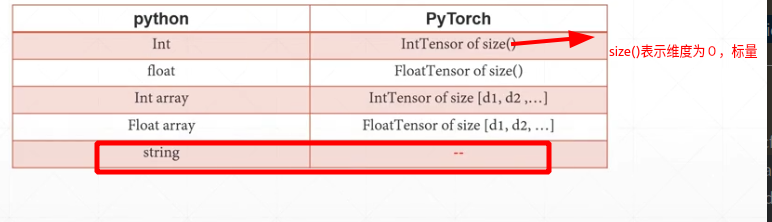

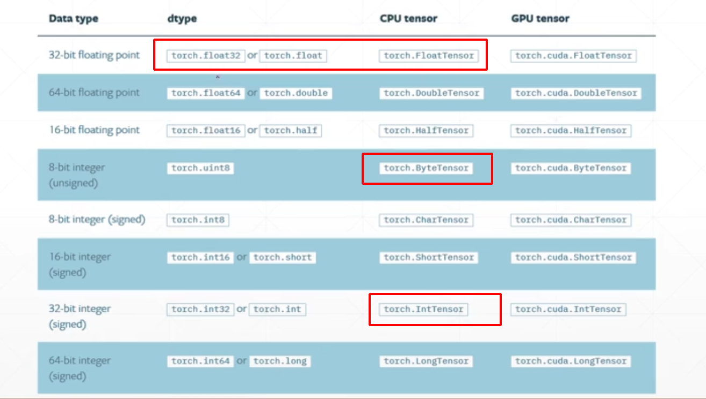

《下图中常用的数据类型使用红色方框表示出来》

### 1.2 pytorch中String的表示方法

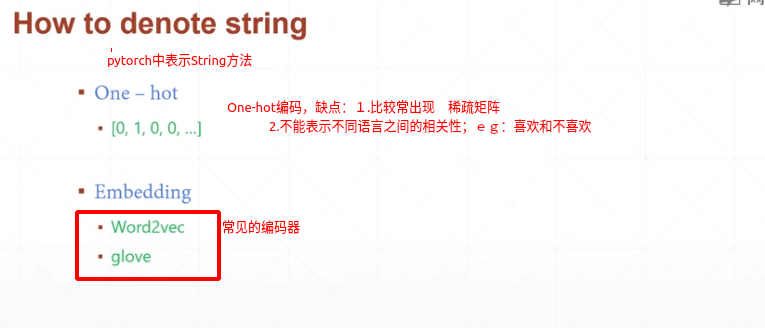

### 1.3　pytorch中CPU和GPU数据类型的区别

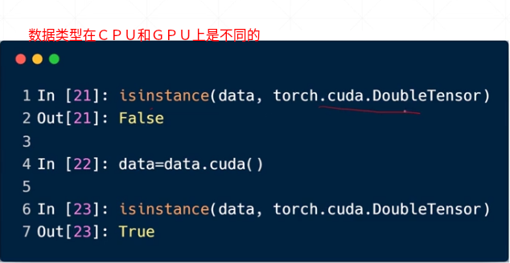


如果在GPU上面，则需要将其数据类型转换:
方法：``data=data.cuda()`　，调用此函数会返回一个ＧＰＵ上的一个应用

### 1.4 torch中数据类型的判断

```python
import torch
# torch中的数据类型
a = torch.rand(2,3)#随机初始化一个两行三列的数据
print(a.type()) #查看数据类型
print(type(a))
print(isinstance(a,torch.FloatTensor)) #数据类型合法性检验
print(isinstance(a,torch.IntTensor))

'''
output:
torch.FloatTensor
<class 'torch.Tensor'>
True
False
'''
```

### 1.5 Tensor的形状

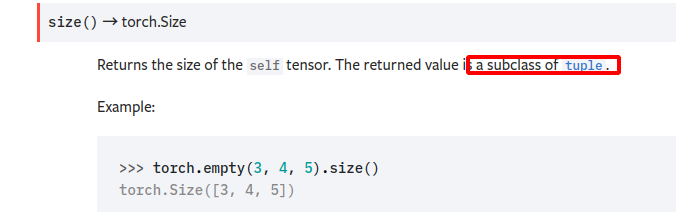

`data.shape`, `data.size()`,`data.dim()`,`data.numel()`

```python
# dim =  size(data.shape) ,表示数据的深度／维度
# size=shape，表示数据的形状，记录每一维度的长度
# numel:表示tensor占用内存的长度
d4 = torch.FloatTensor(2,3)
print(d4.size())
print(d4.shape)
print(d4.dim())
print(d4.size(0)) #可以进行索引，某维度的长度，为了更好地与python进行交互，一般直接将size和shape转换成list
print(d4.size(1))

'''
output:

torch.Size([2, 3])
torch.Size([2, 3])
2
2
3
'''
```

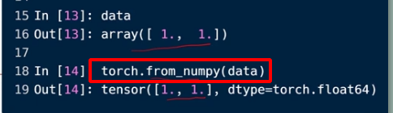

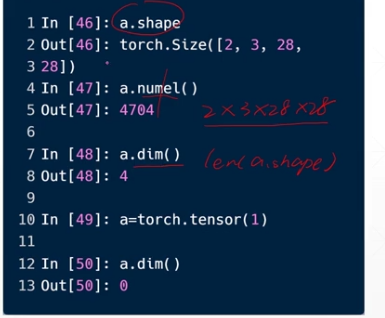

### 1.6 Dim 0的数据

```python
a=torch.tensor(1.0)
print(a.shape) #1.0/tensor(1.)是0维的是标量，但是[1.]是１维长度为１的Tensor
                			#标量的应用：计算的loss函数都是标量
print(len(a.shape))
print(a.size())
print(torch.tensor(2))

'''
output:
torch.Size([]),这里表示size中的‘list'长度为０
0
torch.Size([])
tensor(2)

'''
```

标量的用途：　1.常见是在计算loss函数的结果是用标量表示的


### 1.7 Dim 1的数据

常用于  1. Bias: wx+b 中的 b		 2. Linear Input 例如，手写数字识别中的28*28 可以看作长度为784的一维数据

```python
##Dim 1/ rank 1
#其实在tensor 0.3 之前没有dim=0的Tensor，实际上维度为１，size=1的数即可表示标量,不过0.4之后把他们区分开了

a1=torch.tensor([1.1])#dim=1,size=1
a2=torch.tensor([1.1,2.2]) # dim=1,size=2

a3=torch.FloatTensor(1) #这里的参数指定的是Dim１的长度，随机初始化
print(a1.size())
print(a2.size())
print(a3.shape)

'''
torch.Size([1])
torch.Size([2])
torch.Size([1])
'''
```

### 1.8 Dim２的数据

常用场景：　1. Linear Input batch [ batch_size , features_num]

a=torch.tensor([4,784])
其中4是指数据图片的数目，而784是指每一张图片的特征维度
适用于普通的机器学习数据

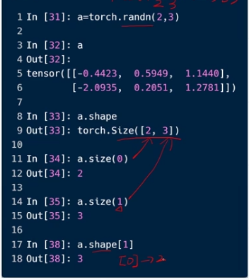


### 1.9 Dim 3的数据

**RNN Input Batch**　[batch_size, sentence_num, word_one_sentence]

例如，对于RNN神经网络进行语音识别与处理时[10,20,100]表示:每个单词包含100个特征，一句话一共有10个单词，而每次输20句话

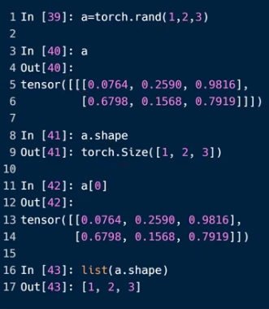


### 1.10 Dim 4 的数据

**CNN input Batch** [batch_size, channel_num, height, weight ]　

通道数，图片的高度，图片的宽度

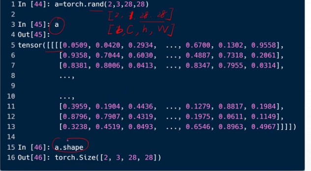

## 2.创建Tensor

### 1. Import from numpy

```python
import numpy as np
a = np.array([2,3.3]) # 数据实际是double类型
print(torch.from_numpy(a))

a = np.ones([2,3])
print(torch.from_numpy(a))

'''
tensor([2.0000, 3.3000], dtype=torch.float64)

tensor([[1., 1., 1.],
        [1., 1., 1.]], dtype=torch.float64)

'''
```


### 2. Import from list

**关于参数传递的小问题**

```
Tensor / FloatTensor /IntTensor　等既可以传递数值型，也可以传递shape相关的类型的数据
tensor只能传递数据list作为参数
```


```python
a = torch.tensor([2.,3.2])
b = torch.tensor([[2.,2.3],[1.,2.34]])
print(a)
print(b)
a2 = torch.FloatTensor([2.,3.2])##不建议用该方法，tensor可以 代替
a3 = torch.FloatTensor(2,3,4) #建议传递参数为shape参数
print(a2)
print(a3)

'''        
tensor([2.0000, 3.2000])

tensor([[2.0000, 2.3000],
        [1.0000, 2.3400]])
        
tensor([2.0000, 3.2000])

tensor([[[ 2.0281e+15,  4.5682e-41,  2.5162e-26,  4.5682e-41],
         [ 2.0260e+15,  4.5682e-41,  2.5162e-26,  4.5682e-41],
         [ 2.0260e+15,  4.5682e-41,  2.5157e-26,  4.5682e-41]],

        [[ 2.0284e+15,  4.5682e-41,  2.6360e-26,  4.5682e-41],
         [ 3.6957e+15,  4.5682e-41,  2.6361e-26,  4.5682e-41],
         [ 2.0284e+15,  4.5682e-41, -2.9008e+29,  3.0639e-41]]])
'''
```

### 3. 未初始化的数据

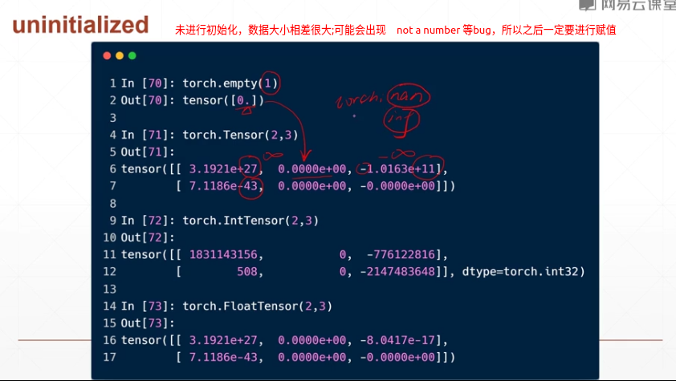


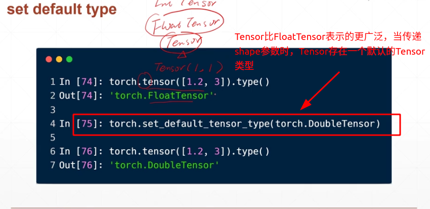


### 4.随机初始化

```
#相关函数
torch.rand(Tensor.shape)　#生成一个[0,1)之间的随机数
torch.randlike(Tensor tt)

torch.randint(  int low , int high , [d1,d2....])#均匀采样，只采整数值
torch.randint_like(Tensor tt ,int low, int high) 
```

代码

```python
a= torch.rand(3,3)
print(a)

# a1 = torch.rand()

b = torch.rand_like(a)#会生成与ａ尺寸大小相同的随机数的tensor
print(b)
c = torch.randint(1,99,[3,3])
print(c)
d = torch.randint_like(c,1,10) #使用randint一定要指出数据范围
print(d)

'''
tensor([[0.9843, 0.0908, 0.6296],
        [0.5270, 0.4654, 0.3570],
        [0.9419, 0.1018, 0.1724]])
        
tensor([[0.3775, 0.3013, 0.3237],
        [0.6003, 0.1313, 0.1082],
        [0.7574, 0.4202, 0.0610]])
        
tensor([[20, 93, 85],
        [20, 81, 95],
        [22, 10, 88]])
        
        
tensor([[8, 9, 8],
        [2, 7, 4],
        [1, 4, 9]])
'''
```

### 5.生成正态分布

```python
#相关函数说明
tensor.normal(mean,std,*,generator=None,out = None) ->Tensor
#参数说明:该方法只能生成一维,需要进行形状变换

#1. mean, std可以都为tensor，此时可以为每个元素指定分布来源
#2. mean,std可以一个为float/tensor，此时最后生成的Tensor的尺寸mean/std(数据类型为tensor)决定，此时所有数据共享均值或者方差
#3. mean,std都为float时，要求指明参数，此时所有数据都来源一个分布

tensor,randn(*size , out = None, dtype = None,....)#参数列表没有列全
#从平均值为0，方差为1的正态分布中返回一个填充有随机数的张量（也称为标准正态分布
```


```python
a1 = torch.randn(2,3)
#从平均值为0，方差为1的正态分布中返回一个填充有随机数的张量，形状由参数决定（也称为标准正态分布）

print(a1)

#关于torch.normal：比较灵活，掌握一种方式就行
#方式１：保证mean和std的尺寸相同
a = torch.normal( mean = torch.arange(1.,11.),std = torch.arange(1,0,-0.1))
print(a)
#方式２：
b = torch.normal(mean = torch.full([10],0),std = 0.5) #这种方式也是可以实现所有数据来自一个分布
print(b)
c = torch.normal(mean = 10, std = torch.arange(5,0,-0.5))
print(c)
#方式３
d = torch.normal(10,0.1,size=(2,3))
print(d)

'''
tensor([[-0.6377,  0.0554, -0.7616],
        [ 0.1244, -0.1076,  0.2659]])
        
tensor([-1.5609,  0.1449,  2.7791,  3.4830,  4.6098,  5.9147,  7.2475,  8.0593,
         9.3134, 10.0676])
         
tensor([ 0.8977, -0.6111, -0.2214, -0.0326,  0.4336, -0.2131, -0.0297, -0.0359,
         0.0294, -0.3355])
         
tensor([11.8549, 12.7589, 13.7979, 12.9034,  8.1115, 15.1006, 13.7763, 12.9549,10.0838, 10.1662])

tensor([[10.0064,  9.8803,  9.9584],
        [10.1267, 10.2988,  9.8402]])
'''

```


### 6.生成元素相同的tensor

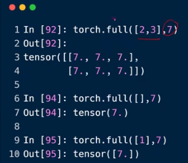


### 7.生成等差数列的tensor

```python
#相关函数说明
torch.arange( start ,end , offset )
#torch.range(start,end, offset) #闭区间
torch.linspace(start, end, steps=100)
'''
Return 
start (float) – the starting value for the set of points

end (float) – the ending value for the set of points

steps (int) – number of points to sample between start and end. Default: 100.
'''

torch.logspace(torch.logspace(start, end, steps=100, base=10.0, out=None, dtype=None, layout=torch.strided, device=None, requires_grad=False) → Tensor
               
 '''  
    Returns a one-dimensional tensor of steps points logarithmically spaced with base base between base^{start}  and  base^{end}
'''

```

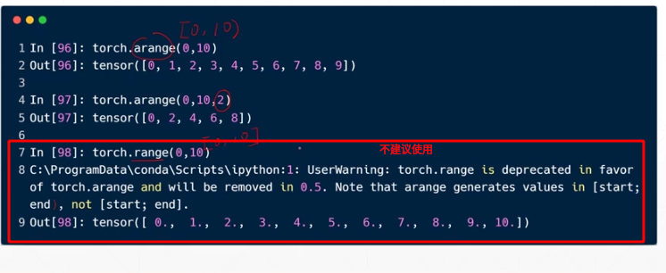


???=＝如何设置base==

### 8.其他生成函数(Ones, zeros,eye)

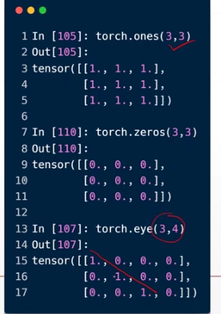

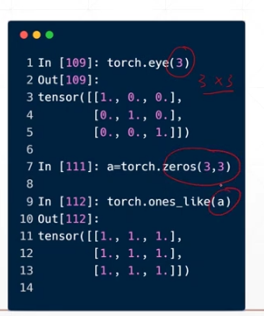

### 9.randperm(random.shuffle)

??

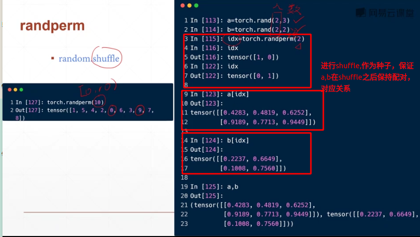

