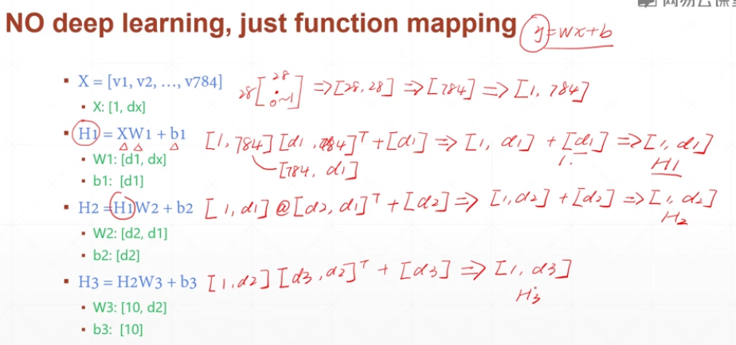
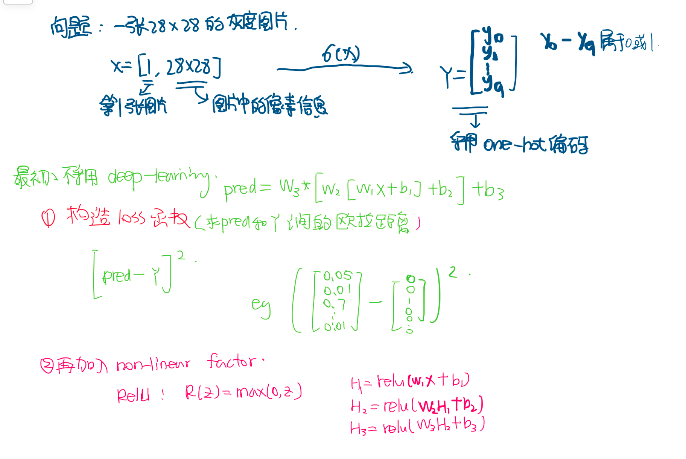
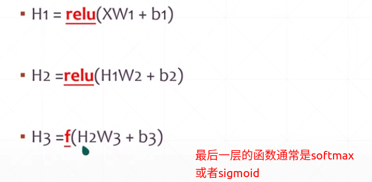

## 手写数字识别

**MNIST　数据集**

由不同风格的手写数字组成(0-9)

每个数字都有7000张，每张图片都是28*28的灰度图片

训练时：将训练集和测试集分为60k Vs 10k


### 1. No deeping learning 

X:[1....28*28]

每个点都是０－１，表示该像素点的灰度值

关键点：参数的维度定义，以及每层转换的含义








2.代码实现

```python
#-*-encodng: utf-8-*-
'''
@File: minist.py.py
@Contact: 2257925767@qq.com
@Author:wangyu
@Version:

@Desciption:
        手写数字识别的核心代码

        还存在一些问题没有解决－－－自己得到的数据比老师的代码迭代的次数要少很多
    env: 
        pytorch 1.3.1
@DateTime: 2020/8/22下午5:04 
'''

import torch
from torch import nn
from torch.nn import functional as F #常见的激活函数

from torch import optim

import torchvision

from matplotlib import pyplot as plt

from util import plot_image, plot_curve, one_hot

# step1 . load dataset,采用向量并行

batch_size = 512

train_loader = torch.utils.data.DataLoader(
    torchvision.datasets.MNIST("mnist_data",train=True,download=True,
                               transform= torchvision.transforms.Compose([torchvision.transforms.ToTensor(),#将numby格式数据转成pytorch
                                                                            torchvision.transforms.Normalize(
                                                                                (0.1307,),(0.3081,)), #对像素点的灰度值进行正则化，会提高优化效率
                                                                          ])),batch_size = batch_size,shuffle = True)#随机打散

test_loader = torch.utils.data.DataLoader(
    torchvision.datasets.MNIST("mnist_data/",train=False,download=True,
                               transform= torchvision.transforms.Compose([torchvision.transforms.ToTensor(),#将numby格式数据转成pytorch
                                                                            torchvision.transforms.Normalize(
                                                                                (0.1307,),(0.3081,)), #对像素点的灰度值进行正则化，会提高优化效率
                                                                          ])),batch_size = batch_size,shuffle = False)#随机打散


x,y = next(iter(train_loader))
print(x.shape,y.shape,x.min(),x.max())
plot_image(x,y,'image_test') #检查数据集

class Net(nn.Module):

    def __init__(self):#初始化函数:搭建网络结构
        super(Net,self).__init__()

        #wx+b
        self.fc1 = nn.Linear(28*28,256)
        self.fc2 = nn.Linear(256,64)
        self.fc3 = nn.Linear(64,10)#28*28 => 256 =>64这个是随机确定的,最后一层的输出是由分类的种类数决定的

    def forward(self,x):#网络的计算过程
        # x :[batch_size,1,28,28] 1:表示只有一个通道

        #h1= relu(xw1+b1)
        x = F.relu(self.fc1(x))
        #h1=relu(h1w2+b2)
        x=F.relu(self.fc2(x))
        #h3=h2w3+b3 --这里没有使用激活函数，只是简单输出
        x=self.fc3(x)

        return x

net = Net()#实例化一个net

#定义优化器
optimizer = optim.SGD(net.parameters(),lr=0.01,momentum=0.9)

train_loss=[]

for epoch in range(3):
    for batch_idx , (x,y) in enumerate(train_loader): #迭代一次数据集

#1.调整数据的尺寸，构建网络，通过网络计算预测值

        #x: [b,1,28,28], y:[512]
        # [b,1,28,28] => [b,784]
        x =x.view(x.size(0),28*28) #size[0]表示batch_size
        #=>[b,10]
        out = net(x) #经过网络计算出来的值
        y_onehot = one_hot(y)

#2.定义梯度
        #loss = mse_loss(out,y_onehot) 欧式距离
        loss = F.mse_loss(out,y_onehot)
#3.梯度清０
        optimizer.zero_grad()

#4.梯度计算过程
        loss.backward()

#5.参数更新
        #w'= w-lr*grad
        optimizer.step()

        train_loss.append(loss.item())#loss: tensor => numpy

        if batch_idx % 10 == 0:
            print(epoch,batch_idx,loss.item())

plot_curve(train_loss)

#get optimal[w1,b2,w2,b2,w3,b3]

total_correct = 0
for x,y in test_loader:
    x = x.view(x.size(0),28*28)
    out = net(x)
    #out = net(x)
    pred = out.argmax(dim=1)

    correct = pred.eq(y).sum().float().item()
    total_correct+= correct

total_num = len(test_loader.dataset)
acc=total_correct/total_num
print('test acc:',acc)

x,y = next(iter(test_loader))
out = net(x.view(x.size(0),28*28))
pred = out.argmax(dim=1)
plot_image(x,pred,'test')


```


```python
#-*-encodng: utf-8-*-
'''
@File: util.py.py
@Contact: 2257925767@qq.com
@Author:wangyu
@Version:
        手写数字识别的工具文件
@Desciption:
    env: 

@DateTime: 2020/8/22下午5:04 
'''

import  torch
from    matplotlib import pyplot as plt


def plot_curve(data):#计算训练曲线
    fig = plt.figure()
    plt.plot(range(len(data)), data, color='blue')
    plt.legend(['value'], loc='upper right')
    plt.xlabel('step')
    plt.ylabel('value')
    plt.show()


def plot_image(img, label, name):#展现出识别结果

    fig = plt.figure()
    for i in range(6):
        plt.subplot(2, 3, i + 1)
        plt.tight_layout()
        plt.imshow(img[i][0]*0.3081+0.1307, cmap='gray', interpolation='none')
        plt.title("{}: {}".format(name, label[i].item()))
        plt.xticks([])
        plt.yticks([])
    plt.show()


def one_hot(label, depth=10):#完成one-hot编码
    out = torch.zeros(label.size(0), depth)
    idx = torch.LongTensor(label).view(-1, 1)
    out.scatter_(dim=1, index=idx, value=1)
    return out
```

