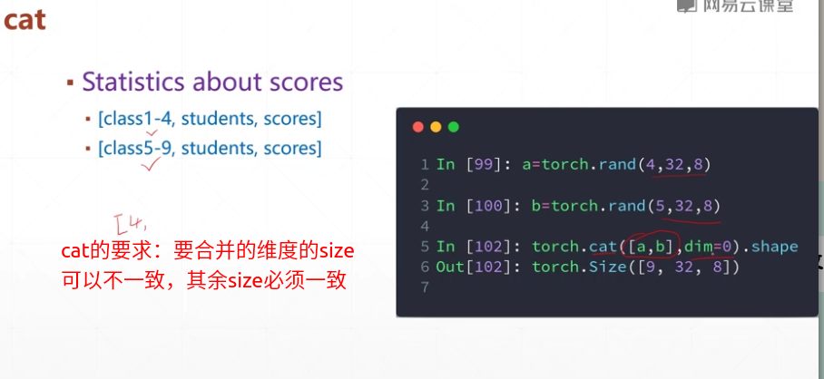
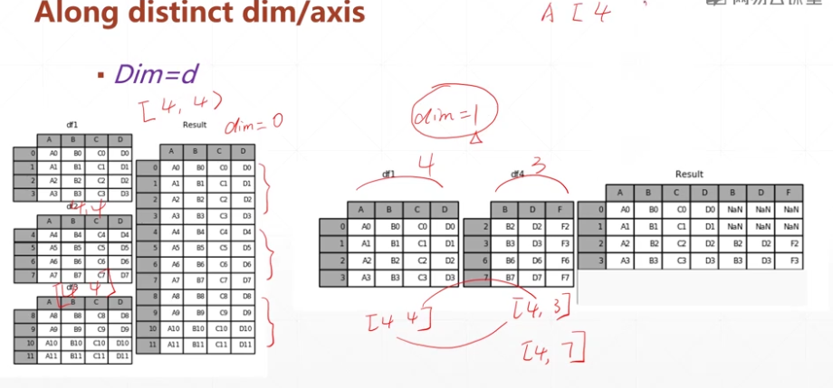
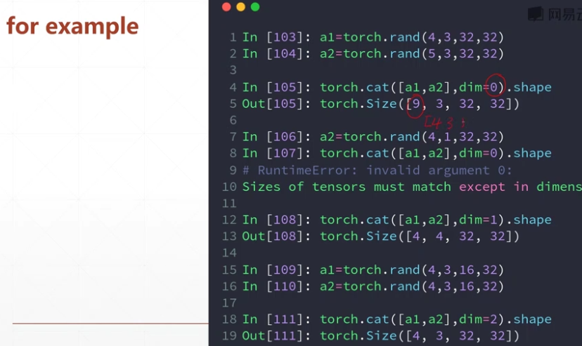
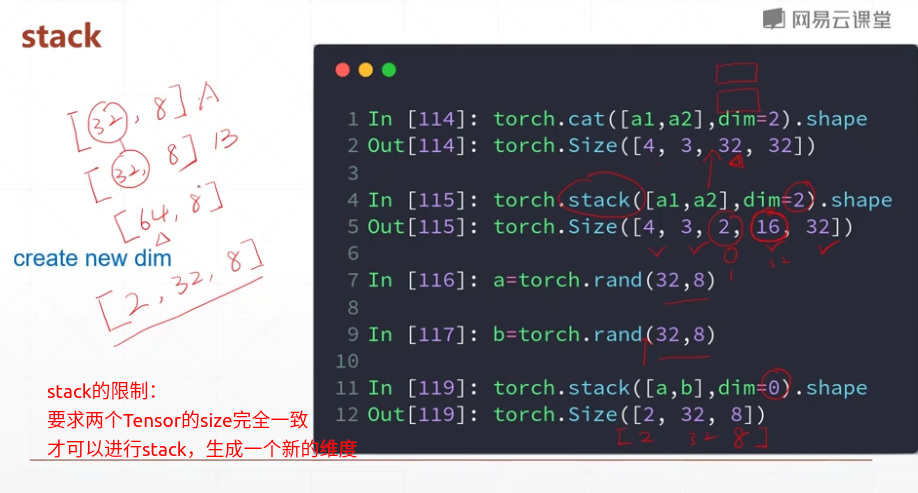
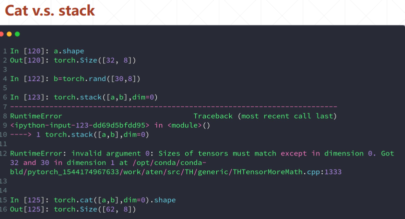

## 　合并与分割

### 1. cat








### 2. stack




### cat v.s. stack



### 3. split 

#### 	by sub-len 

​	

```python
torch.chunk(sub_size ,dim =dd)	#拆分成若干个size都为sub_size的tensor

torch.chunk([sub.size1,sub_size2.....],dim=d) #拆分成各分布为size1,size2...的tensor

```

### 4. chunk

####  by sub-num

```
torch.chunk(sub_num ,dim =dd)
```


汇总代码

```python
a = torch.randn(32,8)
a1 = torch.randn(32,8)
a2 = torch.randn(32,8)
b = torch.randn(32,8)
b2= torch.randn(32,8)
b3 = torch.randn(32,8)


c = torch.stack([a,b],dim=0)
d = torch.cat([a,b],dim=0)
d = torch.cat([a1,d],dim=0)
d = torch.cat([a2,d],dim=0)
d = torch.cat([b2,d],dim=0)
d = torch.cat([b3,d],dim=0)

print(d.shape)

n,m = d.split([2*32,4*32],dim=0) #指定每个sub-tensor的size,使用list表示，所有size的和必须等于拆分前的tensor的size

print(n.shape)
print(m.shape)


nn,mm = d.split(3*32,dim=0) #如果所有长度都固定，就用一个数来表示每个sub-tensor的长度，sub-tensor的个数可以自动计算得到
# nn,mm = d.split(3,dim=0) #报错，如果每个sub-tensor第一维的size＝３，会返回64个sub-tensor
print(nn.shape)
print(mm.shape)


nnn ,mmm = d.chunk(2,dim=0)#拆分成两个tensor,每个tensor的长度相同为３*32
print(nnn.shape)
print(mmm.shape)

```

