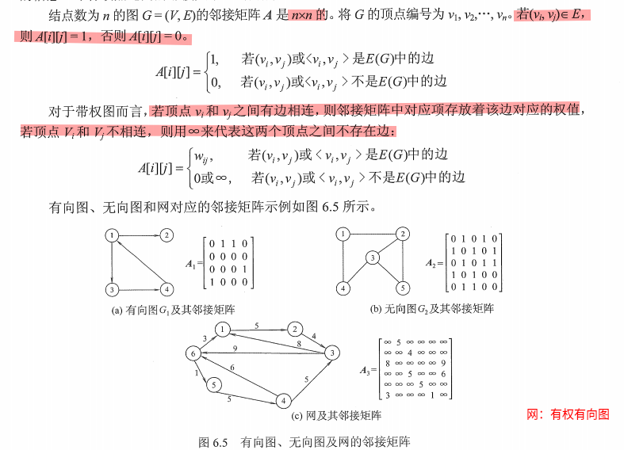
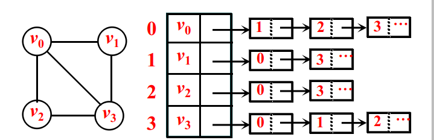
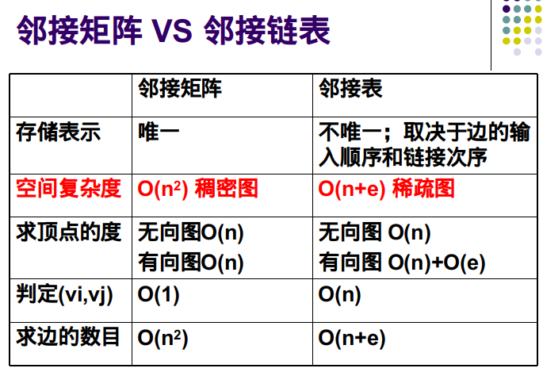

# 图论

## 图的存储结构

点：只关注顶点的编号，可以不存储;如果存储，可以使用线性表存储图的顶点集合(v1,v2,....vn)

边：采用邻接矩阵，邻接表，边表表示

### 邻接矩阵

- 顶点表: 用一个**一维数组**存储图中顶点的信息，
- 边表：用一个**二维数组**存储图中边的信息，存储顶点之间邻接关系的二维数组称为邻接矩阵



```c++
#define MaxVertexNum 100
typedef char VertexType			//顶点编号的数据类型
typedef int EdgeType				//有权图中边上权值的数据类型
typedef struct{
	VertexType Vex[MaxVertexNum]; 										//顶点表，可以省略
	EdgeType Edge[MaxVertexNum][MaxVertexNum]; 	//边表
	int vexnum,arcnum;
} MGraph;
```


### 邻接表

用线性表存储每个顶点发出的边。定长数组A[n][d\],可变长数组vector

```c++
vector<int> Grap [numP]; // 有向无权图
Grap[i].push_back(j);//增加一条边<i,j >


const int maxn =1e4+10;//最大结点数
vector<pair<int,int>> E[maxn];//有向有权图
Grap[i][j];//Grap[i]访问第i个vector,每个vector作为一个动态数组，存储若干pair对，保存边的终点和权值
//该边的起点是i，终点是E[i].first,边的权重是E[i].second.
```


### 邻接链表

对于每个顶点建立一个单链表，第i个单链表中的结点包含顶点$v_i$的所有邻接顶点。

```c++
struct Node{//有权图的边顶点结构
    int index;//边的终点的下标
    int cost;//边的权重
    struct Node* link;//指向下一条弧的指针
};
struct HeadNode{//顶点
    int index;//顶点的信息
    struct Node *adjacent;//指向第一条依附该顶点的弧的指针
};

typedef struct{
	HeadNode* Grap= new HeadNode[vexnum];//创建包含10个点的图
	int vexnum;//顶点的个数
} MGraph;


```


**邻接链表表示无向图**



#### 邻接链表 V.S. 邻接矩阵




## 图的遍历


## 最小生成树


## 最短路问题

对于无权图而言，可以利用广度优先搜索查找单源最短路径

对于有权图而言，可以利用Dijkstra算法计算单源最短路径，利用Floyd算法计算顶点之间的最短路

### Dijkstra算法

保存的数据:

```c++
dist[] ;//记录从源点v0到其他顶点之间的最短路径长度

path[];//记录从源点到顶点之间最短路径的前驱结点,不是必要的
```

算法步骤：(默认源点为v0)

- 初始化，集合S初始化为{0}，dist[]的初始值为 dist[i] = arcs[0][i\],   i=1,2,..n-1

- 从顶点集合 V-S中选择出 $v_j$,满足$dist[j] =Min (dist[i]  | v_i \in V-S )$,  $ v_j$就是当前求得的，一条从v0出发的最短路径的终点

- 修改从v0出发到集合 V-S上的任一顶点 vk可达的最短路径长度：如果dist[j]+ arcs[j\][k] <dist[k] ,则更新dist[k] = sidt[j]+arcs[j][k\];

- 重复步骤 2-3,操作共n-1次，直到所有顶点都包含在S中

  **图结构采用邻接链表的方式存储**

  

```c++
//
// Created by doriswang on 2021/2/28.
//
#include<iostream>
struct Node{
    int index;//边的终点
    int cost;//边的权重
    struct Node* link;//指向下一条弧的指针
};
struct HeadNode{
    int index;//顶点的信息
    struct Node *adjacent;//指向第一条依附该顶点的弧的指针
};
HeadNode* CreatGrap(int Pnum,int Enum){
    HeadNode* Head = new HeadNode[Pnum];
    for(int i=0;i<Enum;i++){
        int strP =0;
        int endP= 0;
        int cost;
        std::cin>>strP>>endP>>cost;//输入一条边
        Node* temp = new Node();
        temp->index=endP;
        temp->cost=cost;
        temp->link = NULL;
        if(Head[strP].adjacent==NULL){//顶点的第一条边
            Head[strP].adjacent = temp;
        }
        else{
            Node* ptr=Head[strP].adjacent;
            for(;ptr->link;ptr=ptr->link){}
            ptr->link = temp;
        }

    }
    return Head;
}

int* Dijkstra(int v,int Pnum,HeadNode* Head) {//计算各个顶点到v点的最短路径
    //输入 strP,endP,cost ; 边的起点和终点，以及边的权重，利用邻接表存储图信息
    int *pre = new int[Pnum];//保存前一个将诶点
    int *dist = new int[Pnum];
    int *s = new int[Pnum];
    for (int i = 1; i < Pnum; i++) {
        pre[i] = -1;
        dist[i] = 0x0fff;
        s[i] = 0;//数组s[i]=1,表示0-i的最短路径已经计算结束
    }
    dist[v] = 0;
    for (int j = 1; j < Pnum; j++) //计算n-1次
    {
        int mindist = 0x0fff;//循环：确定即将被访问的顶点u
        int u = 0;
        for (int i = 1; i < Pnum; i++) {
            if (dist[i] < mindist && s[i] == 0) {
                mindist = dist[i];
                u = i;
            }
        }
        s[u] = 1;
        for (Node *p = Head[u].adjacent; p; p = p->link) {
            int k = p->index;
            if (dist[u] + p->cost < dist[k]) {
                dist[k] = dist[u] + p->cost;
                pre[k] = u;
            }
        }
    }
    return pre;
}
int main(){
    int Pnum=0;//顶点个数
    int Enum=0;//边的个数
    std::cout<<"依次输入顶点的个数，边的个数，以及边的起点，终点，权重"<<std::endl;
    std::cin>> Pnum;
    std::cin>> Enum;
    HeadNode* headlist = CreatGrap(Pnum,Enum);
    int strP = 0;
    int endP =0;
    std::cout<<"输入你要计算最短路径的起点和终点"<<std::endl;
    std::cin>>strP>>endP;
    int* pre = Dijkstra(strP,Pnum,headlist);
    std::cout<<endP;
    int end=pre[endP];
    while(end!=strP){
        std::cout<<" "<<end;
        end = pre[end];
    }
    std::cout<<" "<<strP;

}
```


### 两点之间的所有最短路

#### 队列优化的Dijkstra算法

pat1003

#### 解法1（有一点问题）

```c++
void AdvancedDijkstra(int s){
    fill(dis,dis+maxN,0x3fffffff);//初始化
    dis[s]=0;//保存各顶点到源点之间的距离
    priority_queue<pair<int,int>> q;//默认是大根堆
    q.push(make_pair(0,s));
    while(!q.empty()){
        int u = q.top().second;
        q.pop();
        if( vis[u]==1) continue;
        vis[u]=1;
        for(int i=0;i<E[u].size();++i){//利用u到v，更新源点到v的最短路径和cost
            int v = E[u][i].first,w =E[u][i].second;
            if(dis[v]>dis[u]+w){
                dis[v]=dis[u]+w;
                num[v]=num[u];
                pre[v].clear();
                pre[v].push_back(u);
                MaxCost[v]=MaxCost[u]+cost[v];//更新最短路，必须更新MaxCost
                if(vis[v]==0) q.push(make_pair(-dis[v],v));
            }
            else if(dis[v]==dis[u]+w){
                pre[v].push_back(u);
                num[v]+=num[u];
                if(MaxCost[v]<MaxCost[u]+cost[v]){
                    MaxCost[v]=MaxCost[u]+cost[v];
                }
                if(vis[v]==0) q.push(make_pair(-dis[v],v));
            }
        }
    }
}
```

#### 解法2：

```c++
#include<bits/stdc++.h>
#include<iostream>
using namespace std;
const int MaxN = 510;
const int INF = 0x3fffffff;
int edge[MaxN][MaxN],dist[MaxN],num[MaxN],MaxCost[MaxN],Cost[MaxN];
bool vis[MaxN];
void Dijkstra(int s,int numP){
    num[s]=1;
    MaxCost[s]=Cost[s];
    dist[s]=0;
    for(int i=0;i<numP;i++){
        int MinDis = INF;
        int u=-1;
        for(int j=0;j<numP;j++) {
            if (MinDis > dist[j] && !vis[j]) {
                MinDis = dist[j];
                u = j;
            }
        }
        if(u==-1) {
                return;
        }
        vis[u]=true;
        for(int j=0;j<numP;j++){
            if(edge[u][j]+dist[u]<dist[j]){
                dist[j]=edge[u][j]+dist[u];
                num[j]=num[u];
                MaxCost[j]=MaxCost[u]+Cost[j];
            }
            else if(edge[u][j]+dist[u] == dist[j]){
                num[j]+=num[u];
                if(MaxCost[j]<MaxCost[u]+Cost[j]){
                    MaxCost[j]=MaxCost[u]+Cost[j];
                }
            }
        }
    }

}
```

