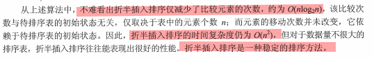
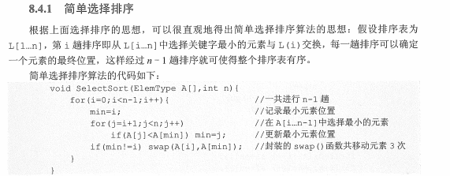
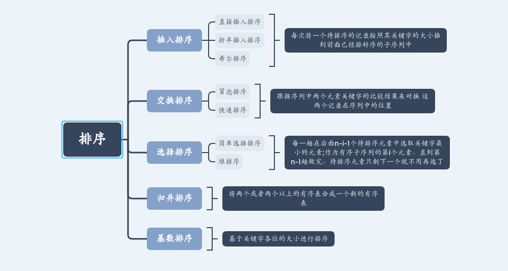
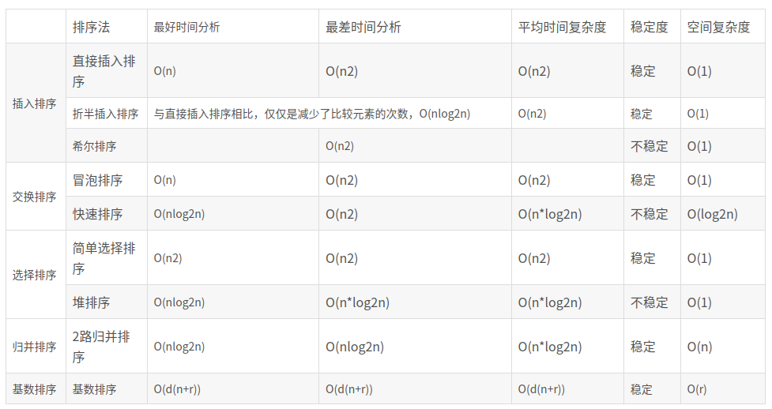

# 总览


# 插入排序

**每次将一个待排序的记录按照其关键字的大小插到前面已经排好序的子序列中**

## 直接插入排序

### 源码实现

```c++
void InsertSort(T A[], int length){
    for(int i=1;i<length;++i){
        if(A[i]<A[i-1]){//前0-i-1个元素是排好序的元素,
            // 如果A[i]>A[i-1]不移动元素
            int temp = A[i];
            int j;
            for(j=i-1;(temp<A[j])&&(j>=0);--j){
                A[j+1]=A[j];
            }
            A[j+1]=temp;
        }
    }
}
```

### 性能分析

|      | 最好                          | 最坏     | 平均     |
| ---- | ----------------------------- | -------- | -------- |
| 时间 | O(n) //只需要比较，不需要移动 | $O(n^2)$ | $O(n^2)$ |
| 空间 | O(1)                          | O(1)     | $O(1)$   |

**稳定性：稳定性的排序方法（数值大小相同的元素排序前后的相对位置不变）**

**适用性：适用于顺序存储和链式存储的线性表**

由于当数据基本有序时，时间复杂度趋于线性，更适用于基本有序的排序表和数据量不大的排序表

## 折半插入排序

利用折半查找优化直接插入排序

### 源码实现

```c++
 template< class T>
 void InsertSort2(T A[] ,int len){
     for(int i=1;i<len;i++){

         if(A[i]<A[i-1]){
             int temp = A[i];
             //利用折半查找，找到要插入的元素;
             int start = 0;
             int end=i-1;
             while(start<end ){
                 int mid = (start+end)/2;
                 if(A[mid]<temp){//要插入的元素，应该是在右边，找到第一个大于temp的
                     start=mid+1;
                 }else{
                     end = mid;
                 }
             }//跳出该循环的条件是，end=start，其中end指向最左侧大于A[i]的下标
             for(int j=i-1;j>=end;j--){
                 A[j+1]=A[j];
             }
             A[end]=temp;
         }
     }
 }
```

### 性能分析



## 希尔排序

由于直接插入排序算法更适用于 基本有序的排序表和数据量不大的排序表。

希尔排序基于这两点进行改进，缩小增量排序

```c++
template<class T>
void ShellSort(T A[],int len){
   for(int d =len/2l;d>1;d=d/2){
       for(int i=d+1;i<len;i++)//起始位置
       {
           if (A[i] < A[i - d]) {
               int temp = A[i];
               int j = 0;
               for (j = i - d; j > 0 && temp < A[j]; j -= d) {
                   A[j + d] = A[j];
               }
               A[j + d] = temp;
           }
       }
   }
}
```

# 交换排序

**交换：跟据序列中两个元素关键点的比较结果来对换这两个记录在序列中的位置**

## 冒泡排序

从后往前两两比较相邻元素的值，

### 源码实现

```c++
template<class T>
void BubbleSort(T A[] , int len){
	bool flag = false;
    while(!flag){
        flag = true;
        for(int i=0;i<len;i++){
            for(int j=0;j<len-1;j++){
                if(A[i]>A[i+1]){
                    std::swap(A[i],A[i+1]);
                    flag = false;
                }
            }
        }
    }
}
```

### 性能分析

|      | 最好                          | 最坏     | 平均     |
| ---- | ----------------------------- | -------- | -------- |
| 时间 | O(n) //只需要比较，不需要移动 | $O(n^2)$ | $O(n^2)$ |
| 空间 | O(1)                          | O(1)     | $O(1)$   |

稳定的排序方法

## 快速排序

基于分治的思想

```c++
template<class T>
int Partition(T A[], int start,int end){
    T base = A[start];
    int low=start;
    int high=end;
    while(low<high){//low指向小于等于元素，high指向大于元素
        while(A[low]<=base){//会自动跳过base
            low++;
        }
        while(A[high]>base){
            high--;
        }
        if(low<high){
            std::swap(A[low],A[high]);//交换两个
        }
    }
    std::swap(A[high],A[start]);//high指向最右侧的最大元素
    return high;
}
template<class T>
void QuickSort(T A[],int start, int end){
    //不断分治
    if(start<end){
        int mid = Partition(A,start,end);
        QuickSort(A,start,mid-1);
        QuickSort(A,mid+1,end);
    }
}
```

### 性能分析

|      | 最好                               | 最坏     | 平均                 |
| ---- | ---------------------------------- | -------- | -------------------- |
| 时间 | O(log_ n) //只需要比较，不需要移动 | $O(n)$   | $O(log_2 n)$         |
| 空间 | $O(n *log_2 n)$                    | $O(n^2)$ | 约等于$O(n*log_2 n)$ |

**最快的内部排序，不稳定的排序方法**

# 选择排序

## 简单选择排序

选择排序基本思想：每一趟在后面n-i-1个待排序元素中选取关键字最小的元素;作为有序子序列的第i个元素，直到第n-1趟做完，待排序元素只剩下一个就不用再选了

### 源码



### 性能分析

|      | 最好                          | 最坏     | 平均     |
| ---- | ----------------------------- | -------- | -------- |
| 时间 | O(n) //只需要比较，不需要移动 | $O(n^2)$ | $O(n^2)$ |
| 空间 | O(1)                          | O(1)     | $O(1)$   |

不稳定的排序方法

## 堆排序

### 源码实现(大根堆为例)

```c++
void HeapSort(){
	//初始建堆
    build();
    //堆排序
    for(int i=1;i<n-1;i++){
        swap(1,hlen);
        hlen--;
        down(1); //不断删除最大结点
    }
}
```

[之前总结过堆的相关笔记](https://gritcs.github.io/2021/02/20/%E5%A0%86/)

### 性能分析

|      | 最好            | 最坏            | 平均            |
| ---- | --------------- | --------------- | --------------- |
| 时间 | $O(n *log_2 n)$ | $O(n *log_2 n)$ | $O(n *log_2 n)$ |
| 空间 | O(1)            | O(1)            | $O(1)$          |

**不稳定的排序方法**

# 归并排序

**”归并“的含义是将两个或者两个以上的有序表**组合成一个新的有序表。

### 源码实现

**迭代实现版本**

```c++
  template<class T>
  void Merge(T A[], int left,int mid,int right){
      int i=left;
      int j=mid;
      int size = right-left;
      T* B= new T(size);
      int k=0;
      while(i<mid&&j<right){
          if(A[i]<A[j]){//A[i]在前
              B[k]=A[i];
              i++;
              k++;
          }else{
              B[k]=A[j];
              j++;
              k++;
          }
      }
      if(i<mid){
          while(i<mid){
              B[k++]=A[i++];
          }
      }
      if(j<right){
          while(j<right){
              B[k++]=A[j++];
          }
      }
      for(int k=0;k<size;k++){
          A[k+left]=B[k];
      }
  }

 template<class T>
 void MergeSort(T A[],int len){
     T *B=new T[len];
    int d=1;
    int start=0;
    int end=len;
    while(start+d<=end){
        for(int i=start;i<=end;i+=2*d){
            if(i+2*d<end)
            {
                Merge(A,i,i+d,i+2*d);//左闭右开
            }else if(i+d<end){
                Merge(A,i,i+d,end);
            }
            //剩余一个数组，不需要排序
        }
        d=d<<1;//乘2
    }
 }
```

|      | 最好            | 最坏            | 平均            |
| ---- | --------------- | --------------- | --------------- |
| 时间 | $O(n *log_2 n)$ | $O(n *log_2 n)$ | $O(n *log_2 n)$ |
| 空间 | O(n)            | O(n)            | $O(n)$          |

是一种稳定的排序方式

## 基数排序

不基于比较和移动进行排序，而是基于关键字各位的大小进行排序

最高次序位法(MSD)：先最高位进行分桶，对桶内记录进行排序，然后按次高位排序，最后按最低位排序。

最低次序位法(LSD)：首先按最低位排序，然后按下一个次低位排序，..，最后按最高位排序。

**比较适合链表结构，辅助空间：r+1个队头指针和队尾指针，n个link域**

一般如果r<<n,时间复杂度是O(n p)

### 源码实现

略

# 内排序总结

如果文件的初始状态已经按关键字基本有序，则选用直接插入或者冒泡排序。

**在基于比较的排序方法中，每次比较两个关键字的大小之后，仅仅出现两种可能的转移。任何借助“比较”的排序算法，至少需要$O(nlog^2n)$**






