## 数学运算

### 1. element-cal

```python
#汇总
torch.add ;  +
torch.sub; -
torch.div ; /
torch.mul; *
a.pow(n) ; a**n
a.sqrt()
a.rsqrt()  #平方根的倒数
a.exp()
a.log()
a.log2()
a.log10()
```


利用重载后的运算符

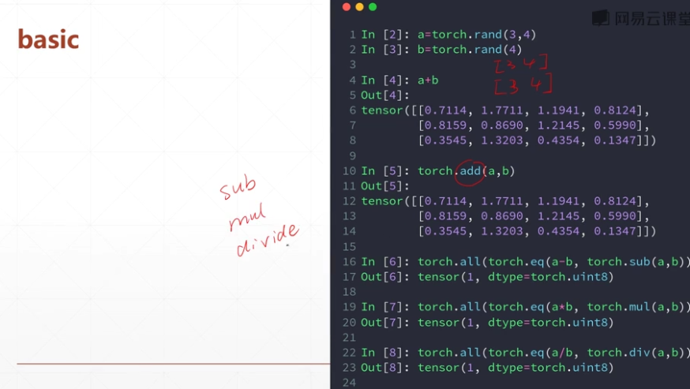

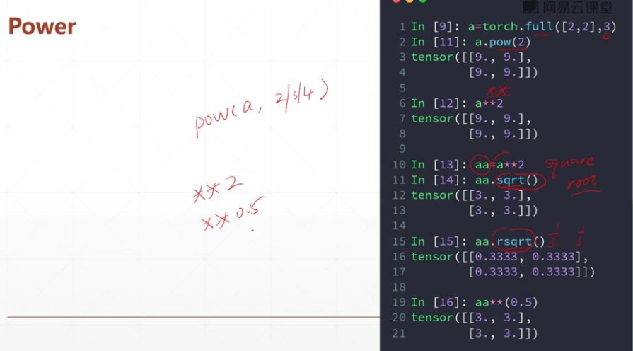

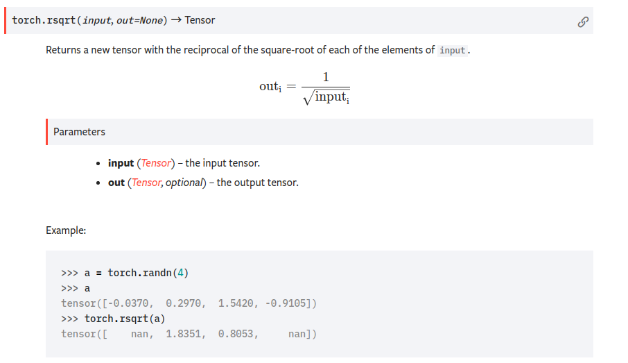

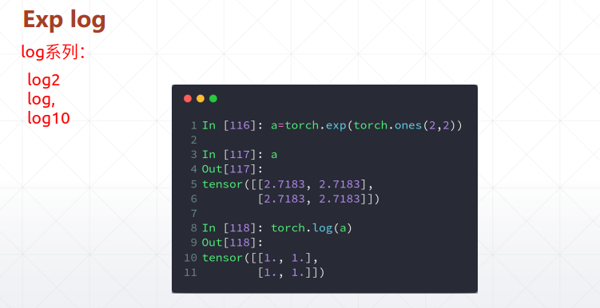

### 2.矩阵的乘除

```python
torch.mm()#只适用于2D
@
torch.matmul()
```


#### 	2.1 ２D矩阵的乘除

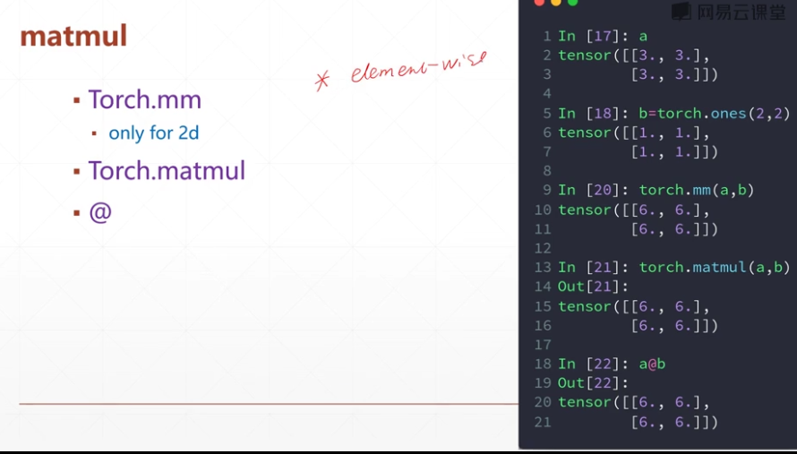

#### 	2.2 多维矩阵的乘除

实际就是支持多个矩阵对并行相乘[只计算最低的两维数据]

**broadcasting**机制

```python
#在计算过程中，可以使用broadcasting对矩阵进行扩展，
#可以使用matmul的标准：1. 低维（1,2）数据要满足矩阵乘法的行/列数的要求，
#高维数据要完全匹配或者经过broadcasting机制可以匹配
#一维数据，求点积

a = torch.tensor([2])
b= torch.tensor([3])
print(torch.matmul(a,b))


print(torch.matmul(a,b).shape) #计算得到标量

#只计算低维数据，高维数据完全匹配
a = torch.rand(4,3,28,64)
b = torch.rand(4,3,64,32)
c = torch.matmul(a,b)

print(c.shape)
#broadcasting 机制
b = torch.rand(64,32)

print(torch.matmul(a,b).shape)

b = torch.rand(4,1,64,32)


print(torch.matmul(a,b).shape)


a = torch.rand(28,64)
b = torch.rand(1,3,64,32)

print(torch.matmul(a,b).shape)


'''
output:

tensor(6)

torch.Size([])

torch.Size([4, 3, 28, 32])

torch.Size([4, 3, 28, 32])

torch.Size([4, 3, 28, 32])

torch.Size([1, 3, 28, 32])

'''
```

#### 2.3其他计算

```python
a.floor()

a.ceil()

a.round()#四舍五入

a.trunc()#取整数部分

a.frac()#取小数部分

a.clamp(min,max) #如果a[i]<min ，a[i] =min ； 如果a[i]>max ，a[i]=max

```


函数相关实例

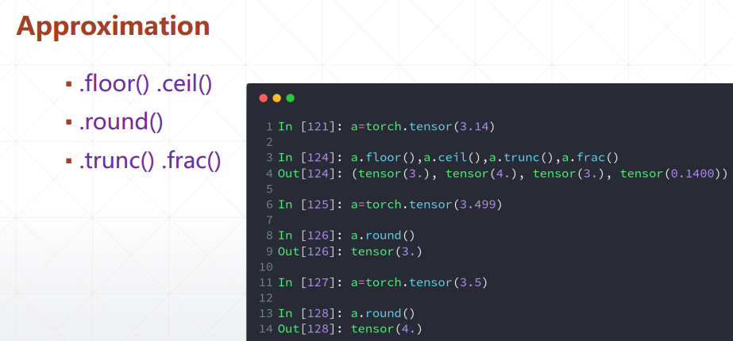

```python

a = torch.rand(2,3)*15
print(a)
print(a.clamp(5,10))

'''

tensor([[ 0.1522,  8.6243, 10.4471],
        [ 2.0610,  8.4947, 10.7278]])
        
        
tensor([[ 5.0000,  8.6243, 10.0000],
        [ 5.0000,  8.4947, 10.0000]])
'''
```


## 统计属性

```python
##相关函数计算

```


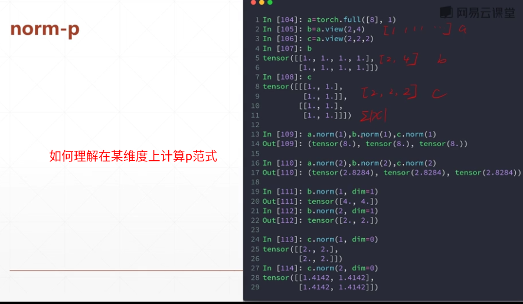

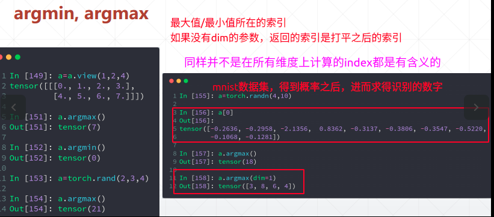


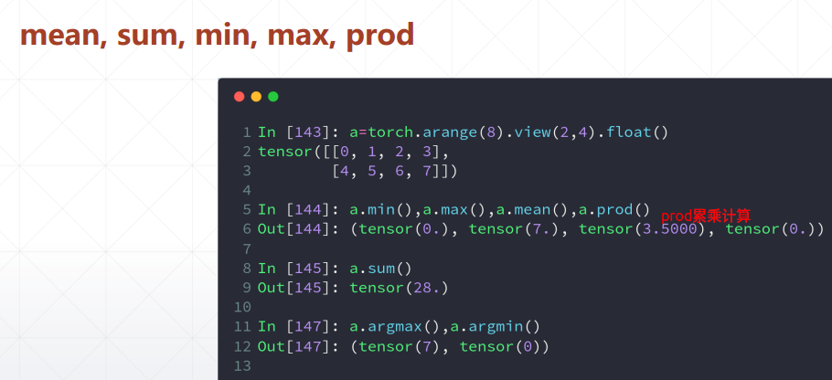


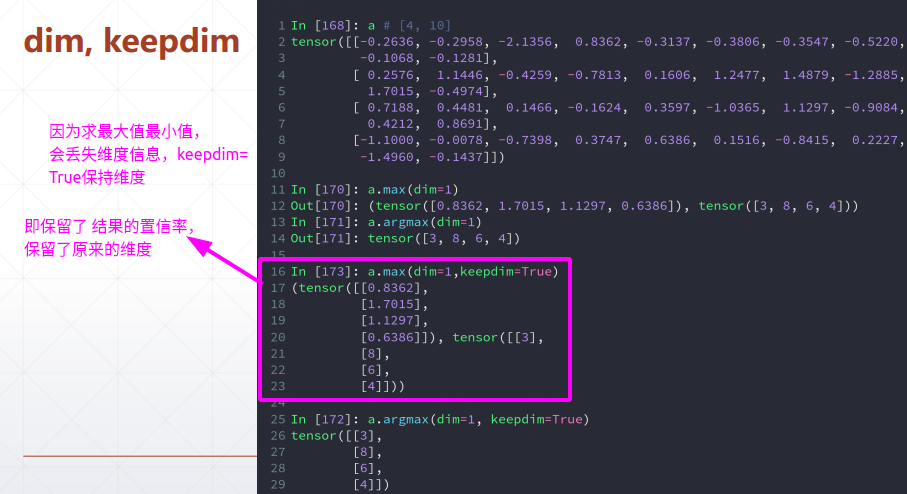

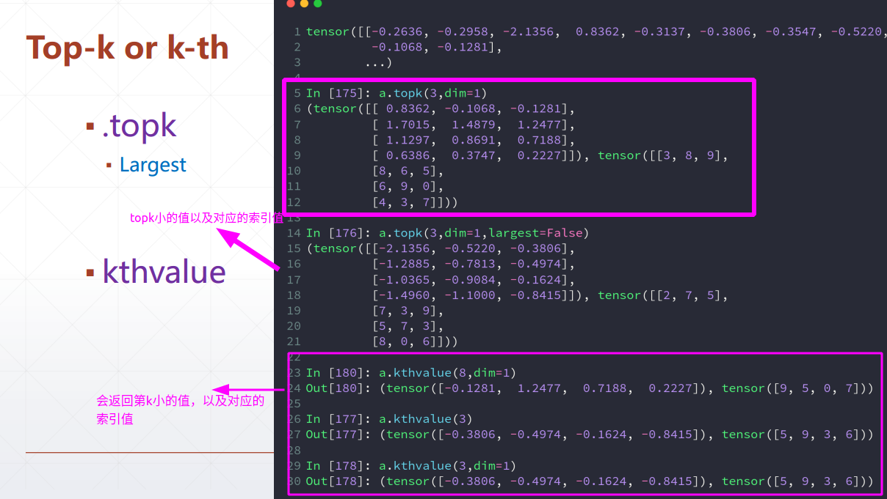


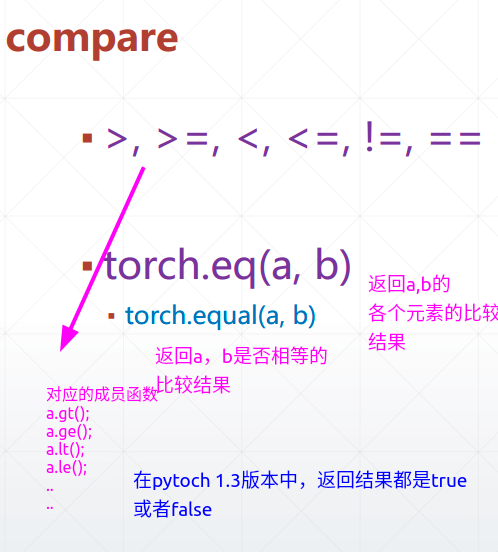


附录：

1。在某维度上argmax的理解---感觉自己对抽象几何不是特别理解

```python
a = torch.randn(4,10)a
print(a)
print(a.argmax())
print(a.argmax(dim=0))
print(a.argmax(dim=1))
'''
tensor([[ 7.0244e-01, -1.8047e-01, -1.3860e+00, -2.7422e-02,  1.0189e-01,
         -4.1896e-01,  2.3863e+00, -2.3053e-01, -1.7369e-02,  1.8899e-01],
        [ 1.0445e-01, -5.9622e-01, -8.3666e-01, -7.0087e-01, -2.1692e-01,
          1.2431e-01, -2.3204e-01, -5.3630e-01, -1.1655e+00,  4.6021e-01],
        [-1.1210e+00, -4.4479e-01,  1.0892e+00, -1.1631e+00,  7.8703e-01,
         -3.9018e-01, -6.1701e-01,  8.2018e-01,  1.2167e-01, -1.6905e+00],
        [-1.4846e+00,  9.5270e-01,  2.2757e-01,  1.5931e+00,  2.9075e-01,
          1.3509e+00,  1.5353e+00, -1.1048e+00,  7.0249e-04, -1.1067e-01]])
tensor(6)
tensor([0, 3, 2, 3, 2, 3, 0, 2, 2, 1])
tensor([6, 9, 2, 3])
'''
```

2.在某维度上范式的计算的理解

```python
a = torch.FloatTensor([1.,2.,3.,4.,5.,6.,7.,8.,9.,10.])
b = a.view(2,5)
print(b)
print(b.norm(1,dim=0))
print(b.norm(1,dim=1))
'''
tensor([[ 1.,  2.,  3.,  4.,  5.],
        [ 6.,  7.,  8.,  9., 10.]])
tensor([ 7.,  9., 11., 13., 15.])
tensor([15., 40.])

'''
```

## 高阶操作

### where 语句

代替for循环，可以利用GPU进行加速计算

```python
cond = torch.tensor([[0.6769,0.7271],[0.8884,0.4163]])

a = torch.tensor([[0.,0.],[0.,0.]])

b = torch.tensor([[1.,1.],[1.,1.]])

print(torch.where(cond>0.5,a,b))


##同上面等效，可以体会一下语义
c =torch.randn(2,2)
for i in range(2):
    for j in range(2):
        if(cond[i][j]>0.5):
            c[i][j] = a[i][j]
        else:
            c[i][j] = b[i][j]
print(c)

'''
output:

tensor([[0., 0.],
        [0., 1.]])
        
        
tensor([[0., 0.],
        [0., 1.]])

'''
```

### gather 语句


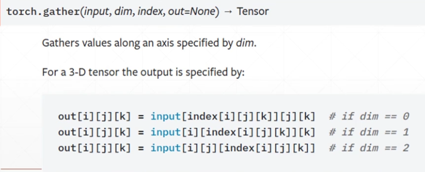

#### 提出的背景

可以自行体会含义

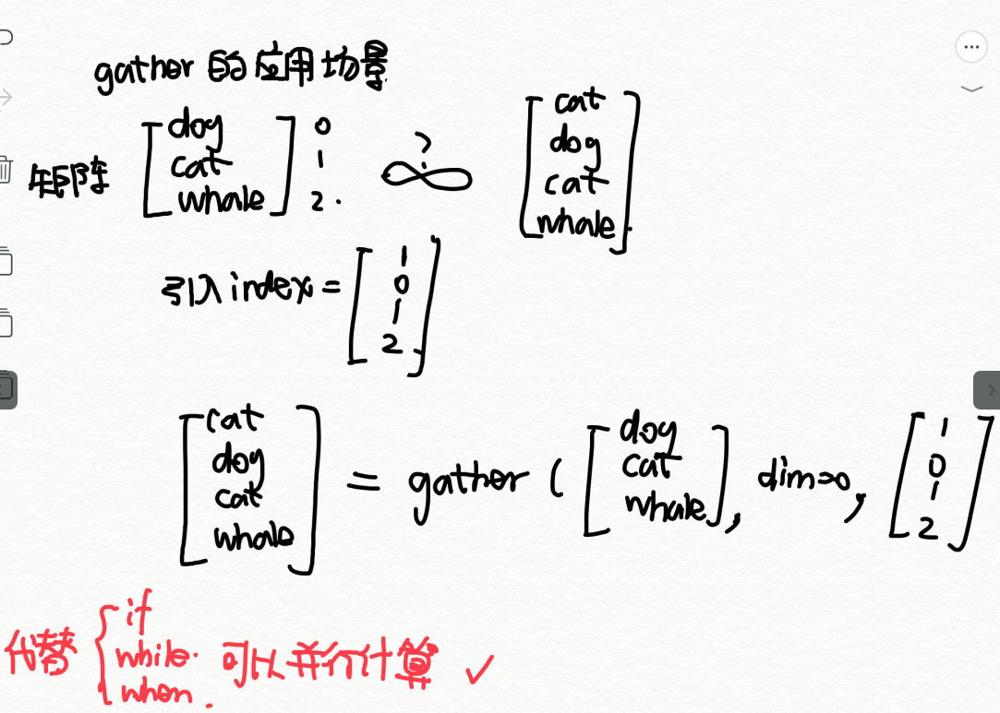

#### 应用场景


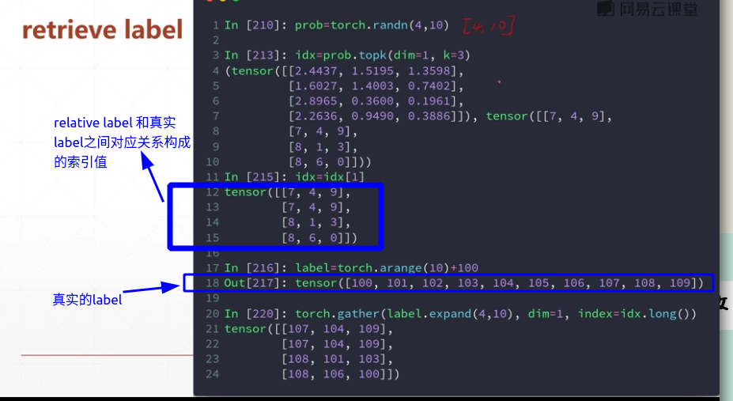