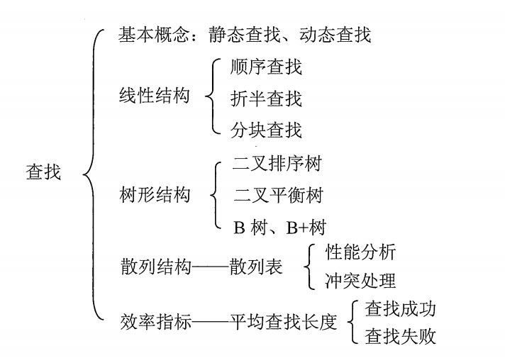
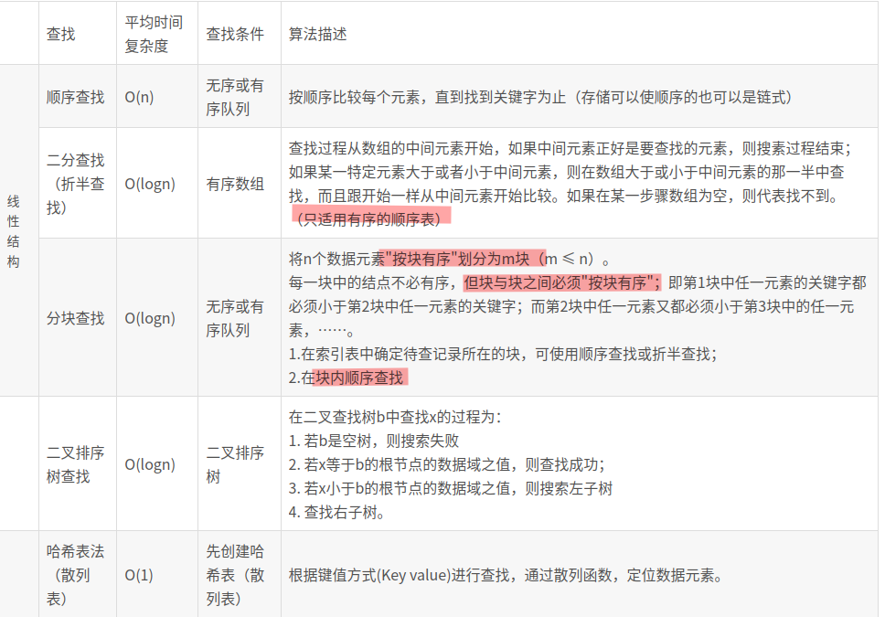
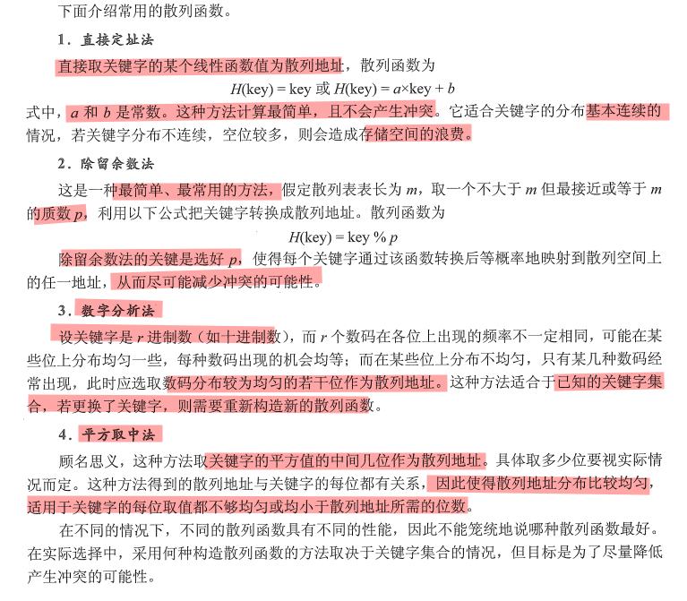
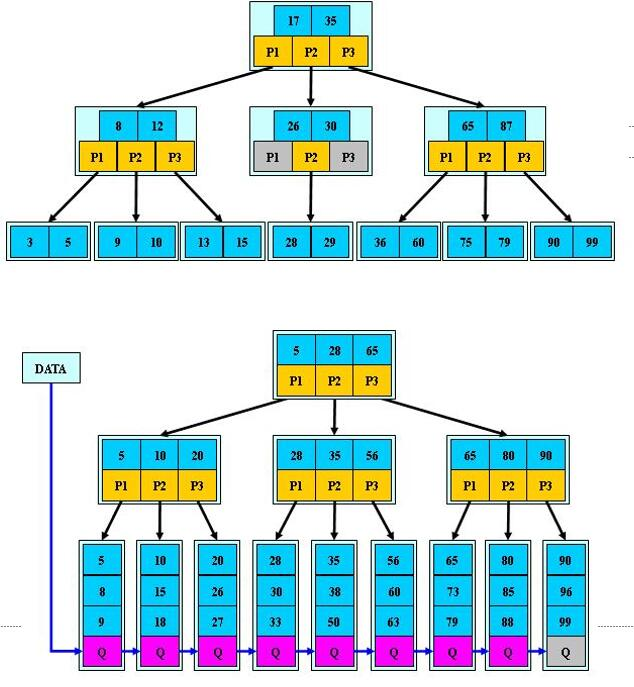
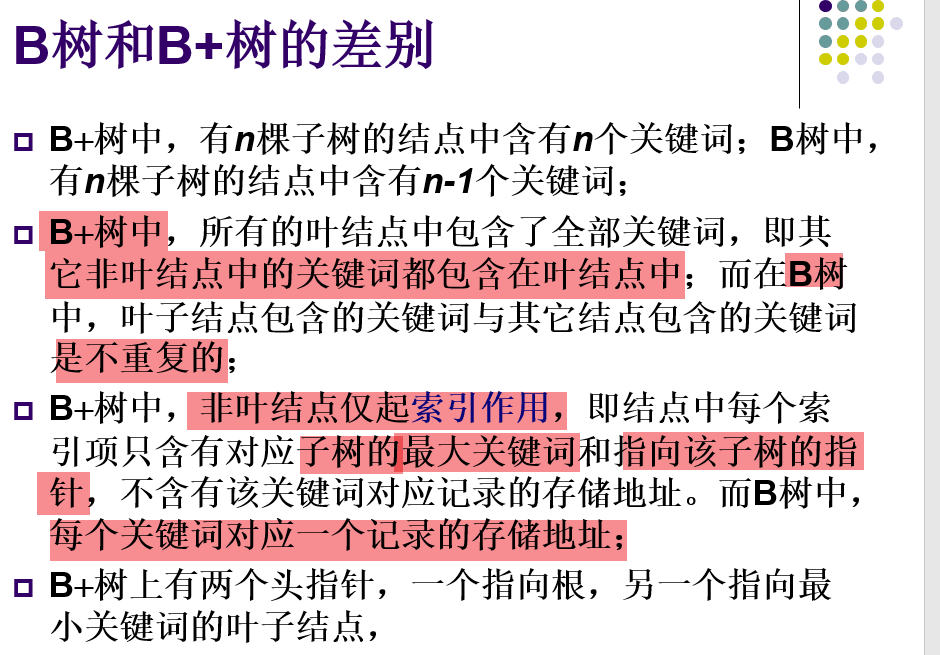
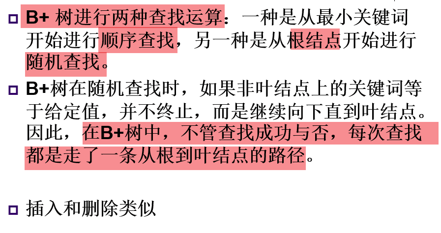
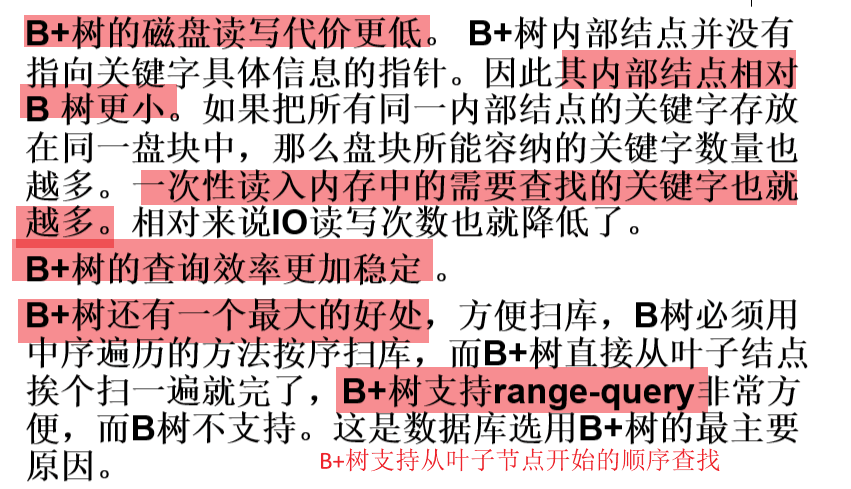

推荐博客:[[link1]](https://blog.csdn.net/sayhello_world/article/details/77200009#t1)

## 知识框架

查找表：用于查找的数据集合

静态查找：查找时，只是检索满足某个条件的特定数据元素，而不动态的修改查找表

​				静态查找方法：顺序查找，折半查找，散列查找。

动态查找：可以动态地插入或者删除的查找表

​				　动态查找的方法：平衡二叉树和B树

## 算法比较

### 斐波那契查找

随着斐波那契数列的递增，前后两个数的比值会越来越接近0.618，为了防止查找树退化，是二分查找的一种提升算法，通过运用黄金比例的概念在数列中选择查找点进行查找，提高查找效率。

### 插值查找

按照数值的分布信息，我们可以将查找的点改进为如下：

　　mid=low+(key-a[low])/(a[high]-a[low])*(high-low)，

相比于二分查找，将上述的比例参数1/2改进为自适应的，根据关键字在整个有序表中所处的位置，让mid值的变化更靠近关键字key，这样也就间接地减少了比较次数。

**基本思想：**基于二分查找算法，将查找点的选择改进为自适应选择，可以提高查找效率。当然，差值查找也属于有序查找。

注：**对于表长较大，而关键字分布又比较均匀的查找表来说，插值查找算法的平均性能比折半查找要好的多。反之，数组中如果分布非常不均匀，那么插值查找未必是很合适的选择。**

### 二分查找和二叉查找树的区别

二分查找适用于有序的线性表结构，

二叉查找树是动态查找。先对待查找的数据进行生成树，确保树的左分支的值小于右分支的值，然后在就行和每个节点的父节点比较大小，查找最适合的范围。 这个算法的查找效率很高，但是如果使用这种查找方法要首先创建树。不同的插入顺序会导致不同结构的二叉查找树，出现退化现象(变成链表)。

**二叉查找树性质**：**对二叉查找树进行中序遍历，即可得到有序的数列。**

## 哈希索引

散列方法是按照关键字编址的一项技术:以关键字K为自变量，通过函数h(K)计算地址.散列表建立了关键点和存储地址之间的一种直接映射关系

散列算法的核心是　散列函数h(x) 和　冲突消解的方法

常见的散列函数：

[**冲突消解的方法**](https://www.cnblogs.com/higerMan/p/11907117.html)：拉链法(拉链　和　合并拉链法)，线性探查方法(线性探查，二次探查，随机探查)，再哈希法，建立公共溢出区

## AVL树

1.AVL树的创建

2.查找

3.插入操作[涉及旋转]

## [2-3树](https://zhuanlan.zhihu.com/p/104031183)

特点：绝对平衡的树，任意结点到它的所有叶子结点的深度都是相等的.保证了插入和删除的复杂度都控制在 O(logN)

定义：

>一颗2-3树或为一颗空树，或有以下节点组成：
>
>2-节点，含有一个元素和两个子树（左右子树），左子树所有元素的值均小于它父节点，右子树所有元素的值均大于它父节点；
>
>3-节点，还有两个元素和三个子树（左中右子树），左子树所有元素的值均小于它父节点，中子树所有元素的值都位于父节点两个元素之间，右子树所有元素的值均大于它父节点；
>
>子树也是空树、2-节点或者3-节点；
>
>没有元素相等的节点。

插入分为４种情况

>1.向2-节点中插入元素；
>
>2.向一颗只含有一个3-节点的树中插入元素；
>
>3.向一个父节点为2-节点的3-节点中插入元素；
>
>4.向一个父节点为3-节点的3-节点中插入元素。

删除

参考算法4中的解读

## 红黑树

黑色结点绝对平衡的二叉树

https://www.jianshu.com/p/e136ec79235c

> ​	红黑树是一种含有红黑结点并能自平衡的二叉查找树。它必须满足下面性质：
>
> - 性质1：每个节点要么是黑色，要么是红色。
> - 性质2：根节点是黑色。
> - 性质3：每个叶子节点（NIL）是黑色。
> - 性质4：每个红色结点的两个子结点一定都是黑色。
> - **性质5：任意一结点到每个叶子结点的路径都包含数量相同的黑结点。**

插入4种情况

删除3种情况

## B/B+树

> 定义:参考ppt
>
> 在插入或者删除操作中，如何维护B/B+树？

https://segmentfault.com/a/1190000020416577

B/B+树之间的不同

### 理解B/B+树的应用背景

#### 为什么B树适合在磁盘中查找？

B树，概括来说是一个节点可以拥有多于2个子节点的二叉查找树。与自平衡二叉查找树不同，B树为系统最优化**大块数据的读和写操作**。B-tree算法减少定位记录时所经历的中间过程，也就是减少了磁盘的IO操作。

#### 为什么MySQL的索引要使用B+树而不是其它树形结构?比如B树？

​		因为B树不管叶子节点还是非叶子节点，都会保存数据，这样导致在非叶子节点中能保存的指针数量变少（有些资料也称为扇出）

指针少的情况下要保存大量数据，只能增加树的高度，导致IO操作变多，查询性能变低；

