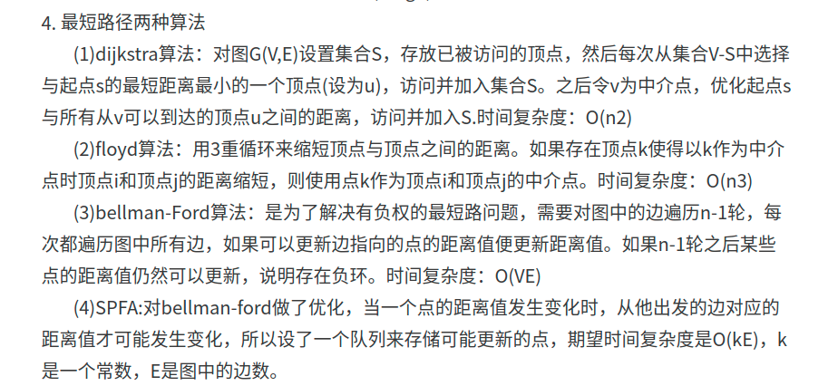
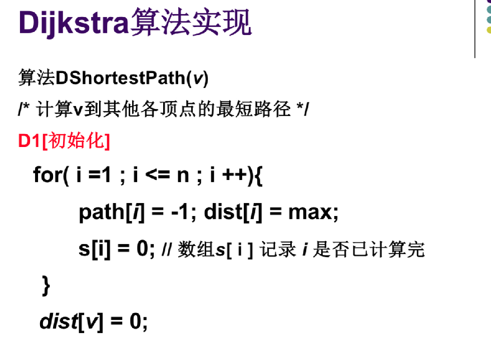
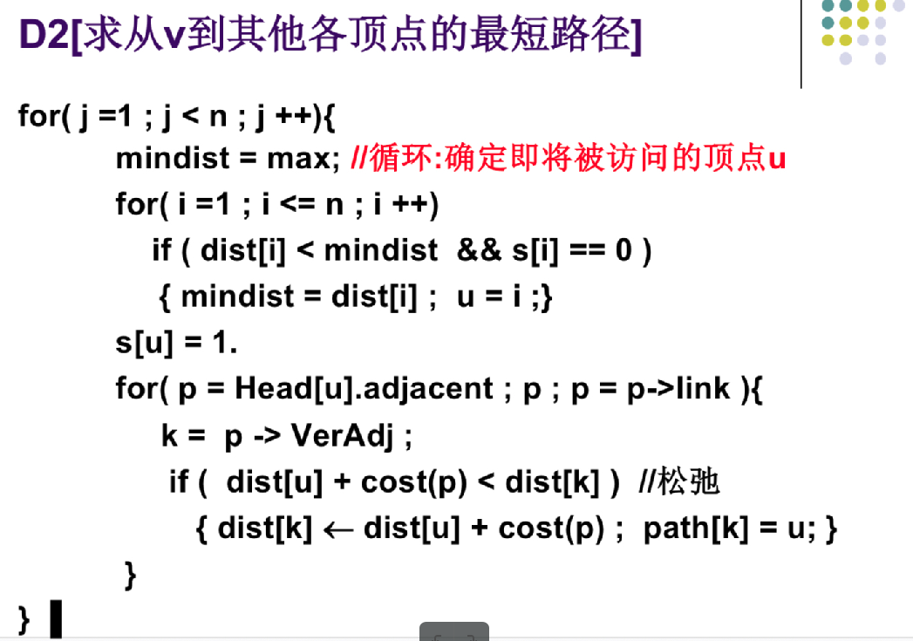
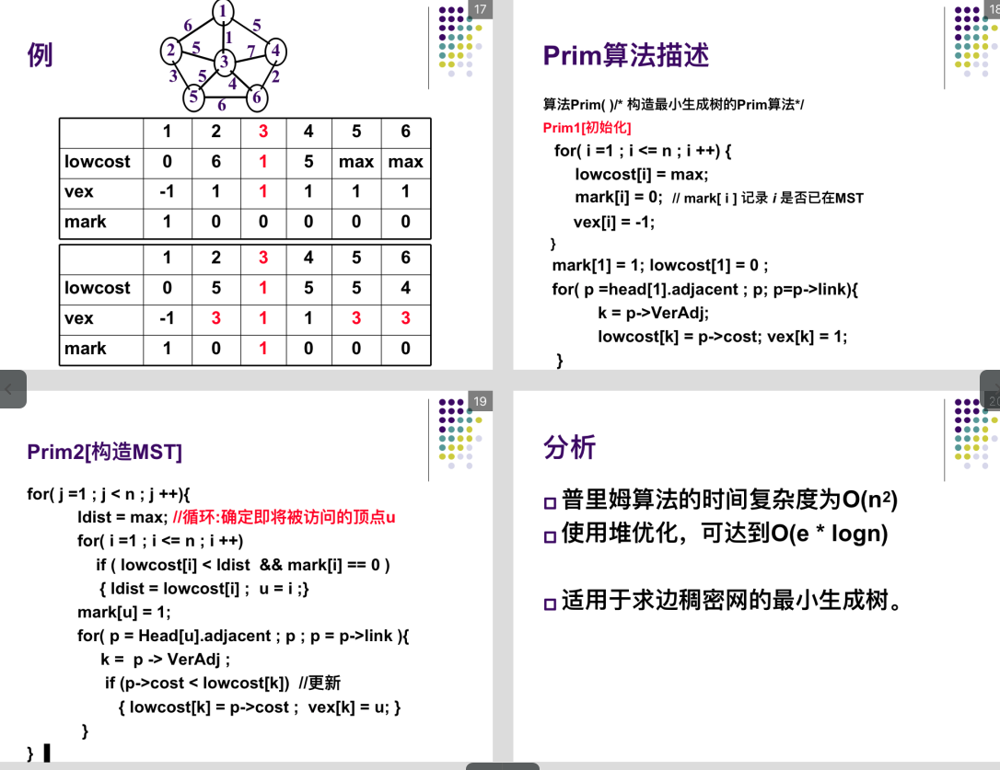
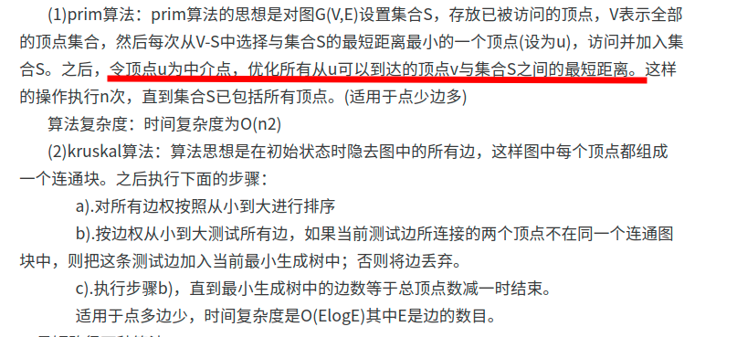
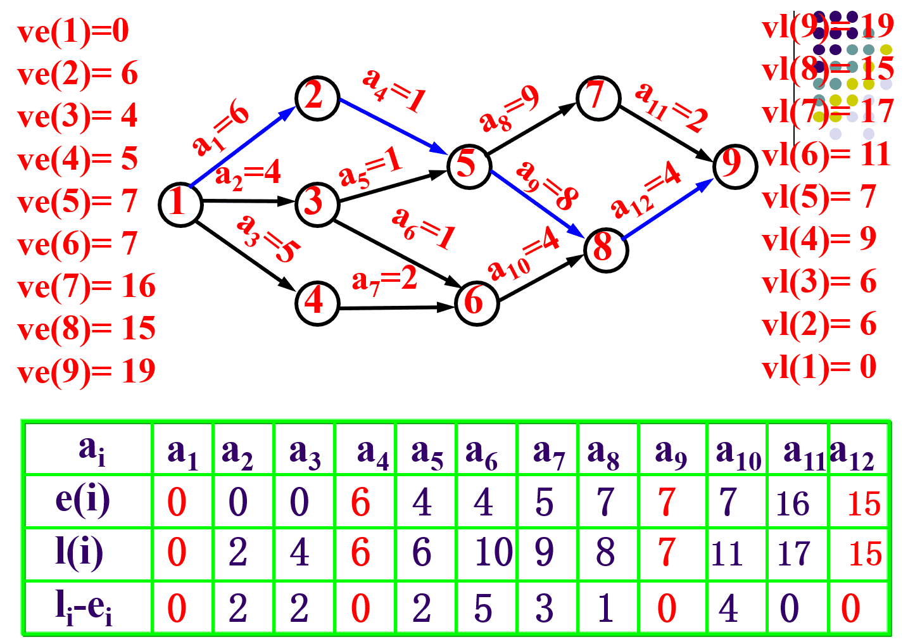
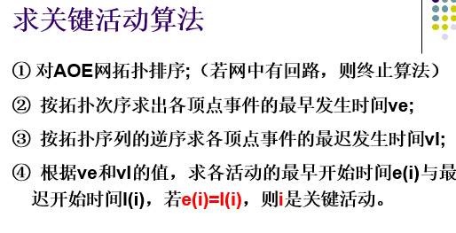

## 最短路问题

| 算法                       | 算法思路                                                     | 备注                                           |
| -------------------------- | ------------------------------------------------------------ | ---------------------------------------------- |
| Dijkstra                   | 求解权图的单源最短路径 按照非递减次序依次得到各顶点的最小路径长度。 适用条件:不存在负权边 | 时间复杂度是O(n^2+e),与边数无关;空间复杂度O(E)​ |
| Bellman-Ford算法           | 求解权图的单源最短路径 使用条件:可以计算包含负权的边，不能计算包含负圈的边 思路：对每条边进行松弛操作，循环v-1次,因为最短路最多包含n-1条边 可以用来判断图是否包含负环:循环第v次时，仍进行松弛操作 | 时间复杂度是O(V *E)​，空间复杂度O(E)​            |
| BFS                        | 求解非权图的单源最短路径                                  | 时间复杂度:O(n^2)--邻接矩阵，O(E*V)​-邻接链表   |
| mark优化的Bellman-Ford算法 | 增加一个mark标记，如果在一次循环中，bellman-Ford没有进行松弛操作，则退出循环 |                                                |
| SPFA                       | https://blog.csdn.net/qq_35644234/article/details/61614581 https://www.cnblogs.com/shadowland/p/5870640.html |                                                |
| Floyd算法                  | 邻接矩阵存储图像 适用条件：不存在负权值边组成的回路 path[i\][j\]保存路径 | 多源最短路，时间复杂度O(V^３)​                  |

### 相关算法的伪代码

#### Prim算法

### 相关题目

> 最长路径的计算	
>
> 次短路计算
>
> 关于多条最短路径的计算，参考PAT相关题目（我记得有道PAT用的dijkstra计算的负权最短路径

## 最小生成树

问题：寻找包含全部顶点的连通子图，且代价最小

| 算法    | 思路                                                         | 备注                                                  |
| ------- | ------------------------------------------------------------ | ----------------------------------------------------- |
| Prim    | 类似于Dijkstra思路，求$V_0$的单源最短路径，构成最小生成树 求边稠密网 用pre存储树结构, | 时间复杂度为O(n^2) 使用堆优化，可以达到O(e*logn)​      |
| Kruskal | 思路：T为最小生成数，连通图　G=(V,E,C) ; 在E中选择权值最小的边，如果不成环，则加入T中，直到选够n-1条边 https://zhuanlan.zhihu.com/p/34922624 | 时间复杂度O(ElogV ),采用并查集判环－一次find() : logV |

>

>闭圈法/破圈法
>
>最大生成树

> 相关例题：POJ 3255:

## 拓扑排序

**AOV网**：用顶点表示活动，用有向边表示活动之间的前后关系，称这样的有向图表示AOV网。

拓扑排序：在图论中，由一个有向无环图的顶点组成的序列，当且仅当满足一下条件时，称为该图的一个拓扑排序

- 每个顶点出现且只出现一次
- 如果顶点Ａ在序列中排在Ｂ的前面，则图中不存在从顶点B到顶点A之间的路径。

每个AOV网都有一个或者多个拓扑排序。

拓扑排序的方法：（可以采用深搜－https://note.youdao.com/ynoteshare1/index.html?id=367d1dbbbc7034a7d1e86bf27bb38e84&type=note时间复杂度是$O(V+E)$）

> 1. 从AOV网中选择一个没有前驱(入度为0)的顶点并输出。
> 2. 从网中删除该顶点和所有以它为起点的有向边。
> 3. 重复1和２,直到AOV图为空或者剩余结点都不为空（后者表示存在回路）。

## 关键路径

**AOE**网:　边表示活动，边的权值表示活动的持续时间，顶点表示入边的活动已经完成，出边的活动可以开始的状态，称为事件

源点：表示整个工程的开始(入度为０)

汇点：表示整个工程的结束(出度为０)

关键路径：在**AOE**中，具有最大长度的路径。关键路径上的活动都是关键活动。

关键活动:不能延期的活动。不按期完成就会影响整个工期的活动。

**求关键路径的算法**

> vn表示汇点，v0表示源点
> 关于事件的量
> ① 事件vj的最早发生时间 ve(j):
> 	从源点v0到vj的最长路径长度。
> ② 事件vj的最迟发生时间 vl(j):
>     保证汇点的最早发生时间不推迟的前提下，事件vj允许的最迟开始时间，等于ve(n)减去从vj到vn最长路径长度
>
>   关于活动的量
> ③ 活动ai的最早开始时间e(i):
>  设活动ai为有向边<vj ,vk>，则 e(i) = ve(j)。
>   ve(j)是从源点v0到vj的最长路径长度，决定了所有从vj开始的活动的最早开始时间。
> ④ 活动ai的最迟开始时间 l(i):
>   l(i) 是在不会引起工期延误的前提下，该活动允许的最迟开始时间。设活动ai为有向边<vj ,vk>, 则 l(i) = vl(k)-weight(<j, k>)。
>
>    关键活动： l(i)＝ e(i) 表示活动ak 是没有时间余量的关键活动

