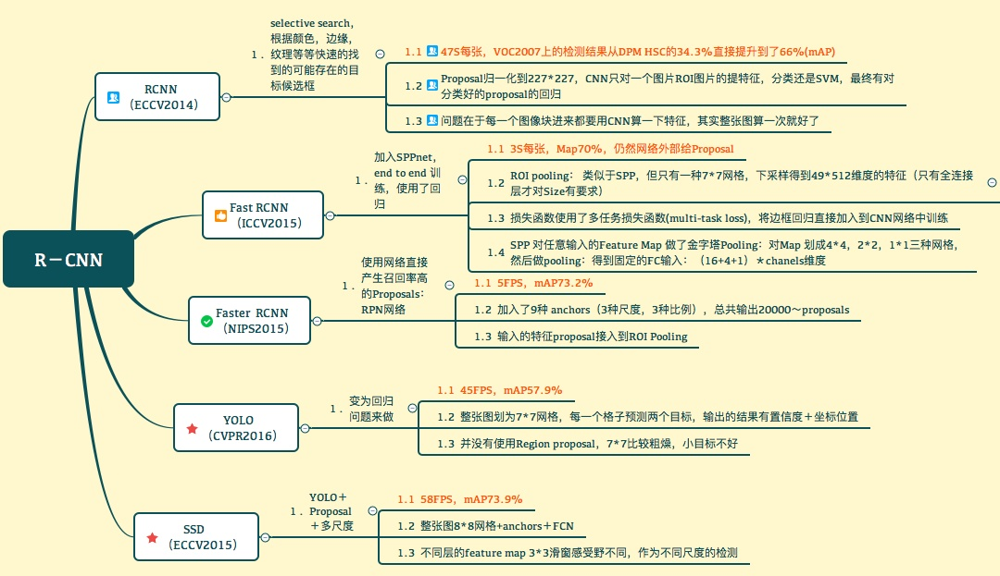
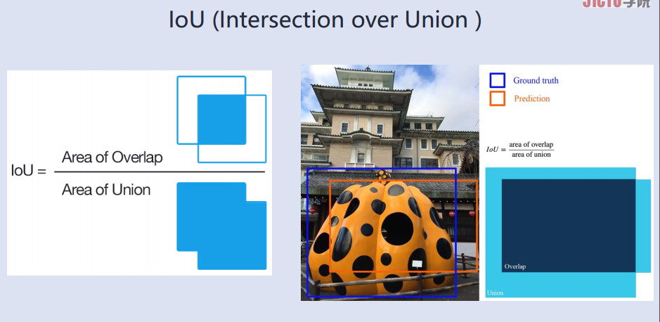
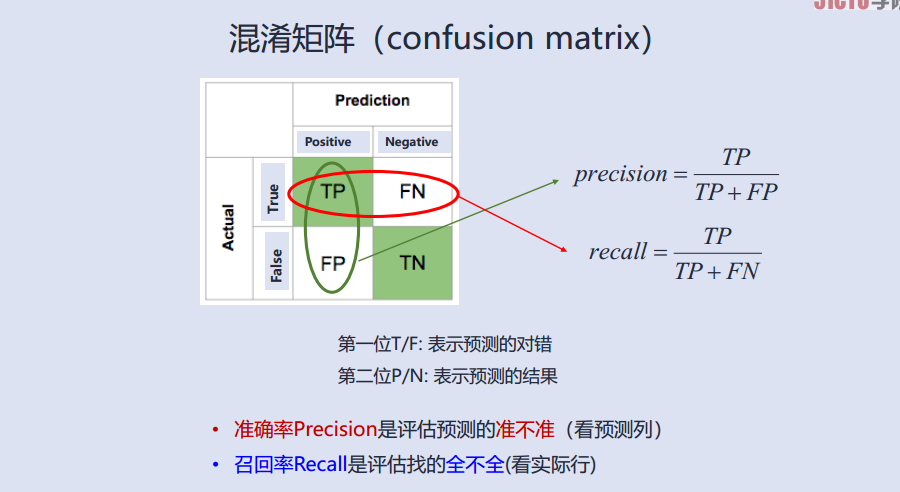
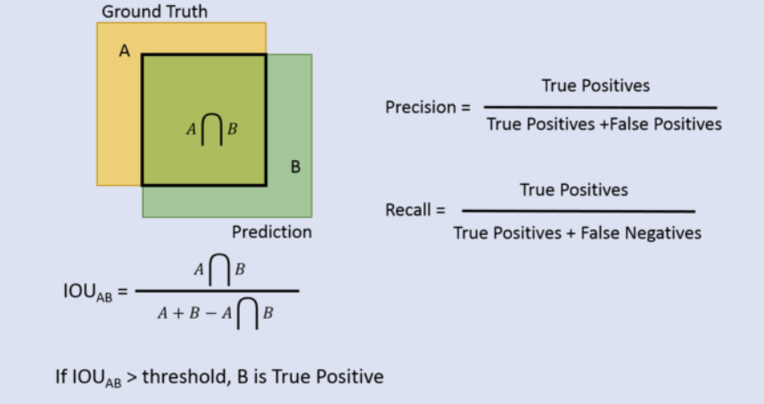

## 目标检测summary

本文在 其他优秀博主的基础上进行 修改和总结，主要描述目标检测的问题以及解决方法

目标检测的任务本质只有两个问题：图像识别，定位

这里着重介绍一下目标检测的评价方式

## 评价指标

**数据集不平衡时， precision和recall等指标就不具备参考性**，所以引出了AP
，它的[相关介绍用例子介绍比较合适](https://zhuanlan.zhihu.com/p/56961620)

