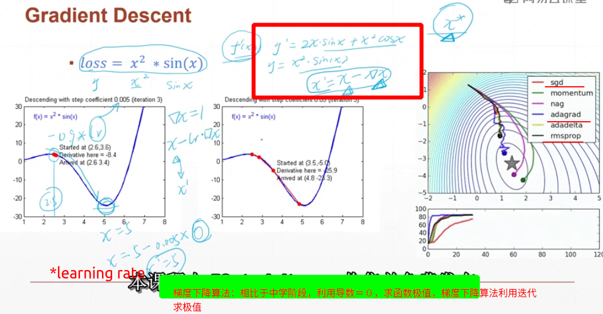
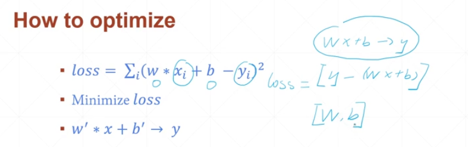
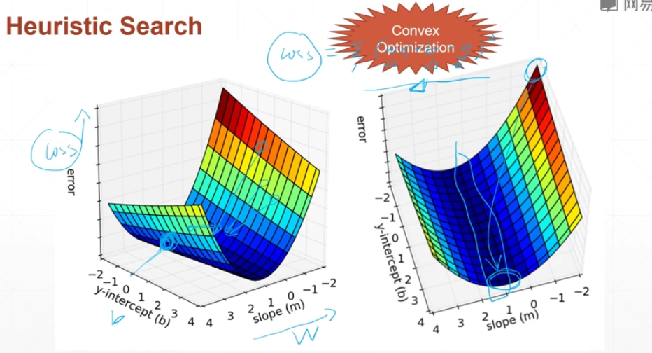
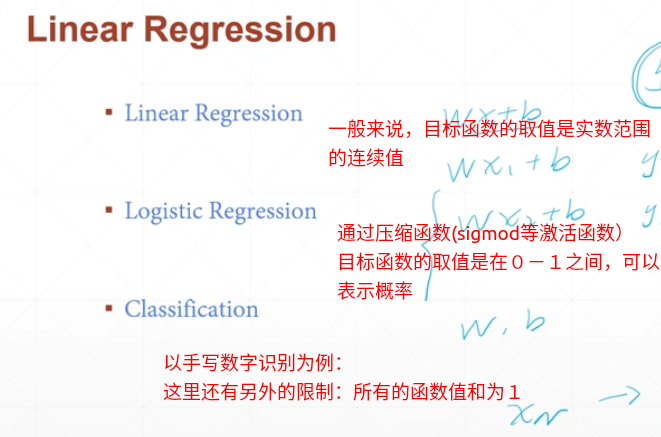

## 简单的回归问题

### １．从简单到复杂

==梯度下降算法==：梯度是深度学习的核心

１.简单的小例子




２.问题的迭代

求解$y = wx+b$　二元一次方程$w, b$的值

　　i.中学阶段：　求解二元一次方程的方法－－>消元法(利用Closed Form Solution精确求得ｗ,b的解)


​		ii.引入噪音(noise：），模拟现实情况，我们的目标并不是为了得到一个精确解，而是得到一个从经验上精度可行的近似解即可，

解决方法：需要更多的样本点＋之后采用梯度下降算法求解


​		iii.首先构造一个函数(均方差)，因为梯度下降算法是求解极值的算法

​		
$$
loss = (y-wx-b)^2
$$
$loss$方程值最小所对应的$w,b$ 可以近似认为是二元一次方程的解

​		注:在实际问题中，首先根据样本分布的情况，选择它可能对应的方程（二元一次，二元二次....)

​		V:优化过程（Convex Optimization-凸优化问题)



​		针对于一个样本来讲
$$
对于loss函数，变量ｗ,b；按照梯度下降的算法求loss的极值\\
			找到loss最小时，对应的w,b\\
			通过梯度迭代更新\\
initial : w=0,b=0

\\
b = b+ learningRate* \partial w\\
w = w+ learningRate*\partial b
			
\\ 
\partial w = 2(y-wx-b)*(-x)
\\
\partial b= 2(y-wx-b)(-1)
$$

之后编程实现的是在Ｎ个样本上的问题




​		

### 2.问题类型



### 3. 二元一次方程　编程实现

```python
import numpy as np

def computer_error_for_line_given_points(b,w,points): ##计算错误率
    totalError = 0
    for i in range(0,len(points)):
        x=points[i,0]
        y=points[i,1]
        totalError += (y-(w*x+b))**2
    return totalError/(float)(len(points))

def step_gradient(b_current,w_current,points,learningRate):##在所有的节点上进行，一次梯度下降，更新参数
    b_gradient=0
    w_gradient=0
    N= float(len(points))
    for i in range(0,len(points)):
        x=points[i,0]
        y=points[i,1]
        b_gradient += -(2/N) *(y-((w_current*x)+b_current))
        w_gradient += -(2/N)*x*(y-((w_current*x)+b_current))
    new_b = b_current -(learningRate*b_gradient)
    new_w = w_current -(learningRate*w_gradient)

    return[new_b,new_w]

def gradient_descent_runner(points,starting_b,starting_w,learning_rate,num_iterator):

    b= starting_b
    w= starting_w

    for i in range(num_iterator):
        b,w = step_gradient(b,w,np.array(points),learning_rate)#这里应该是没有选择最小的loss只是把最后迭代的结果返回
    return [b,w]

#这里没有数据
def run():
    points = np.genfromtxt("/home/doriswang/workplace/coding/pytorch_learning/venv/include/2.1/data.csv",delimiter=",")
    # print(points)
    learning_rate =0.0001
    initial_b =0
    initial_w =0
    num_iterations = 1000
    print("Starting gradient descent at b={0} , w={1} ,error ={2}".format(initial_b,initial_w,computer_error_for_line_given_points(initial_b,initial_w,points)))
    [b,w]=gradient_descent_runner(points,initial_b,initial_w,learning_rate,num_iterations)
    print("After {0} iterations b={1},w={2},error={3}".format(num_iterations,b,w,computer_error_for_line_given_points(b,w,points)))

if __name__ == '__main__':
    run()
```

