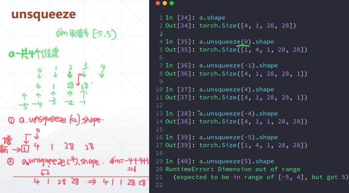
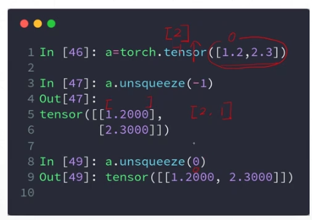
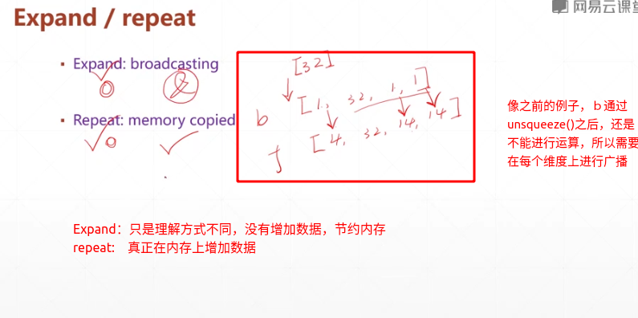
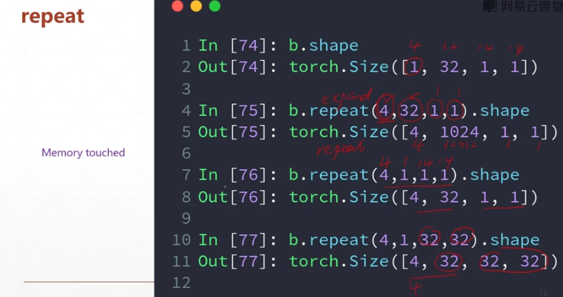
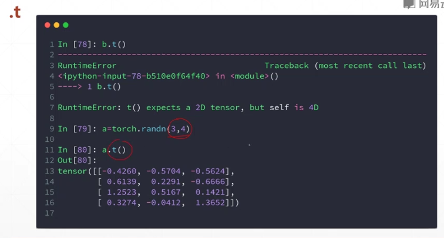
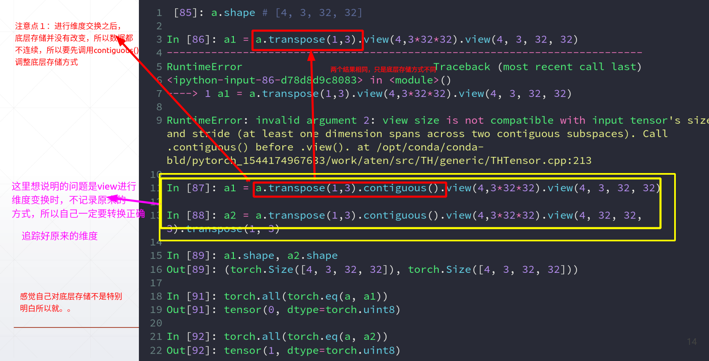
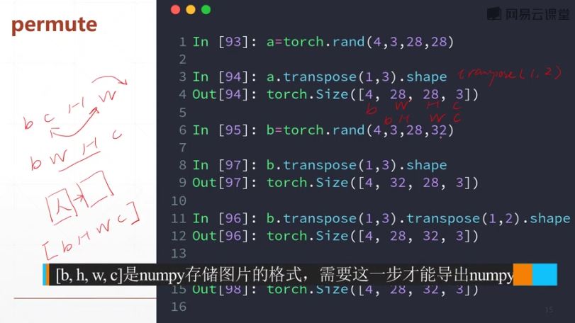

## 维度变换

**数据没有被改变，改变的只有数据的理解方式**

### 1. view / reshape

1.view reshape ,两个方法的用法完全相同
要求转换前后tensor的numel()相同即可，prod(a.size()) ==prod(b.size())

```python

a = torch.randn(4,1,28,28)
print(a.shape)
#把每张照片打成一维数据,这个常做为－卷积网络的输入
b = a.view(4,28*28)
print(b.shape)
#把只是关注照片中每行的特点
c = a.view(4*1*28,28)
print(c.shape)

#不关心像素点是来自哪里，只是关注图片中不同像素点的不同
d = a.view(4*1,28,28)
print(d.shape)

#数据的存储／维度顺序非常重要，但是这里view 和reshape函数在转换时把这一信息丢掉了，无额外记录之前的形状，无法恢复

'''
Output:

torch.Size([4, 1, 28, 28])
torch.Size([4, 784])
torch.Size([112, 28])
torch.Size([4, 28, 28])


'''
```


### 2.squeeze v.s. unsqueeze-维度

#### 2.1 unsqueeze()

```python
#unsqueeze( input , dim ) ->Tensor

#####参数说明：
#input (Tensor) – the input tensor.
# dim (int) – the index at which to insert the singleton dimension,dim的取值范围[- input.dim() -1 , input.dim()+1 ]

#如果dim为负数，则　dim = dim + input.dim()+1 将其转换成正数
#如果dim为整数，则　新增的维度添加到　dim的前面
#维度上的元素个数只有一个，所以数据规模没有改变，改变的只是数据的含义
```

**图示**



可以看出来维度变换之后，数据的理解方式不同，要好好体会



**数据处理的实例应用**

```python
b = torch.rand(32)
f = torch.rand(4,32,14,14)
b = b.unsqueeze(-1).unsqueeze(-1).unsqueeze(0)
print(b.shape)
#方便之后 f+b的计算。b 即bias，相当于给每个channel上的所有像素增加一个偏置

'''
output : torch.Size([1, 32, 1, 1])

'''
##常用的：　就是如果向后面插就使用　unsqueeze(-1)多次插入，就多次写
#向开头插入就，直接调用 unsqueeze(0)

```

#### 2.2 squeeze

```python
#torch.squeeze(input , dim =None ,Out = None) ->tensor
#当不传参数时，会将input所有元素只有一个的维度给去掉
#传参数dim，在指定维度上且维度只有一个元素时，将挤压掉该维度

#b.shape = torch.Size([1,32,1,1])
print(b.squeeze(-1).shape)
print(b.squeeze(1).shape) #无效
'''
torch.Size([1, 32, 1])
torch.Size([1, 32, 1, 1])
'''
```

### 3.Expand /repeat-行



#### 3.1 expand

参数是广播的目标tensor的shape

```python

a = torch.rand(4,32,14,14)

b = torch.rand(32)

b = b.unsqueeze(-1).unsqueeze(-1).unsqueeze(0)

b1 = b.expand(4,32,14,14)#之后b2即可以与a进行运算

print(b1.shape)
# b2 = b.expand(4,33,14,14) 会报错 The expanded size of the tensor (33) must match the existing size (32) at non-singleton dimension 1

b2 = b.expand(-1,-1,2,3) #-1表示不想对该维度进行修改

print(b2.shape)

print(b.shape)
```

#### 3.2 repeat－－不建议使用

进行repeat之后，可能会开辟新的空间去保存repeat的结果，会降低效率

*参数传递是每个维度上要重复的次数，需要自己计算*



### 4.转置操作　.t（只能适用于2D操作）



### 5.Transpose()



```python
#转换效果图

a = torch.randn(2,3,2)
print(a)
b = torch.transpose(a,1,2)

c = torch.transpose(a,1,2).contiguous().view(2,2*3).view(2,3,2)

d = torch.transpose(a,1,2).contiguous().view(2,2*3).view(2,2,3).transpose(1,2)


print(b)
print(c)
print(d)

'''
tensor([[[-0.2507, -0.4298],
         [-2.8421,  0.9166],
         [ 3.2584,  1.1366]],

        [[ 1.8887, -0.5606],
         [ 1.3798, -0.5037],
         [ 0.9862,  0.8550]]])
         
         
tensor([[[-0.2507, -2.8421,  3.2584],
         [-0.4298,  0.9166,  1.1366]],

        [[ 1.8887,  1.3798,  0.9862],
         [-0.5606, -0.5037,  0.8550]]])
         
         
tensor([[[-0.2507, -2.8421],
         [ 3.2584, -0.4298],
         [ 0.9166,  1.1366]],

        [[ 1.8887,  1.3798],
         [ 0.9862, -0.5606],
         [-0.5037,  0.8550]]])
         
         
tensor([[[-0.2507, -0.4298],
         [-2.8421,  0.9166],
         [ 3.2584,  1.1366]],

        [[ 1.8887, -0.5606],
         [ 1.3798, -0.5037],
         [ 0.9862,  0.8550]]])
'''
```


### 6.permute

permute也会打乱内存的顺序，需要调用coutigious函数

permute底层是调用多次transpose()实现的



```python
#上面遮挡住的命令是
b.permute(0,2,3,1).shape
#out : torch.Size([4,28,32,3])
```

