## 语义分割概述

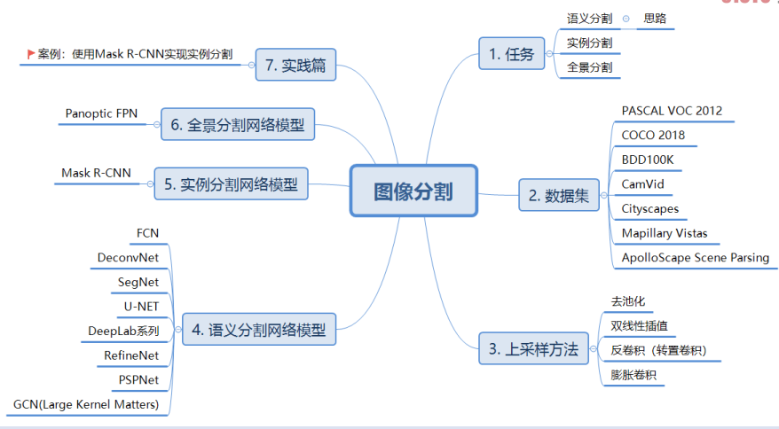

### 语义分割的任务

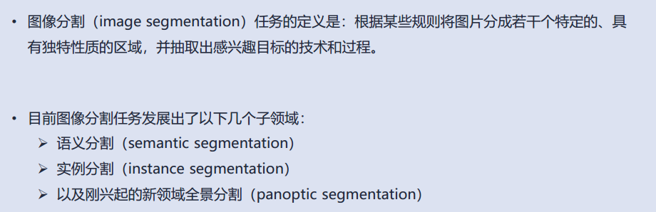

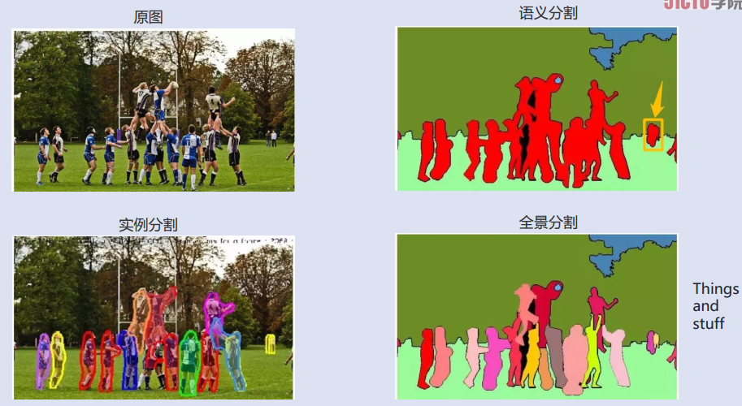

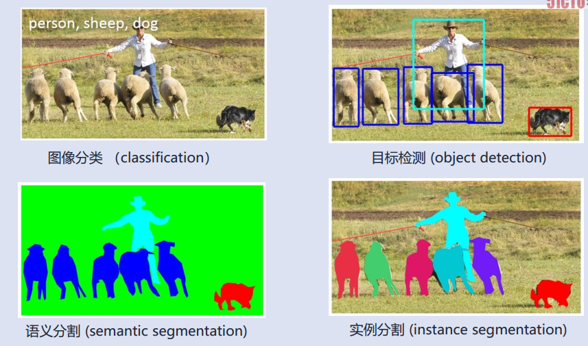

#### 语义分割的概念

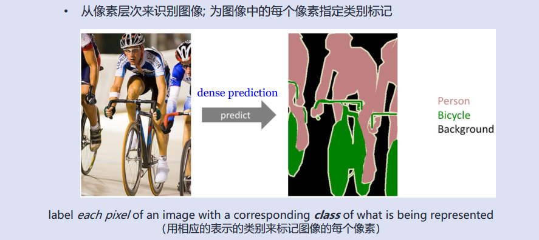

#### 语义分割的应用

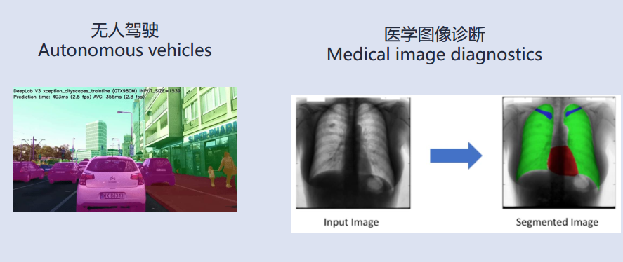

#### 提出任务

目标是 RGB 彩色图像（H\*W\*3) 或者灰度图像（高×宽×1）作为输入，输出分割图（即用相应的类别来标记图像的每个像素点）

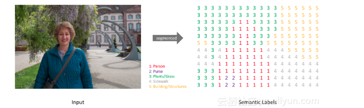

一般的实现过程：

1. 通过 一个one-hot编码的label来创建目标--为每个可能的类创建一个输出通道

   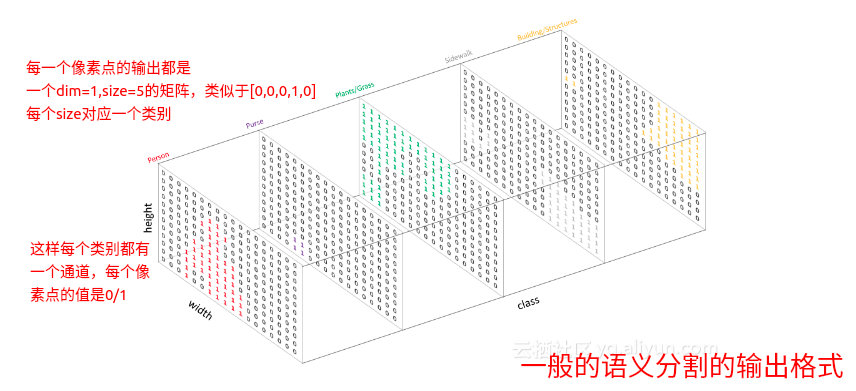

2. 通过argmax操作，获得每个深度像素向量的argmax值，可以将一个预测图分解成分割图，将目标叠加在观察目标上

   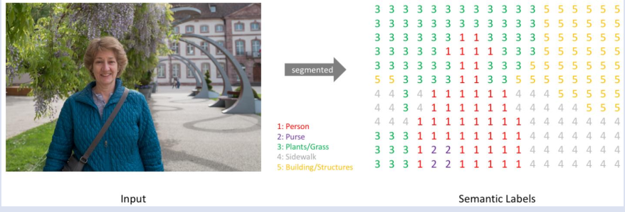

3. 同时我们也可以利用掩模技术（某个类别对应的单个通道），发现存在特定类别的图像的区域

4. 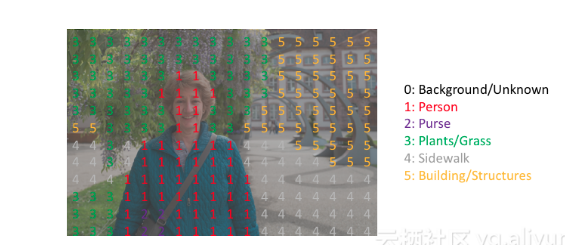

###### 关于[掩模（mask)](https://blog.csdn.net/guofei_fly/article/details/104505795?utm_medium=distribute.pc_relevant.none-task-blog-BlogCommendFromMachineLearnPai2-5.channel_param&depth_1-utm_source=distribute.pc_relevant.none-task-blog-BlogCommendFromMachineLearnPai2-5.channel_param#commentBox)的理解

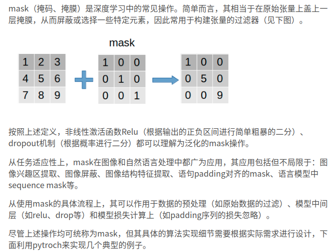

### 常用数据库介绍

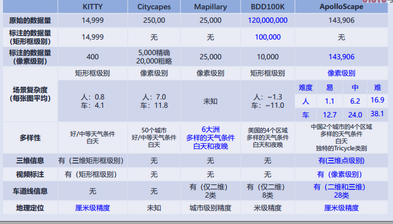

## 常见的网络结构

### 编码器和解码器的网络结构

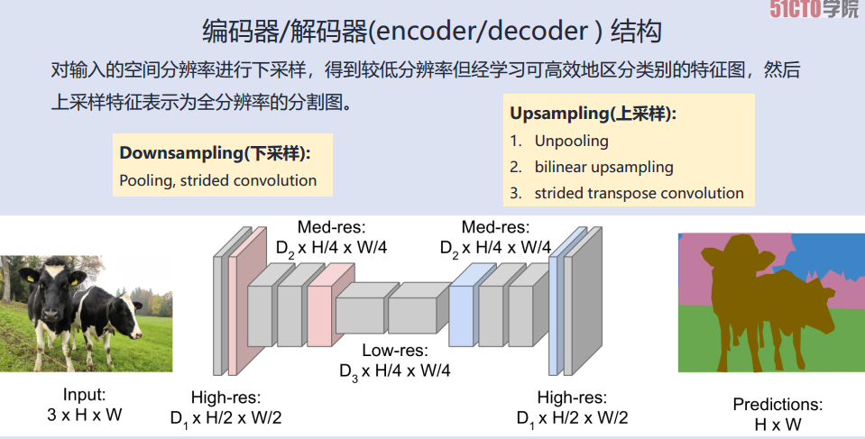

​	 不同于图像分类，我们只关心图像中所包含的内容（不用关心它的位置信息），因此我们可以采用汇聚或者跨越卷积的方式通过周期性地对特征图进行才应来减轻计算负担。 

​	但是语义分割不仅需要在像素级有分类能力，还需要有把在不同阶段学到的可判别特征映射到像素空间的机制; 所以， 我们需要一个全分辨率的语义预测

​	编码器的任务：-

​		通常是一个预训练的分类网络，对输入空间进行下采样开发低分辨率的特征映射，用来进行分类，eg： VGG，ResNet

​	解码器的任务：--上采样

​		将编码器学习得到的可判别特征从语义上映射到像素空间（较高分辨率，以获得密集分类。		

​		不同的架构采用不同的机制（跳远连接、金字塔池化等）作为解码机制的一部分。

### 上采样和下采样

#### 上采样

######  Unpooling(去池化)

1. 最近临方法

2. 钉床方法

   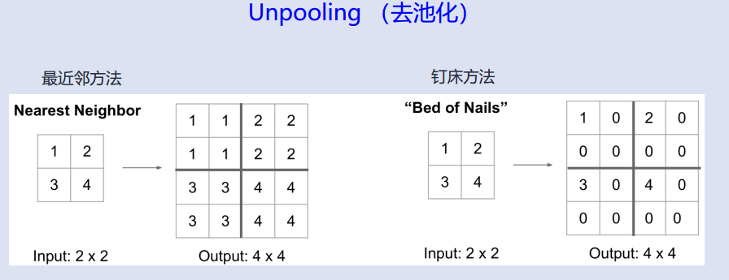

3. 最大去池化（seg-net)

这些都不需要参数，比较简单

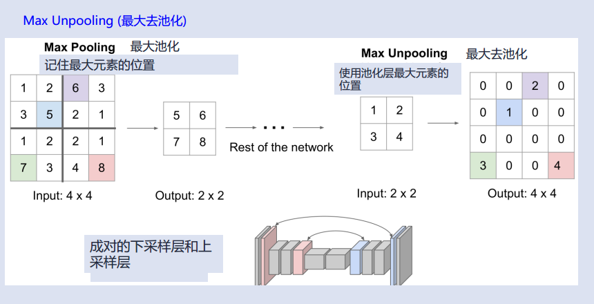

###### interpolation

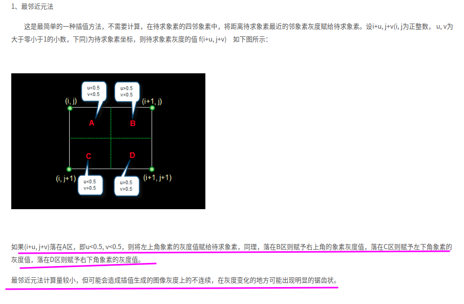

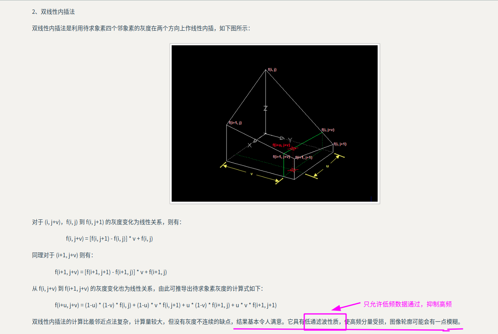

###### transpose convolutions(U - net )

https://www.cnblogs.com/sandy-t/p/7210895.html

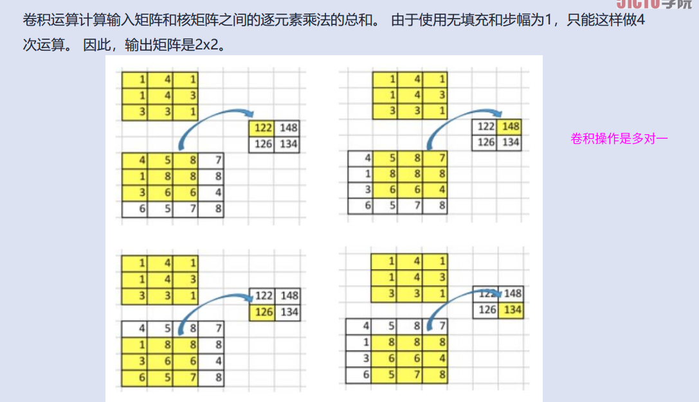

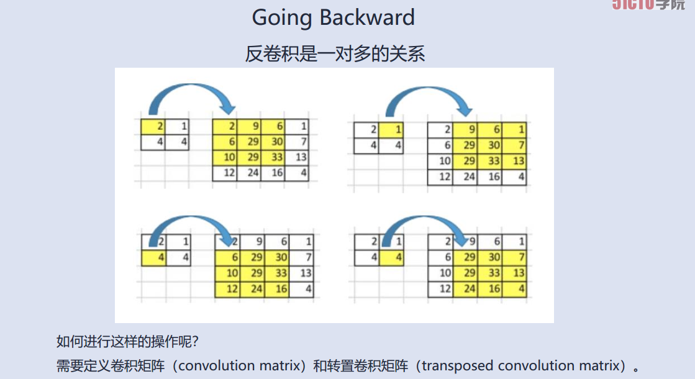

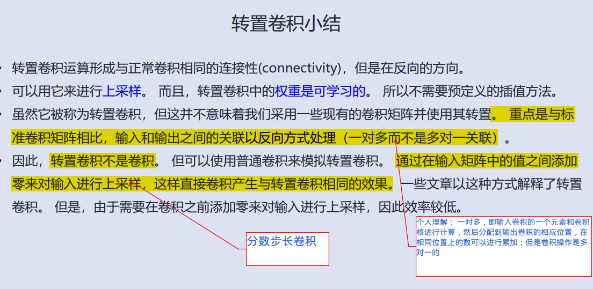

可学习的上采样方法

​	Transpose convolution (转置卷积)又称
• Fractionally-strided convolution (分数步长卷积)
• Deconvolution (反卷积)

应该是有很多方法（ 比如是否采用 padding 或者 strides 的方法）

感觉这里自己学习的很模糊：

1. 不知道各种padding和strides带来什么影响

2. 而且卷积计算过程不是很明确---应该是有多种卷积类型的

   ​	而且反卷积和卷积的卷积核之间的关系是？？

   ​	个人理解是 反卷积目的就是提高分辨率：一定是将 小->大（ 可以采用 padding 或者 较大的卷积核<比输出的卷积的尺寸大些>；或者strides<即填充一些0>

###### Dilated Convolutions(膨胀卷积/空洞卷积)

[理解的也不是很透彻的样子，主要是具体操作不是很清楚]

增加网络的感受野，减少特征图像尺寸的损失（没有pooling 层）

https://www.zhihu.com/question/54149221

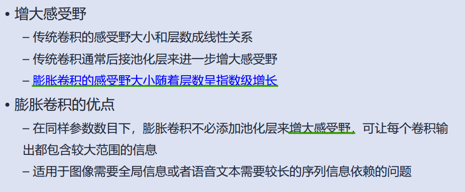

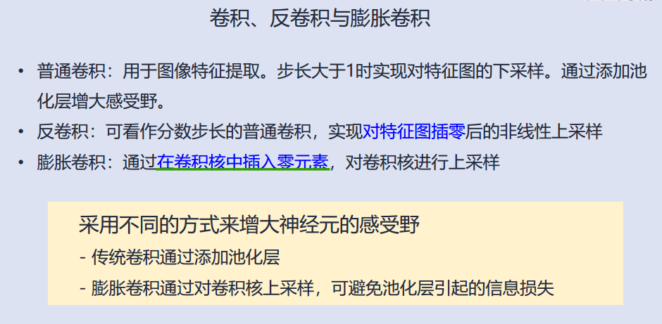

相关衔接：

[语义分割概述](https://developer.aliyun.com/article/596507)

[一文概览主要语义分割网络](https://bbs.cvmart.net/topics/752/vote_count?)

[图像的上采样和下采样](https://developer.aliyun.com/article/596507)

https://github.com/vdumoulin/conv_arithmetic