## 梯度 

### 基本概念

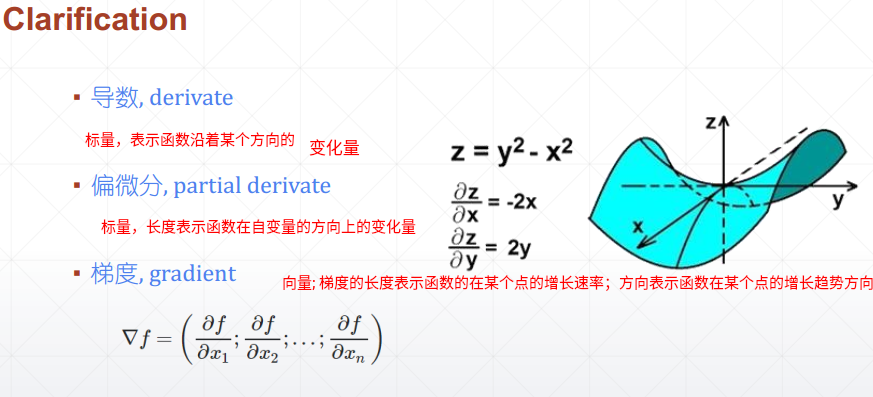


梯度是方向导数最大的地方

### 利用SGD深度学习的一般步骤

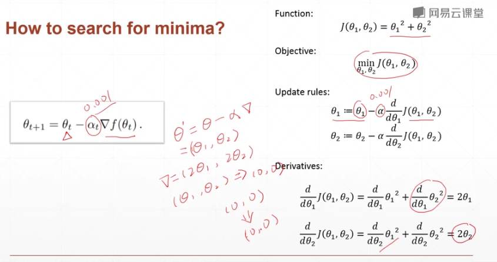

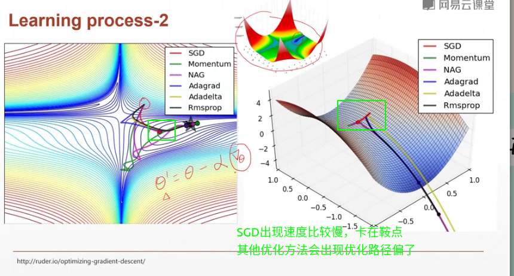

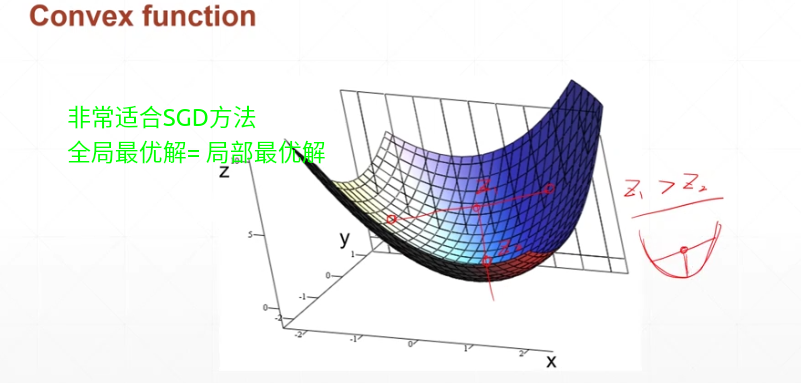


### 影响优化器的因素

每个都是一个研究方向，这里只是简单列出，只有有机会会分专题详细学习

#### 梯度问题

###### 局部最小值

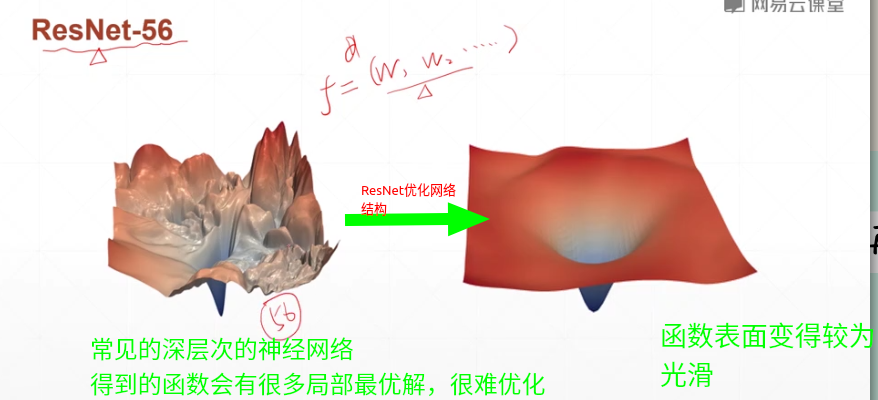

###### 鞍点

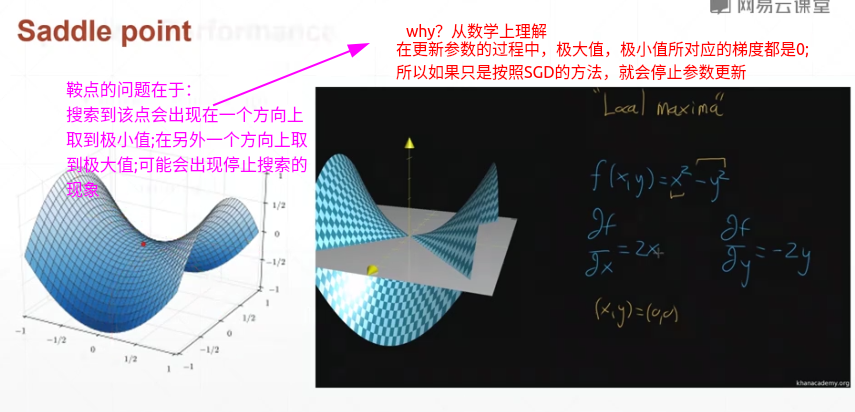

#### 权重初始值

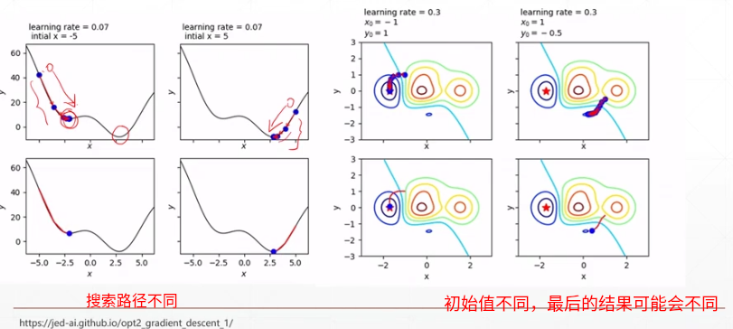

不仅仅课程中所提到的问题：由于之后网络层次比较深刻，所以会出现**梯度消失**或者**梯度爆炸**的问题


常见的初始化方法：[还没有彻底的理解，先学习一个框架]

https://blog.csdn.net/u012328159/article/details/80025785?utm_medium=distribute.pc_relevant.none-task-blog-BlogCommendFromMachineLearnPai2-2.channel_param&depth_1-utm_source=distribute.pc_relevant.none-task-blog-BlogCommendFromMachineLearnPai2-2.channel_param

https://zhuanlan.zhihu.com/p/62850258

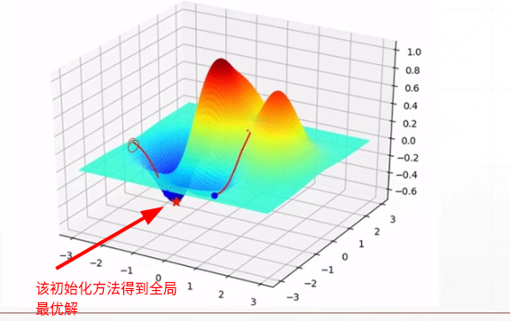

#### learning rate

逐步衰减;过大，可能会出现震荡，不会达到局部最优解;过小，优化的速度会很慢

#### momentum

动量：用来逃出局部最优解

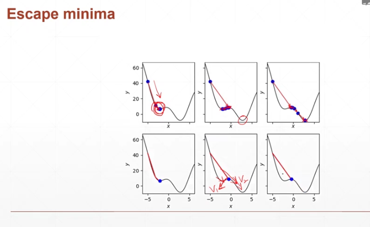

## 激活函数与loss的梯度计算

注意！！！：梯度是向量，这是我之前一致都不大注意的点，将它与导数混淆

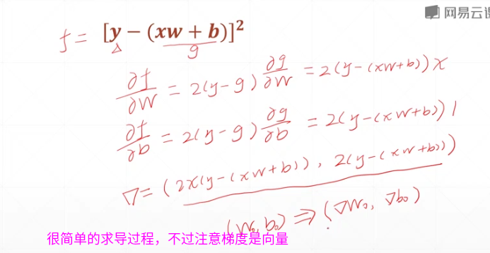


### 激活函数的概念

灵感来自 青蛙的神经元的结构--一个阈值函数：神经元并不是各个输入的加权求和而是只有大于某个阈值之后才会输出，输出值是固定的值

早期的激活函数

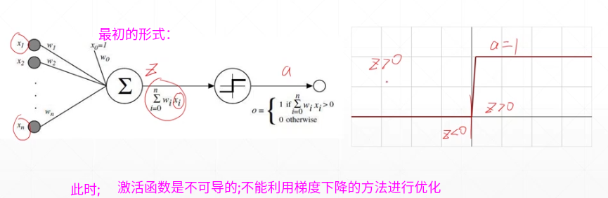


[之前自己总结有各种激活函数](https://blog.csdn.net/Doris12138lucky/article/details/104375745)：

课程里所提到的几个简单的激活函数，以及对应的导数

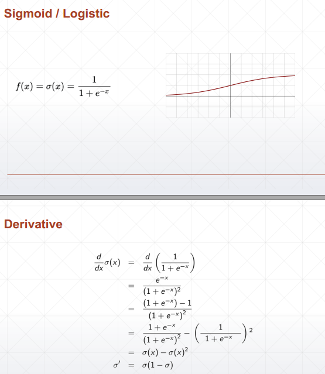

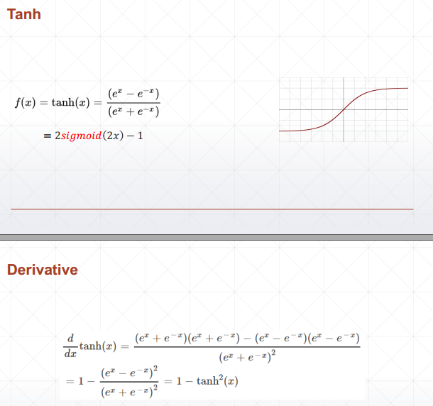

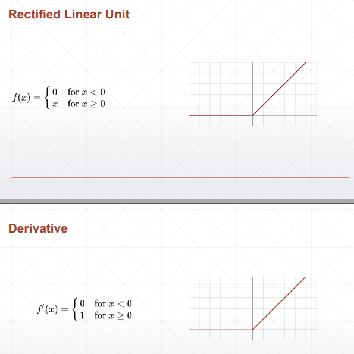

#### 在pytorch相对应的函数

```python
torch.sigmoid()

torch.tanh()

torch.nn.functional.relu()

```

### 常见的loss函数

mean-square-error

Cross-Entropy-loss

Softmax

#### 相关导数推导

###### mse

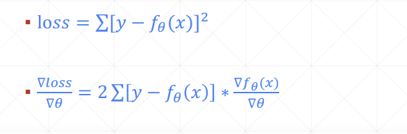

###### softmax

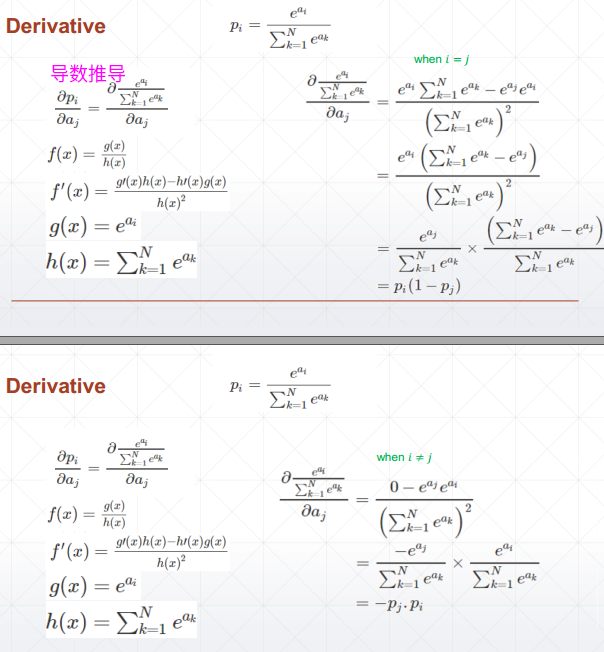

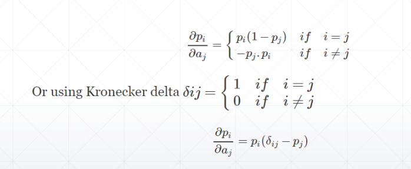

### pytorch中的自动求导

#### `torch.autograd.grad()`

```python
import torch.nn.functional as F
a = torch.rand(3) # [batch, class_num]
a.requires_grad_()
print(a)
p = F.softmax(a,dim=0)#在第0维上，也就是 class_num上,定义损失函数
print(p)

#方法2：

print(torch.autograd.grad(p[0],[a],retain_graph= True)) #单个计算每个损失函数

print(torch.autograd.grad(p[1],[a],retain_graph= True))

print(torch.autograd.grad(p[2],[a],retain_graph= True))


'''
tensor([0.5666, 0.6252, 0.9636], requires_grad=True)
tensor([0.2819, 0.2989, 0.4192], grad_fn=<SoftmaxBackward>)
(tensor([ 0.2024, -0.0842, -0.1182]),)
(tensor([-0.0842,  0.2096, -0.1253]),)
(tensor([-0.1182, -0.1253,  0.2435]),)
'''
```


#### `loss.backword()`

```python
import torch.nn.functional as F
a = torch.rand(3) # [batch, class_num]
a.requires_grad_()
print(a)
p = F.softmax(a,dim=0)#在第0维上，也就是 class_num上,定义损失函数
print(p)

##p.backward() 报错 ，因为此时p为向量，没有办法进行求导
# pytorch: grad can be implicitly created only for scalar outputs
##只能对单个y进行自动求导，
#所以单独列开，同时由于p[0]-p[2]都使用同一个计算图，
# 但是pytorch的计算图如果没有显式声明要保存，计算一次之后会作废，所以要置retain_graph=True
# retain_graph 有效次数是1次，即如果下次还需要用到计算图，还是需要置为True

p[0].backward(retain_graph =True)
p[1].backward(retain_graph =True)
p[2].backward(retain_graph =True)
print(a.grad) 

'''
tensor([0.1281, 0.9067, 0.9391], requires_grad=True)
tensor([0.1842, 0.4013, 0.4145], grad_fn=<SoftmaxBackward>)
tensor([1.4901e-08, 4.4703e-08, 1.4901e-08])

'''

```

#### 两种方法对比

```python
torch.autograd.grad(

outputs: Union[torch.Tensor, Sequence[torch.Tensor]], 

inputs: Union[torch.Tensor, Sequence[torch.Tensor]],

grad_outputs: Union[torch.Tensor, Sequence[torch.Tensor], None] = None,

retain_graph: Optional[bool] = None, # True--------the function will only return a list of gradients w.r.t the specified inputs.
    																		# False,  will be accumulated into their .grad attribute.

create_graph: bool = False,

only_inputs: bool = True, # True--------the function will only return a list of gradients w.r.t the specified inputs.
    												# False,  will be accumulated into their .grad attribute.


allow_unused: bool = False) → Tuple[torch.Tensor, ...] 


```


```python
torch.autograd.backward(
			tensors: Union[torch.Tensor, Sequence[torch.Tensor]], 
			
			grad_tensors: Union[torch.Tensor, Sequence[torch.Tensor], None] = None, 
			
			retain_graph: Optional[bool] = None, 
			
			create_graph: bool = False, 
			
			grad_variables: Union[torch.Tensor, Sequence[torch.Tensor],None] = None) → None
			
	
    #该函数是将所有的梯度计算都累加到需要计算梯度的变量的grad属性中
```

官方文档建议使用第一种，因为第二种存在内存泄漏问题（也不是很清楚


#### 遇到的bug和解决问题

代码背景

```python
import torch.nn.functional as F
a = torch.rand(3) # [batch, class_num]
a.requires_grad_()
print(a)
p = F.softmax(a,dim=0)#在第0维上，也就是 class_num上,定义损失函数
print(p)
```

**RuntimeError: Trying to backward through the graph a second time, but the buffers have already been freed. Specify retain_graph=True when calling backward the first time.**

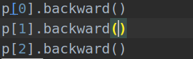

修改方案： retain_graph

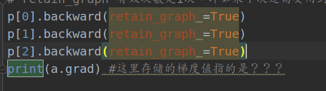


**pytorch: grad can be implicitly created only for scalar outputs**

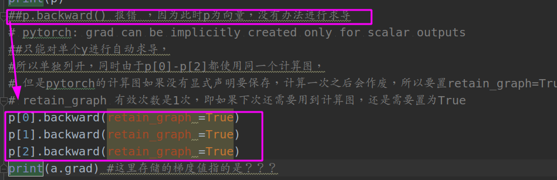


