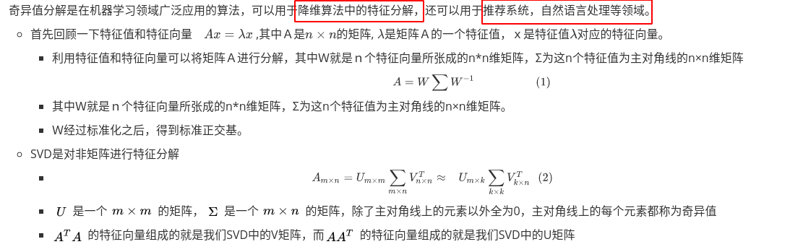
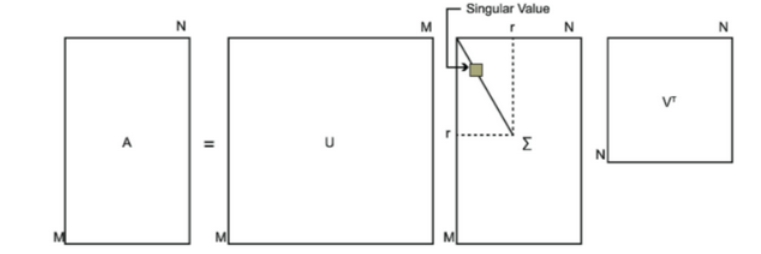
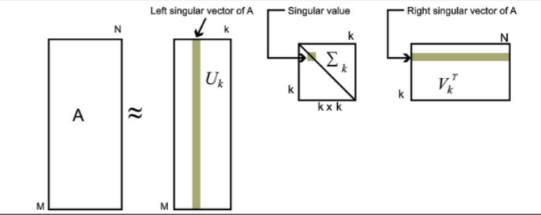
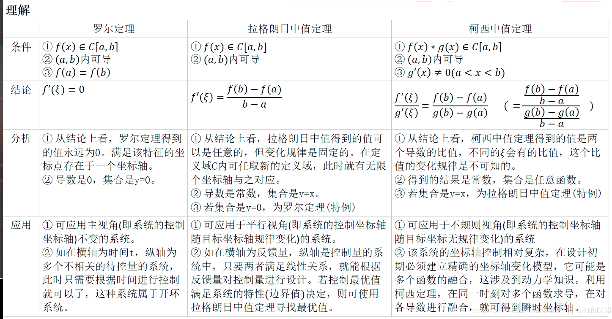

[6.2 浙大吴健老师]

1. 解释一下SVＤ，以及它的应用场景

   [[link]](https://www.cnblogs.com/endlesscoding/p/10033527.html)

   [[link]](https://zhuanlan.zhihu.com/p/29846048)

   - 

   - 图示

   - 

     

   - SVD的性质

     - 可以用最大的k个的奇异值和对应的左右奇异向量来近似描述矩阵，由于这个重要的性质，SVD可以用于PCA降维，来做数据压缩和去噪
     - 也可以用于推荐算法，将用户和喜好对应的矩阵做特征分解，进而得到隐含的用户需求来做推荐
     - 同时也可以用于NLP中的算法，比如潜在语义索引（LSI）。

2. 先验概率和后验概率之间的区别

   [[l1]](https://blog.csdn.net/genghaihua/article/details/92194362)

   [[l2]](https://zhuanlan.zhihu.com/p/38567891#:~:text=%E5%90%8E%E9%AA%8C%E6%A6%82%E7%8E%87%EF%BC%88posterior%20probability%EF%BC%89%EF%BC%9A,%E6%8C%87%E6%9F%90%E4%BB%B6%E4%BA%8B%E5%B7%B2%E7%BB%8F%E5%8F%91%E7%94%9F%EF%BC%8C%E6%83%B3%E8%A6%81%E8%AE%A1%E7%AE%97%E8%BF%99%E4%BB%B6%E4%BA%8B%E5%8F%91%E7%94%9F%E7%9A%84%E5%8E%9F%E5%9B%A0%E6%98%AF%E7%94%B1%E6%9F%90%E4%B8%AA%E5%9B%A0%E7%B4%A0%E5%BC%95%E8%B5%B7%E7%9A%84%E6%A6%82%E7%8E%87%E3%80%82%20%E5%8F%AF%E4%BB%A5%E7%9C%8B%E5%87%BA%EF%BC%8C%E5%85%88%E9%AA%8C%E6%A6%82%E7%8E%87%E5%B0%B1%E6%98%AF%E4%BA%8B%E5%85%88%E5%8F%AF%E4%BC%B0%E8%AE%A1%E7%9A%84%E6%A6%82%E7%8E%87%E5%88%86%E5%B8%83%EF%BC%8C%E8%80%8C%E5%90%8E%E9%AA%8C%E6%A6%82%E7%8E%87%E7%B1%BB%E4%BC%BC%E8%B4%9D%E5%8F%B6%E6%96%AF%E5%85%AC%E5%BC%8F%E2%80%9C%E7%94%B1%E6%9E%9C%E6%BA%AF%E5%9B%A0%E2%80%9D%E7%9A%84%E6%80%9D%E6%83%B3%E3%80%82)

   **贝叶斯公式：**符号定义与全概率公式相同，则：
   $$
   P(B_i |A) = \frac{P(B_i)P(A|B_i)}{P(A)}
   $$
   可以看出，贝叶斯公式是“由果溯因”的思想，当知道某件事的结果后，由结果推断这件事是由各个原因导致的概率为多少

   **先验概率（prior  probability）：**指根据以往经验和分析。在实验或采样前就可以得到的概率。$P(B_i)$

   **后验概率（posterior  probability）：**指某件事已经发生，想要计算这件事发生的原因是由某个因素引起的概率 $P(B_i|A)$

   

3. 中值定理

   [[link1]](https://zhuanlan.zhihu.com/p/47436090)

   [link2]

   函数与其导数是两个不同的函数；而导数只是反映函数在一点的局部特征；

   如果要了解函数在其定义域上的整体性态，就需要在导数及函数间建立起联系，微分中值定理就是这种作用。

   

4. 简单介绍一下　中心极限定理

   

5. SVM大致的内容

   https://zhuanlan.zhihu.com/p/31886934

   也可以参考西瓜书的内容，讲的很详细

6. LDA(线性判别分析算法)

   常用于降维，特征提取，二分类。目的是对数据进行降维，保留尽可能多的分类信息，因此需要找到最佳的投影方向，将数据点尽可能的分开。分开的标准是同类数据尽可能靠近，不同类的数据尽可能分开

7. 经典机器学习算法

   - 线性回归
   - logistic回归
   - LDA，仅限于二分类
   - 决策树
   - 朴素bayes
   - KNN　(K最近邻算法)
   - 学习向量量化  (LVQ)
   - SVM
   - 袋装法//随机森林
   -  Boosting 和 AdaBoost

