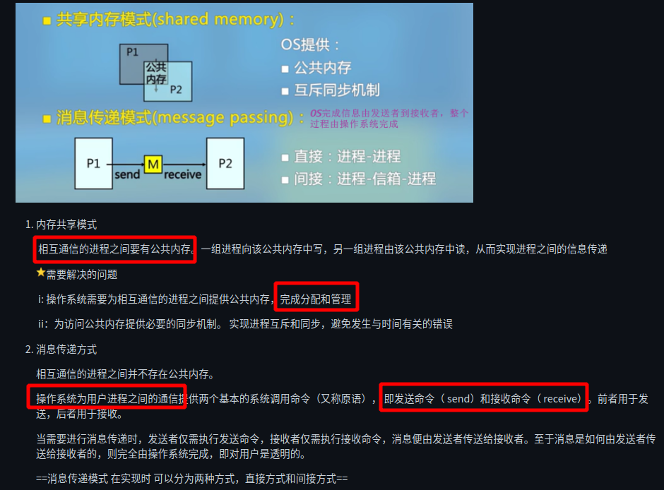

# 操作系统

## 进程通讯的几种方式

进程同步与进程互斥称为进程之间的低级通信

进程间大量数据的传递称为进程之间的高级通信。进程之间的低级通信和高级通信称为进程间通信

## 颠簸

颠簸又译抖动, 是指页面在内存与外存之间频繁地调度, 以至于系统用于调度页面所需要的时间比进程实际运行所占用的时间还要多

颠簸是由于页故障率比较高产生的结果，严重影响系统的效率

原因： 1. 分给进程的物理页框过少

 2 .淘汰算法不合理

 3.程序结构

处理：1.增加分给的物理页框数

 2.改进淘汰算法

 3.改进程序结构【全局变量的分散定义，go语句等都要避免】

## 介绍下几种常见的进程调度算法及其流程

## 死锁

## 同步

# 计组

## 虚拟内存

- 将内存空间和相对较大的外存空间相结合,构成一个远大于实际内存空间的虚拟存储空间,程序运行在这个虚拟的存储空间中.
- 解决了编程受限的问题,又解决了多道程序共享主存的安全问题,同时提高了内存的使用效率
- 实现虚拟存储的依据是程序的局部性原理,由操作系统和硬件共同完成

## 简要介绍一下分页分段

分页和分段属于不同的虚拟内存策略.

- 分段是将虚拟空间划分成若干个段:段的大小,起始地址是任意的；利用段表来追踪存储器中的段:包含段的大小和起始地址
  - 逻辑地址为: 段号:段内地址

- 分页:将虚拟地址空间划分为若干块,称为页.每个页面的大小相等,页地址唯一,
  - 并且将物理内存划分为若干块,称为帧,与页面大小一样.
  - 逻辑地址为: 虚页号:页内地址；  物理地址为 帧号:页内地址.

区别: 段是信息的逻辑单位,由源程序的逻辑结构以及含义所决定,是用户可见的.

​		  页是信息的物理单位,与源程序的逻辑结构无关,是用户不可见的.

## TLB快表(translation look aside buffer转换后缓缓冲器)

跟据访问的局部性,将当前最活跃的页表项放到特殊的cache中.是减少虚拟内存机制中访问时延的一种方法.

## DMA

direct memory access:直接存储器访问

DMA传输将数据从一个地址空间复制到另外一个地址空间，提供在外设和存储器之间或者存储器和存储器之间的高速数据传输。CPU初始化这个传输动作，但是DMA本身是由DMA控制器实现和完成的。

## 级流水CPU的各阶段

指令取指，译码，执行，访存，写回

执行单条指令时单周期CPU和五级流水CPU谁更快？为什么？

# 计算机网络

## OSI-7层模型

[OSI-7层模型](https://blog.csdn.net/weixin_44129618/article/details/113881121?utm_medium=distribute.pc_relevant.none-task-blog-2%7Edefault%7EBlogCommendFromMachineLearnPai2%7Edefault-8.control&depth_1-utm_source=distribute.pc_relevant.none-task-blog-2%7Edefault%7EBlogCommendFromMachineLearnPai2%7Edefault-8.control)：应用层，表示层，会话层，传输层，网络层，数据链路层，物理层

| 分层       | 功能                                                 |
| ---------- | ---------------------------------------------------- |
| 应用层     | 网络服务与最终用户的一个接口（可理解为人机交互界面） |
| 表示层     | 数据的表示，安全，压缩                               |
| 会话层     | 建立，管理，终止会话                                 |
| 传输层     | 定义传输数据的协议端口号，以及流控和差错校验         |
| 网络层     | 进行逻辑地址寻址，实现不同网络之间的路径选择         |
| 数据链路层 | 建立逻辑连接，进行硬件地址寻址，差错校验等功能       |
| 物理层     | 机械电子等物理通信信道上的原始比特流传输             |

TCP/IP模型：应用层，传输层，网络层，数据链路层，物理层

手机发消息为例，解释一下消息传递所经历的过程[[link]](https://sspai.com/post/64142)

> 1. 首先当打开一个通讯软件，就由应用层支持　我们与应用之间的交互
>
> 2. 输入相应的消息。输入的消息称为用户数据，会经过表示层翻译成计算机可以识别的ASCII码等
>
> 3. 我们按发送按钮。　会话层会建立相应的会话，产生相应的主机进程，并把消息传递给传输层
>
> 4. 传输层将相应数据进行分割，加上端口号以便目的主机识别，并交给网络层.
> 5. 在网络层加上IP地址，并且选择相应的路由，到达具体的某个主机
> 6. 6.到数据链路层后，数据前面会被加上mac地址，在局域网内部寻找具体主机，并将数据转换成比特流,在物理网络上传输
> 7. 数据被网络上的各个主机接收之后，**主机会看一眼是不是找自己的，如果不是就丢掉，如果是找自己的就会查看端口号，判断由哪个进程来处理该信息。**比如说微信发的消息就会去找微信，不会说 QQ 收到了微信的消息。

按照TCP/IP参考模型中，“输入www.baidu.com”从应用层到网络层用到哪些协议？

> ​	应用层: HTTP: www访问协议　DNS域名解析服务
>
> ​	传输层:　TCP： HTTP提供可靠的数据传输，　UDP：DNS使用UDP传输
>
> ​	网络层: IP：IP包传输和路由选择　ICMP:提供网络传输中的差错检测，　ARP：本机的默认网关IP转换成相应的MAC地址

## TCP和UDP之间的区别

TCP和UDP是传输层的协议

传输层提供的服务：进程之间的逻辑通信，复用和分用，差错检测，面向连接的TCP和无连接的UDP.

| 名称 | 特点                                                         |
| ---- | ------------------------------------------------------------ |
| TCP  | 有连接，一对一，提供可靠交付(保证目的主机的目的进程可以接收到正确的报文)，全双工通信，面向字节流 |
| UDP  | 无连接，最大努力交付，应用层要保证可靠性                     |

## 一个主机将两个端口接到网络上是否会提升吞吐量？为什么？

吞吐量:单位时间内通过某个网络(信道,或者接口)的数据量.吞吐量受网络带宽或者网络额定速率的影响.

## 网络中两台主机通信的完整过程

[[link]](https://blog.csdn.net/weixin_34292402/article/details/93848551?utm_medium=distribute.pc_relevant.none-task-blog-baidujs_title-0&spm=1001.2101.3001.4242)

1.如果主机A和B在同一个二层网络中,直接走二层交换(A-交换机-B)

2.如果主机A和B不在同一个网络中,走3层路由(A-交换机I-路由..路由-交换机II-B)

## 3次握手//4次握手

TCP连接的建立:３次握手

>  1.　客户机的TCP向服务器的TCP发送一个连接请求报文段，
>  2.　服务器的TCP收到连接请求报文后，如果同意连接，就向客户机发回确认，并为该TCP连接分配TCP缓存和变量
>  3.　当客户机收到确认段报文后，还要向服务器给出确认，并且也要给该连接分配缓存和变量．

TCP连接的释放:４次握手

> 1. 客户机打算关闭连接时,向其TCP发送一个连接释放报文段,并停止发送数据
> 2. 服务器收到连接释放报文段后即发出确认,(服务器仍然可以发送数据)
> 3. 服务器如果没有向客户机发送数据,向客户端发送连接释放报文
> 4. 客户机收到连接释放报文段之后,发送确认.

# 其他

## 介绍下事务的ACID特性分别是什么?

构成单一逻辑工作单元的操作集合称为事务,在关系型数据库中,事务是恢复和并发控制的基本单位,要么执行整个事务,要么属于该事务的操作一个也不执行.

ACID:  Atomicity -原子性:事务是一个不可分割的工作单位,它包括的操作要么都做,要么什么都不做.

​			Consistency:一致性是指在**执行一个事务前和后，数据库的完整性约束没有没有被破坏**

​			 Isolation:  **隔离性是指多个事务并发时，每个事务应该是隔离的**，一个事务不应影响其他事务的运行效果

​			Durability 持久性意味着事务执行完成后，该事务对数据库的更改便持久到了数据库中，这个更改是永久的

https://blog.csdn.net/corbin_zhang/article/details/80578005

## 事务的ACID特性怎么保证？（REDO/UNDO机制）

Oracle中用**锁** 、**并发与多版本** （非阻塞读）保持**一致性** 和**隔离性** ，用事务的commit,rollback(回滚),savepoint保持**原子性** ，用数据库文件保持持久性，断电后，内存数据丢失，硬盘文件数据不丢失，重启后从文件中加载到内存，保持**持久性**

## 电脑的开机过程

计算机的整个启动过程分成四个阶段。

1. 读取BIOS(basic input/output system),硬件自检

2. 读取主引导记录(MBR),512字节,放到0x7c000处
3. 硬盘启动
4. 启动操作系统

[[link]](https://blog.csdn.net/LOVELX1991/article/details/8584428?utm_medium=distribute.pc_relevant.none-task-blog-2%7Edefault%7EBlogCommendFromMachineLearnPai2%7Edefault-4.base&depth_1-utm_source=distribute.pc_relevant.none-task-blog-2%7Edefault%7EBlogCommendFromMachineLearnPai2%7Edefault-4.base)

