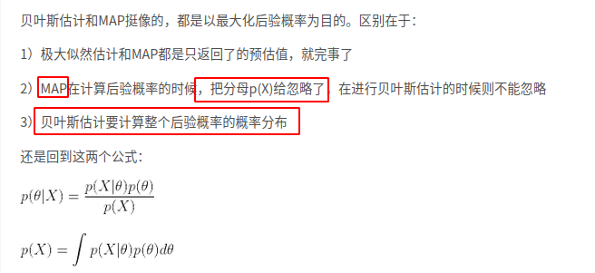

### 梯度下降算法

梯度下降是一种迭代算法，选择初值x0，然后不断迭代更新x，进行目标函数的最小化，直到收敛，由于负梯度方向是使得函数值下降最快的方向。    

### 牛顿迭代法

https://zhuanlan.zhihu.com/p/240077462

### 介绍下梯度下降法和牛顿迭代法寻找极值的过程

### 极大似然估计(MLE)，极大后验估计(MAP)，贝叶斯估计(BE)之间联系和不同

[[link1]](https://blog.csdn.net/vividonly/article/details/50722042?utm_medium=distribute.pc_relevant.none-task-blog-2%7Edefault%7EBlogCommendFromBaidu%7Edefault-4.withoutpai&depth_1-utm_source=distribute.pc_relevant.none-task-blog-2%7Edefault%7EBlogCommendFromBaidu%7Edefault-4.withoutpai)  , [[link2]](https://blog.csdn.net/bitcarmanlee/article/details/81417151?utm_medium=distribute.pc_relevant.none-task-blog-2%7Edefault%7EOPENSEARCH%7Edefault-6.withoutpai&depth_1-utm_source=distribute.pc_relevant.none-task-blog-2%7Edefault%7EOPENSEARCH%7Edefault-6.withoutpai), [[link3]](https://blog.csdn.net/sinat_36118365/article/details/102644479)

#### 频率学派VS贝叶斯学派

> 对于θ的本质不同认识，可以分为两个大派别。
>
> 1、频率学派：认为θ是确定的，有一个真实值，目标是找出或者逼近这个真实值。
>
> 2、贝叶斯学派：认为θ是不确定的，不存在唯一的真实值，而是服从某一个概率分布

#### MLE:(频率学派)

#### MAP:(bayes学派)

​	相比于MLE，它引入了一些先验概率，目的是让最优的参数应该是让后验概率最大。

　MAP + 高斯先验 = MLE + L2正则

#### BE:（bayes学派)

​	BE是在MAP上做了进一步的拓展，不直接估计参数的值，而是允许参数服从一定的概率分布。

### 机器学习和深度学习之间的联系和差别

>	**人工智能包括专家系统、机器学习、进化计算、模糊逻辑和计算机视觉、自然语言处理、推荐系统等。**
>		
>	**现在仍然是弱人工智能，前者让机器具备观察和感知的能力，可以做到一定程度的理解和推理，而强人工智能让机器获得自适应能力，解决一些之前没有遇到过的问题。**
>		
>	机器学习：**是实现人工智能的方法**，使用算法来解析数据、从中学习、然后对现实世界进行预测。机器学习是用大量的数据来训练，通过各种算法从数据中学习如何完成任务。
>		
>	深度学习：是一种实现机器学习的技术。深度学习本来并不是一种独立的学习方法，其本身也会用到有监督和无监督的学习方法来训练深度神经网络。但由于近几年该领域发展迅猛，一些特有的学习手段相继被提出（如残差网络），因此越来越多的人将其单独看作一种学习的方法。最初的深度学习是利用深度神经网络来解决特征表达的一种学习过程。深度神经网络本身并不是一个全新的概念，可大致理解为包含多个隐含层的神经网络结构。为了提高深层神经网络的训练效果，人们对神经元的连接方法和激活函数等方面做出相应的调整。其实有不少想法早年间也曾有过，但由于当时训练数据量不足、计算能力落后，因此最终的效果不尽如人意。

### 决策树

https://easyai.tech/ai-definition/decision-tree/

### 随机森林算法

https://easyai.tech/ai-definition/random-forest/

### Kmeans

https://easyai.tech/ai-definition/k-means-clustering/#baidu

算法是无监督算法，是基于样本集合划分的聚类算法，它将样本集合划分成k个子集，k个类，将这n个集合归于k个类中，每个样本到其类的中心距离最小。是硬聚类。

### KNN

KNN是K近邻算法，比较简单直观，给定一个训练集，对于输入的实例，在训练集数据中找到与之最近的k个实例，这k个实例多数属于某个类别，就把输入实例归于这个类。

## 特征选择方法

[t-test](https://blog.csdn.net/heda3/article/details/95931174)

相关参考文献：

https://zhuanlan.zhihu.com/p/354144381
