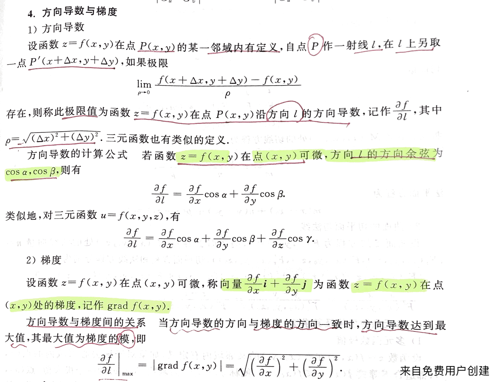
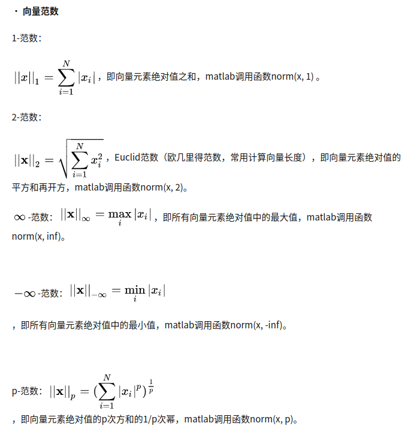
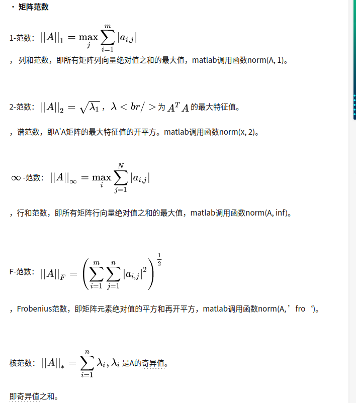
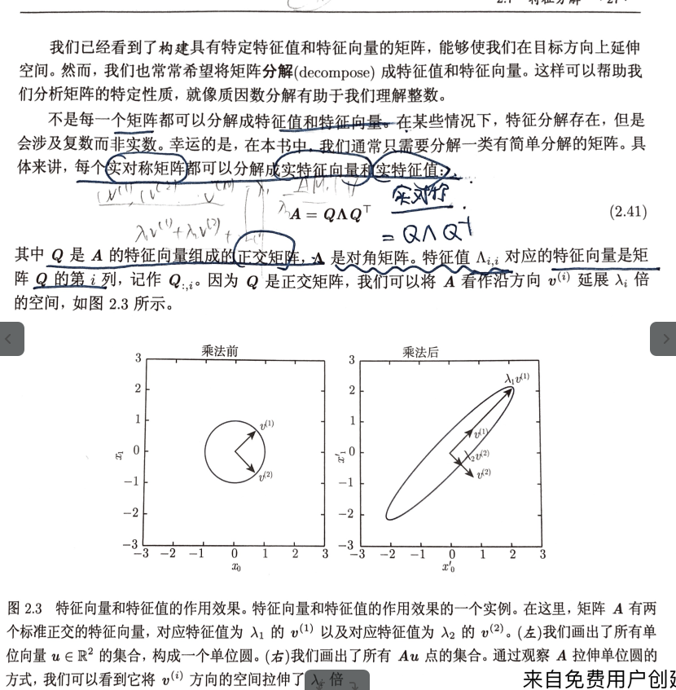
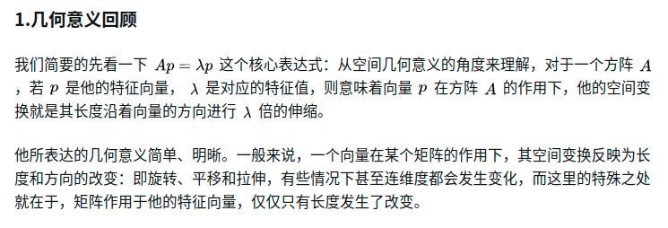
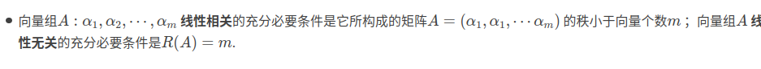
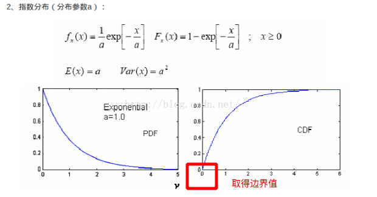
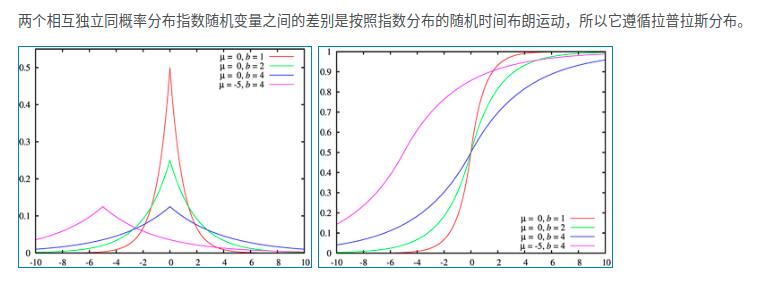

# 高等数学

## 梯度, 方向导数, 梯度下降

### 二元函数求极值？

# 线性代数

## 矩阵运算下　AX=b什么条件下x有解

[[link: MIT 线性代数]](https://zhuanlan.zhihu.com/p/44114447#:~:text=%E5%BE%88%E6%98%BE%E7%84%B6%EF%BC%8C%E5%A6%82%E6%9E%9Cb%E5%AD%98%E5%9C%A8%E4%BA%8E%E7%B3%BB%E6%95%B0%E7%9F%A9%E9%98%B5A%E7%9A%84%E5%88%97%E6%89%80%E6%9E%84%E6%88%90%E7%9A%84%E7%A9%BA%E9%97%B4%E4%B8%AD%EF%BC%88%E5%8D%B3%E5%88%97%E7%A9%BA%E9%97%B4C%20%28A%29%EF%BC%89%EF%BC%8C%E9%82%A3%E4%B9%88%E6%96%B9%E7%A8%8B%E7%BB%84%E6%9C%89%E8%A7%A3%E3%80%82.%20%E6%80%BB%E7%BB%93%E4%B8%80%E4%B8%8BAx%3Db%20%E6%9C%89%E8%A7%A3%E7%9A%84%E6%9D%A1%E4%BB%B6%3A%20%E8%A1%8C%E7%9A%84%E8%A7%92%E5%BA%A6%EF%BC%9A%E5%A6%82%E6%9E%9C%E6%96%B9%E7%A8%8B%E7%BB%84%E7%B3%BB%E6%95%B0%E7%9F%A9%E9%98%B5A%E7%9A%84%E8%A1%8C%E5%90%91%E9%87%8F%E7%9A%84%E7%BA%BF%E6%80%A7%E7%BB%84%E5%90%88%E5%8F%AF%E4%BB%A5%E7%94%9F%E6%88%90%20%240%24%20%E5%90%91%E9%87%8F%EF%BC%8C%E9%82%A3%E4%B9%88%E7%9B%B8%E5%90%8C%E7%9A%84%E7%BB%84%E5%90%88%E4%BD%9C%E7%94%A8%E5%9C%A8b%E7%9A%84%E5%88%86%E9%87%8F%E4%B8%8A%EF%BC%8C%E4%B9%9F%E5%BF%85%E9%A1%BB%E5%BE%97%E5%88%B0%20%240%24%E3%80%82.,%E5%BF%85%E9%A1%BB%E6%98%AF%20A%20%E5%90%84%E5%88%97%E5%90%91%E9%87%8F%E7%9A%84%E7%BA%BF%E6%80%A7%E7%BB%84%E5%90%88%E3%80%82.%20%E5%88%97%E7%A9%BA%E9%97%B4%E8%A7%92%E5%BA%A6%EF%BC%9A%E5%BD%93%E4%B8%94%E4%BB%85%E5%BD%93%20b%20%E5%B1%9E%E4%BA%8E%20A%20%E7%9A%84%E5%88%97%E7%A9%BA%E9%97%B4%E6%97%B6%E6%88%90%E7%AB%8B%E3%80%82.)

> 1. 行的角度:　如果方程组系数矩阵A的行向量的线性组合可以生成0向量，那么相同的组合作用在b分量上，也必须得到０向量。
>
> 2. 列向量的角度：b必须是A各列向量的线性组合
> 3. 列空间角度：当且仅当b属于A的列空间时成立

## 矩阵的范数

范数:

## 矩阵特征值和特征向量

[[link1]](https://blog.csdn.net/hjq376247328/article/details/80640544?utm_medium=distribute.pc_relevant.none-task-blog-2%7Edefault%7EBlogCommendFromMachineLearnPai2%7Edefault-4.withoutpai&depth_1-utm_source=distribute.pc_relevant.none-task-blog-2%7Edefault%7EBlogCommendFromMachineLearnPai2%7Edefault-4.withoutpai):矩阵的特征值和特征矩阵的应用：它与PCA之间的关系。

## 正定矩阵

- 所有特征值都是整数的矩阵称为正定.
- 所有特征值都是非负数的矩阵称为半正定矩阵.
- 各阶主子式大于零

## 相似矩阵

相似矩阵的秩相同，特征值也相同。

## 正交矩阵

正交矩阵（Orthogonal Matrix）是指其转置等于其逆的矩阵。

正交变换不改变向量的内积，不改变向量的模，夹角和距离，所以保持两点的欧式距离不变的线性变换

https://www.docin.com/p-2153312748.html

## 等价矩阵

如果矩阵A经过有限次的初等变换到矩阵B,则称A与B等价

**如果AB=C**,B是可逆的,则称A与C是列向量等价

## 合同矩阵

设A,B是n阶矩阵,如果存在可逆矩阵C,使得B = C^T A C,则称A与B之间是合同矩阵. 

​	-	任何一个对称矩阵合同与同一个对角矩阵; 

​	-	如果矩阵A,B合同,则A和B的秩是相同的

## 线性相关和线性无关

## 矩阵的秩

- 矩阵中所有行向量中**极大线性无关组**的元素个数
- 与向量空间的关系   
  - 任何矩阵的行空间的维数等于矩阵的列空间的维数等于矩阵的秩

# 概率论

## 期望,方差,协方差

### 期望

计算函数f(x)关于某分布P(X)的期望: 当x由P(x)产生时.f(X)的平均值
$$
\mathbb{E}_{x~P[f(x)]} = \sum_{x}P(X)f(x) = \int p(x)f(x) dx
$$

### 方差

衡量当我们对x依据它的概率分布进行采样时,随机变量x的函数值会呈现什么样的差异
$$
Var(f(x) )=\mathbb{E}[(f(x) - \mathbb{E}[f(x)])^2]
$$

### 协方差

给出了两个变量相性相关性的强度以及变量的尺度

$$
Cov(f(x),g(y))= \mathbb{E}[(f(x) - \mathbb{E}[f(x)])(g(y) - \mathbb{E}[g(y)] )]
$$
两个变量相互独立,其协方差为0;如果协方差为0 ,只能说明他们没有线性关系,不代表相互独立(可能存在独立性)

如果协方差为正,两个变量线性正相关;协方差为负,两个变量线性负相关.

## 概率论和数理统计的区别

> ​	他们是方法论上的不同，概率论是推理，数理统计是归纳。
>
> 　　概率论在给定数据生成过程下观测，研究数据的性质。而数理统计是跟据观测的数据，反向思考数据生成过程。
>
> 　　预测、分类、聚类、估计等，都是统计推断的特殊形式。

备注：

概率论是由概率分布推断样本性质，如大数定律、中心极限定理。(这些保证了统计推理的合理性)
统计是由样本信息反推概率分布，如概率分布参数的点估计、区间估计，以及线性回归。在估计之前都要对概率模型进行假设。

## 大数定律和中心极限定理的意义与作用（切比雪夫大数定律）

    中心极限定理
    
    中心极限定理指的是给定一个任意分布的总体。我每次从这些总体中随机抽取 n 个抽样，一共抽 m 次。 然后把这 m 组抽样分别求出平均值。 这些平均值的分布接近正态分布。
    
    大数定理
    　大数定律证明了在大样本条件下,样本平均值可以看作是总体平均值(数学期望)，所以在统计推断中，一般都会使用样本平均数估计总体平均数的值。
## 常见离散概率分布

[[link]](https://blog.csdn.net/pipisorry/article/details/39076957)

正态分布
$$
N(X,\mu,\sigma^2) = \sqrt{\frac{1}{2\pi \sigma^2}} exp(\frac{-(x-\mu)^2}{2\sigma^2})
$$
当我们缺乏对某个实数分布的先验知识时,我们默认选择正态分布.

原因:

> 	1. 中心极限定理说明很多独立随机变量的和 近似独立正态分布/很多复杂的系统都可以被成功地建模为正态分布的噪音
>  	2. 在具有相同方差的所有可能的概率分布中,正态分布在实数上具有最大的不确定性.即它是对模型要求先验知识最小的分布.

指数分布:可以得到一个在x=0处取得边界点的分布

Laplace分布:它允许我们在任意一点\mu设置概率质量的峰值
$$
Laplace(x; \mu,\gamma) = \frac{1}{2\gamma}exp(-\frac{|x-\mu|}{\gamma})
$$

## 全概率公式

$$
 p(X,Y) = p(X|Y)p(Y) =p(Y|X)P(X)
$$

## 最大似然估计

　　常用的概率估计的一种方法。最大似然估计的核心思想是:认为当前发生的事情是概率最大的事件。就给定的数据集，使得该数据集发生的概率最大来计算模型中的参数。似然函数如下:
$$
p(X| \theta) = \prod_{x1}^{x_n} p(x_i | \theta)
$$
为了便于计算，我们对似然函数两边取对数，生成新的对数似然函数（因为对数函数是单调增函数，因此求似然函数最大化就可以转换成对数似然函数最大化):
$$
p(X| \theta) = \sum_{x1}^{x_n} log [p(x_i | \theta)]
$$
​	求对数似然函数最大化，可以采用SGD和Newton

- remark： 只关注当前的样本，也就是只关注当前发生的事情，不考虑事情的先验情况。由于计算简单，而且不需要关注先验知识，因此在机器学习中的应用非常广，**最常见的就是逻辑回归的求解就是用的极大似然估计**

## bayes

$$
p(\theta|X)(posterior) = \frac{[p(X| \theta)(likehood)] * [p(\theta)(prior)]}{P(X)}
$$

**posterior：通过样本X得到参数 ![[公式]](https://www.zhihu.com/equation?tex=%5Ctheta) 的概率，也就是后验概率。**

**likehood：通过参数 ![[公式]](https://www.zhihu.com/equation?tex=%5Ctheta) 到样本X的概率，似然函数，通常就是我们的数据集的表现。**

**prior：参数 ![[公式]](https://www.zhihu.com/equation?tex=%5Ctheta) 的先验概率，一般是根据人的先验知识来得出的。**

# 离散数学

### 离散数学的主要内容

数理逻辑，二元关系，群与环，数论什么的，是一门比较抽象的学科，主要作用是建立相关的数学模型，把实际问题抽象成为计算机能够理解的逻辑结构，并且用计算机的思维去解决实际问题，往往实际用的不多，主要是训练思维.

### 偏序关系

集合X上的偏序是一个自反，反对称，传递的关系。严格的偏序关系是一个反自反，反对称且传递的关系

**覆盖**　,**哈斯图**　[[link]](https://zhuanlan.zhihu.com/p/365442689)

### 等价关系

对于集合X，如果Ｘ上的关系R自反，对称且传递，则Ｒ是一个等价关系

不难发现，集合 $X$上的等价关系相当于将  $X$划分成若干个非空的等价类，每个等价类中任意两个元素均等价。而对于任意将$X$ 划分成若干非空集合的划分，一定存在 $X$ 上的等价关系与之对应

### 欧拉回路

经过图中每一条边且仅一次，并且遍历图中的每个顶点回路，称为欧拉回路

- 无向图 G 有欧拉回路，当且仅当 G是连通图且无奇度顶点；
- 无向图 G 有欧拉通路，当且仅当 G连通图且恰好有两个奇度顶点。这两个奇度顶点是欧拉通路的端点。

### 哈密顿回路

经过图中**每个顶点一次且仅一次**的回路（通路）称为**哈密顿回路（通路）**。存在哈密顿回路的图称为哈密顿图

### 群

link:https://blog.csdn.net/zqm_0015/article/details/109236372#t9
