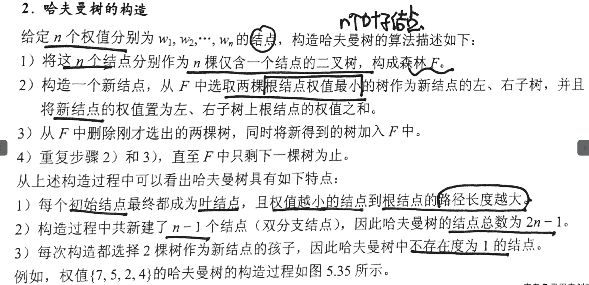
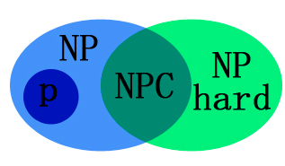

## 判断一个无向图是否是一棵树

树的定义是连通的有向无环图，所以需要判断图是否是连通而且没有环，一次dfs或者bfs即可，遍历时需要加访问标记,时间复杂度是O(V) //每条边都遍历了一次.

## 各种排序算法的稳定性，复杂度的对比，简单思路

[[link]](https://gritcs.github.io/2021/02/22/%E6%8E%92%E5%BA%8F%E7%AE%97%E6%B3%95%E6%80%BB%E7%BB%93/)

##  高度k的树最少节点数

感觉不是很严谨，如果没有规定，树可以退化成链表,最少是k个点。

对于完全二叉树而言，高度为h的二叉树 2^h个结点，至少有 2^h 个结点

对于高度为h的m叉树至多包含   (m^h-1)/(m-1) 个结点。[等比数列]

## 哈夫曼编码(huffman code)

在含有n个带权叶结点的二叉树中,其中带权路径长度(WPL)最小的二叉树被称为哈夫曼树。

含有n个叶子结点的huffman树，一共有2n-1个结点，huffman中只包含叶子结点和度为2的点.

**可以用堆来构造。**，时间复杂度是O(nlogn)

构建过程



## huffman编码：

​	可变长编码，把字符出现的频率看作是结点的权重

## 后缀表达式

运算符紧跟在操作数的表达式，没有括号，运算符之间不存在优先级的差别，计算过程完全按照运算符出现的先后顺序进行。

### 中缀转后缀

[link](https://www.cnblogs.com/menglong1108/p/11619896.html#:~:text=%E4%B8%AD%E7%BC%80%E8%A1%A8%E8%BE%BE%E5%BC%8F%E8%BD%AC%E5%90%8E%E7%BC%80%E8%A1%A8%E8%BE%BE%E5%BC%8F%20%E4%B8%AD%E7%BC%80%E8%A1%A8%E8%BE%BE%E5%BC%8F%E4%B8%BA%E6%88%91%E4%BB%AC%E4%BA%BA%E7%B1%BB%E8%83%BD%E8%AF%86%E5%88%AB%E7%9A%84%E6%96%B9%E5%BC%8F%EF%BC%8C%E8%80%8C%E5%90%8E%E7%BC%80%E8%A1%A8%E8%BE%BE%E5%BC%8F%E6%98%AF%E8%AE%A1%E7%AE%97%E6%9C%BA%E8%BF%9B%E8%A1%8C%E8%BF%90%E7%AE%97%E7%9A%84%E6%96%B9%E5%BC%8F%EF%BC%88%E5%8D%B3%E6%88%91%E4%BB%AC%E4%B8%8A%E8%BF%B0%E7%9A%84%E8%BF%87%E7%A8%8B%29%E3%80%82,%E8%BD%AC%E6%8D%A2%E8%A7%84%E5%88%99%201%EF%BC%89%E6%88%91%E4%BB%AC%E4%BD%BF%E7%94%A8%E4%B8%80%E4%B8%AAstack%E6%A0%88%E7%BB%93%E6%9E%84%E5%AD%98%E5%82%A8%E6%93%8D%E4%BD%9C%E7%AC%A6%EF%BC%8C%E7%94%A8%E4%B8%80%E4%B8%AAList%E7%BB%93%E6%9E%84%E5%AD%98%E5%82%A8%E5%90%8E%E7%BC%80%E8%A1%A8%E8%BE%BE%E5%BC%8F%E7%BB%93%E6%9E%9C%202%EF%BC%89%E9%A6%96%E5%85%88%E8%AF%BB%E5%8F%96%E5%88%B0%E6%95%B0%E5%AD%97%EF%BC%8C%E7%9B%B4%E6%8E%A5%E5%AD%98%E5%85%A5list%E4%B8%AD)

### 后缀表达式计算

- 从左依次读取后缀表达式的一个符号
  - 如果是操作数，则压栈
  - 如果是运算符，则从栈中连续弹出两个元素，进行相应的运算，并将结果压入栈
- 如果读入的是结束符，则栈顶就是计算结。

## 快速排序的时间和空间复杂度

快速排序的核心思想是　partition操作（分治策略）

- 选取一个基准元素（pivot）

- 比pivot小的放到pivot左边，比pivot大的放到pivot右边

- 对pivot左边的序列和右边的序列分别递归的执行步骤1和步骤2

  一次partition的时间复杂度是O(n). 当每次S(n)划分后，左右两个序列变成S(1)和S(n-1)，快排退化成冒泡，时间复杂度变成O(n*n)

  

  所以每次partition可以利用随机算法选择基准元素。

  ### 快排为什么会快？

  > ​	在堆排序中，存在大量的随机存取(包括一些无效的swap操作)，而在快速排序中，数组指针的移动都是在相邻的区域内的，符合空间局部性的特点，经常访问cache中的数据，cache比主存快的多。
  >
  > 

## 堆及其应用

[[link]](https://gritcs.github.io/2021/02/20/%E5%A0%86/)

堆维护一个偏序关系，能够支持的操作是

```c++
void up(int index); //尝试将index元素上浮
void down(int index);　//尝试将index处元素下沉
void inser(int val);//直接在堆的最末尾插入值为val的结点，之后为并使用up(len)操作，维护堆的有序性
void delete(int index);//删除index处的元素，实现是先将index处元素和堆最后的元素交换，删除最后的元素，并采用up//down维护堆的操作
```

应用：　1.优先级队列 　2.堆排序

## 时间复杂度//空间复杂度

​	时间：一个语句的频度是指该语句在算法中被重复执行的次数，算法中所有语句的频度之和记为T(n)，它是该算法问题规模n的函数，时间复杂度主要是为了分析T(n)的数量级。

​	空间：算法所耗费的存储空间，它是该算法问题规模n的函数

​	算法的特点是：有限性，可行性，确定性，输入，输出.

## 广义表

[[link]](http://data.biancheng.net/view/189.html)

## NP和NPC问题

[[link]](https://blog.csdn.net/qq_29176963/article/details/82776543)

- P类问题：能在多项式时间内可解的问题。
- NP类问题：在多项式时间内“可验证”的问题。也就是说，不能判定这个问题到底有没有解，而是猜出一个解来在多项式时间内证明这个解是否正确。P类问题属于NP问题，但NP类问题不一定属于P类问题。
- NPC问题：存在这样一个NP问题，所有的NP问题都可以约化成它。换句话说，只要解决了这个问题，那么所有的NP问题都解决了。其定义要满足2个条件：
  - 它是一个NP问题
  - 所有的NP问题都可以规约到它
- NP-hard问题: 即所有的NP问题都能约化到它，但是他不一定是一个NP问题



## 如何判断一个树是否是一个完全二叉树

> ​	通过层次遍历的方式：
>
> 基本思路是层次遍历该树，从第一个度不为２的结点开始，之后的结点的度都为0．

[[link]](https://leetcode-cn.com/problems/check-completeness-of-a-binary-tree/)


